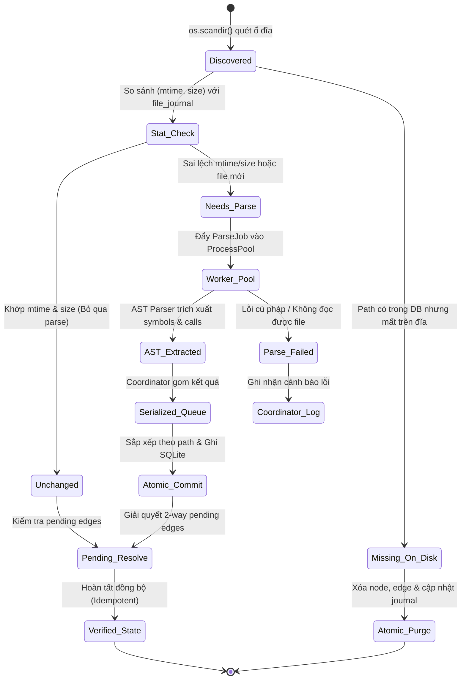
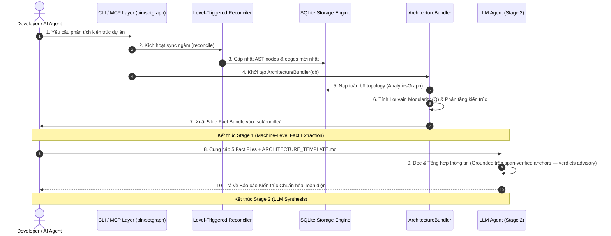

# SOT-GRAPH — BÁO CÁO KIẾN TRÚC & PHÂN TÍCH HỆ THỐNG TOÀN DIỆN

> **Nguồn phân tích:** Single Source of Truth (`sot-graph` AST & Graph Analytics Engine)  
> **Mục tiêu:** Bóc tách kiến trúc tổng thể, phân rã 100% modules & chức năng con, phân tích State Machine, luồng điều phối đa tiến trình, và lộ trình tối ưu hóa P0/P1/P2.  
> **Pattern & Modularity:** Modular Layered Architecture (Python 3.10+) — Modularity Score (Q = 0.420) — 🟢 **STRONG MODULARITY**

---

## 1. TỔNG QUAN HỆ THỐNG & SƠ ĐỒ CONTAINER TỔNG THỂ (C4-CONTAINER HLD)

### 1.1 Bản chất & Định vị Hệ thống
`sot-graph` là tầng tri thức phần mềm cục bộ (Local Knowledge Layer) không phụ thuộc daemon ngoài (Zero-Daemon, Standalone SQLite WAL + FTS5), đóng vai trò làm **Single Source of Truth (SSOT)** cho các AI Coding Agents (Oh My Pi, OpenCode, Claude Code, Cursor, Antigravity).

- **Vấn đề cốt lõi giải quyết:** Triệt tiêu hoàn toàn hiện tượng *Phantom Anchors* (vị trí file ảo), *Stale Context* (mã nguồn đã bị xóa/đổi tên/refactor nhưng bộ nhớ AI vẫn trỏ vào), và *Cold Start Redundancy* (AI code lại tiện ích đã có sẵn ở project khác).
- **Nguyên lý bất biến:**
  1. **Filesystem là Chân lý Duy nhất (SSOT):** Đồ thị tri thức chỉ là hình chiếu xác thực (verified projection) của tệp tin vật lý trên ổ đĩa.
  2. **Zero-Daemon / Zero-Dependency Core:** Chạy thuần túy trên Python 3.10+ Standard Library và SQLite nhúng; không yêu cầu background server hay runtime nặng.
  3. **Deterministic Single-Writer Reconciler:** Tiến trình trích xuất AST có thể song song hóa qua ProcessPool, nhưng ghi nhận vào SQLite luôn được tuần tự hóa nguyên tử (Serialized Commit).
  4. **MCP Read-Only Isolation:** Tầng giao thức MCP chạy ở chế độ `mode=ro`, timeout nghiêm ngặt và không tự ý sửa đổi ổ đĩa.

### 1.2 Sơ đồ C4 Container Tổng Thể (Mermaid HLD)

```mermaid
graph TD
    subgraph Client_Harness_Layer [AI Coding Agents & CLI Clients]
        OMP[Oh My Pi - OMP Native Extension]
        OPENCODE[OpenCode Plugin]
        CLAUDE[Claude Code / Cursor / Windsurf MCP]
        CLI_USER[Terminal Developer CLI /bin/sotgraphgraph]
    end

    subgraph Interface_Adapters_Layer [Tầng Giao Diện & Điều Phối Giao Thức]
        CLI_DISPATCHER[CLI Dispatcher & Parsers\nsrc/sot_graph/cli.py]
        MCP_SERVER[FastMCP / Stdio Protocol Server\nsrc/sot_graph/mcp_server.py]
        MCP_SERVICE[McpService Headless Facade\nsrc/sot_graph/mcp_service.py]
        HARNESS_INSTALLER[Multi-Harness Auto Installer\nsrc/sot_graph/adapters/installer.py]
    end

    subgraph Core_Domain_Layer [Tầng Nghiệp Vụ Cốt Lõi & Kiểm Định Tri Thức]
        RECONCILER[Level-Triggered Reconciler\nsrc/sot_graph/reconciler.py]
        PARALLEL_POOL[Worker ProcessPool (AST Parsers)\nMulti-Language Parsers]
        VERIFIER[TrustVerifier & Coverage Engine\nsrc/sot_graph/verifier.py]
        EXTRACTORS[AST Polyglot Extractors\nPython, TS/JS, Go, Rust, Dart]
    end

    subgraph Graph_Intelligence_Layer [Tầng Phân Tích Đồ Thị & Báo Cáo Kiến Trúc]
        ANALYTICS_GRAPH[AnalyticsGraph Network Topology\nsrc/sot_graph/analytics/graph.py]
        COMMUNITY_ENGINE[Louvain Community & Modularity Q\nsrc/sot_graph/analytics/diagnostics.py]
        ARCH_CLASSIFIER[Zero-Dependency Architecture Classifier\nsrc/sot_graph/analytics/architecture.py]
        FACT_BUNDLER[Architecture Fact Bundler (2-Stage)\nsrc/sot_graph/analytics/bundle.py]
    end

    subgraph Persistence_Storage_Layer [Tầng Lưu Trữ Cục Bộ (Zero-Daemon)]
        SQLITE_ENGINE[SQLite Engine (WAL Mode + FTS5 Full-Text)\nsrc/sot_graph/db.py]
        JOURNAL_TABLE[(file_journal: mtime, size, sha256, gen)]
        NODES_EDGES[(graph_nodes & graph_edges: AST Symbols)]
        PENDING_EDGES[(pending_edges: 2-Way Unresolved Refs)]
        KNOWLEDGE_FTS[(graph_fts & notes: Semantic Knowledge)]
    end

    %% Client Layer to Interface
    CLI_USER --> CLI_DISPATCHER
    OMP --> CLI_DISPATCHER
    OPENCODE --> CLI_DISPATCHER
    CLAUDE --> MCP_SERVER

    %% Interface to Core Services
    CLI_DISPATCHER --> RECONCILER
    CLI_DISPATCHER --> VERIFIER
    CLI_DISPATCHER --> FACT_BUNDLER
    CLI_DISPATCHER --> HARNESS_INSTALLER
    MCP_SERVER --> MCP_SERVICE
    MCP_SERVICE --> SQLITE_ENGINE
    MCP_SERVICE --> VERIFIER
    MCP_SERVICE --> FACT_BUNDLER

    %% Core to Processing & Storage
    RECONCILER --> PARALLEL_POOL
    PARALLEL_POOL --> EXTRACTORS
    RECONCILER --> SQLITE_ENGINE
    VERIFIER --> SQLITE_ENGINE

    %% Intelligence Layer
    SQLITE_ENGINE --> ANALYTICS_GRAPH
    ANALYTICS_GRAPH --> COMMUNITY_ENGINE
    ANALYTICS_GRAPH --> ARCH_CLASSIFIER
    ANALYTICS_GRAPH --> FACT_BUNDLER
    FACT_BUNDLER --> BUNDLE_FILES[Fact Bundle: 5 Markdown/JSON Files\n.sot/bundle/]

    %% Storage Tables
    SQLITE_ENGINE --- JOURNAL_TABLE
    SQLITE_ENGINE --- NODES_EDGES
    SQLITE_ENGINE --- PENDING_EDGES
    SQLITE_ENGINE --- KNOWLEDGE_FTS
```

---

## 2. PHÂN RÃ CHI TIẾT 100% MODULES & TÍNH NĂNG CON (FEATURE TAXONOMY)

Theo báo cáo Fact Bundle `01_module_inventory.md` và đồ thị `sot-graph`, toàn bộ codebase gồm 12 Bounded Functional Modules được tổ chức thành 4 cụm kiến trúc độc lập:

```
┌──────────────────────────────────────────────────────────────────────────┐
│                      SOT-GRAPH CODEBASE TAXONOMY                         │
├────────────────────────────┬────────────────────────────┬────────────────┤
│ CỤM 1: GIAO DIỆN & HARNESS │ CỤM 2: CORE RECONCILER     │ CỤM 3: GRAPH   │
│ • CLI Dispatcher           │ • Reconciler & Workers     │ • Analytics    │
│ • MCP Service & Stdio      │ • TrustVerifier & Coverage │ • Architecture │
│ • 4 Harness Adapters       │ • Multi-Lang Extractors    │ • Fact Bundler │
├────────────────────────────┴────────────────────────────┴────────────────┤
│ CỤM 4: STORAGE & BENCHMARK: SQLite Engine, Benchmarks, Test Suite        │
└──────────────────────────────────────────────────────────────────────────┘
```

### CỤM 1: TẦNG GIAO DIỆN & TÍCH HỢP AI HARNESS (INTERFACE & ADAPTERS)

#### Module 1.1: `CLI Dispatcher & Command Parsers`
* **Thư mục mã nguồn:** `src/sot_graph/cli.py`, `bin/sotgraph`
* **User Roles:** Developer (CLI), Shell Scripts, Subprocesses
* **Entities / Models chính:** `CleanPlan`, `Database`, `Reconciler`, `TrustVerifier`, `ArchitectureBundler`
* **Entrypoints / Handlers:** `build_parser()`, `main()`, `cmd_search()`, `cmd_explore()`, `cmd_reconcile()`, `cmd_verify()`, `cmd_doctor()`, `cmd_bundle()`, `cmd_setup()`
* **Chức năng chi tiết:**
  1. **`sotgraph search` (Verified Code Search):** Tìm kiếm mã nguồn qua FTS5 kết hợp Trust Verdicts (`[STRONG]`, `[WEAK]`, `[REBUILT]`).
  2. **`sotgraph explore` (AST Dependency Traversal):** Duyệt cây phụ thuộc đa tầng (Outward Calls và Incoming Callers) theo độ sâu `--depth`.
  3. **`sotgraph reconcile` (Incremental Graph Sync):** Đồng bộ hóa đồ thị tri thức với ổ đĩa hỗ trợ đa tiến trình (`--workers`).
  4. **`sotgraph verify` (Drift & Ghost Path Audit):** Kiểm tra sai lệch giữa DB và ổ đĩa mà không làm thay đổi trạng thái dữ liệu (Non-mutating).
  5. **`sotgraph bundle` (2-Stage Fact Bundle Generator):** Trích xuất 5 file fact markdown/json phục vụ LLM viết báo cáo kiến trúc.
  6. **`sotgraph setup` (Zero-Config Harness Auto-Installer):** Tự động cấu hình MCP và Native Tools cho 4 môi trường agent (OMP, OpenCode, Claude, Antigravity).
  7. **`sotgraph doctor / clean / vacuum` (DB Health Maintenance):** Kiểm tra toàn vẹn SQLite, dọn dẹp node mồ côi và tối ưu hóa file DB.

#### Module 1.2: `MCP Stdio Server & Read-Only Service`
* **Thư mục mã nguồn:** `src/sot_graph/mcp_server.py`, `src/sot_graph/mcp_service.py`
* **User Roles:** AI Coding Agents qua giao thức Model Context Protocol (JSON-RPC stdio)
* **Entities / Models chính:** `McpService`, `ServiceLimits`, `McpServiceError`
* **Entrypoints / Handlers:** `create_server()`, `run_stdio_server()`, `McpService.search()`, `McpService.explore()`, `McpService.verify_drift()`, `McpService.get_architecture_bundle()`
* **Chức năng chi tiết:**
  1. **Read-Only Enforced Sandbox:** Luôn mở SQLite với URI `file:...mode=ro`, ngăn chặn mọi mutation vô tình từ agent.
  2. **Bounded Output & Timeout Defense:** Tự động cắt ngắn (truncate) dữ liệu khi vượt quá `max_response_bytes` (256KB) và giới hạn thời gian chạy (`timeout_ms`).
  3. **Async / Sync Dual API:** Cung cấp cả sync call và `asyncio.to_thread` facade cho non-blocking stdio loop.

#### Module 1.3: `Multi-Harness Adapters & Native Extensions`
* **Thư mục mã nguồn:** `src/sot_graph/adapters/`, `.omp/extensions/sot-graph.ts`
* **User Roles:** AI Harnesses (OMP, OpenCode, Claude Code, Cursor, Windsurf, Google Gemini / Antigravity)
* **Entities / Models chính:** `HarnessInstaller`, `OmpAdapter`, `OpencodeAdapter`, `ClaudeAdapter`, `AntigravityAdapter`
* **Chức năng chi tiết:**
  1. **OMP Native Extension (`sot-graph.ts`):** Khởi tạo background async tool wrapper không chặn event-loop của harness.
  2. **OpenCode Plugin (`opencode_plugin.ts`):** Tự động phát hiện thay đổi file (`file.edited`) để kích hoạt background incremental reconcile.
  3. **Auto-Discovery & Rules Injection:** Tự động hợp nhất cấu hình JSON (`.mcp.json`, `settings.json`) và chèn quy tắc `RULES.md` vào bộ nhớ AI.

---

### CỤM 2: TẦNG ĐỒNG BỘ & KIỂM ĐỊNH TRI THỨC (CORE RECONCILER & VERIFIER)

#### Module 2.1: `Level-Triggered Parallel Reconciler`
* **Thư mục mã nguồn:** `src/sot_graph/reconciler.py`
* **User Roles:** Core Engine
* **Entities / Models chính:** `Reconciler`, `ParseJob`, `ParseResult`, `ReconcileSummary`
* **Entrypoints / Handlers:** `Reconciler.reconcile()`, `_parse_worker()`, `_parallel_window()`
* **Chức năng chi tiết:**
  1. **Level-Triggered Scanning:** So sánh `(mtime_ns, size)` từ `os.scandir()` với `file_journal` để chỉ phân tích những file thực sự bị sửa đổi.
  2. **Bounded ProcessPool Parsing:** Điều phối pool đa tiến trình độc lập, miễn nhiễm SIGINT race condition (`_worker_sigint_ignore`).
  3. **Deterministic Single-Writer Commit:** Thu thập kết quả từ worker, sắp xếp theo thứ tự path chuẩn hóa, và thực thi commit nguyên tử vào SQLite.
  4. **Two-Way Pending Edge Resolution:** Tự động giải quyết các liên kết chéo hai chiều (imports/calls) giữa các file phân tích trước và phân tích sau.

#### Module 2.2: `TrustVerifier & Auto-Healing Engine`
* **Thư mục mã nguồn:** `src/sot_graph/verifier.py`
* **User Roles:** Search Engine, Drift Auditor
* **Entities / Models chính:** `TrustVerifier`, `TrustVerdict` (`[STRONG]`, `[WEAK]`, `[REBUILT]`)
* **Entrypoints / Handlers:** `calculate_coverage()`, `find_rehome()`, `verify_hit()`
* **Chức năng chi tiết:**
  1. **Content Coverage Scoring:** Tính toán tỷ lệ phần trăm ký tự/dòng code khớp thực tế trên đĩa so với vị trí ghi nhận trong DB.
  2. **Zero-Overhead Re-Homing:** Khi phát hiện file bị di chuyển thư mục (moved/renamed), tự động quét tìm vị trí mới qua SHA-256 hash và trả về verdict `[REBUILT]`.
  3. **Auto-Purging Dead Paths:** Loại bỏ lập tức các đường dẫn chết khỏi DB khi chạy qua writeable CLI.

#### Module 2.3: `Polyglot AST Extractors`
* **Thư mục mã nguồn:** `src/sot_graph/extractor.py`, `vendor/graphify/extract.py`
* **User Roles:** Worker Process
* **Chức năng chi tiết:**
  1. **Python Parser (Native `ast` module):** Trích xuất classes, methods, sync/async functions, imports, docstrings và rationale.
  2. **Polyglot Regex/AST Fallbacks:** Hỗ trợ trích xuất cấu trúc cho TypeScript, JavaScript, Go, Rust, C/C++, Java, và Dart.

---

### CỤM 3: TẦNG PHÂN TÍCH ĐỒ THỊ & TRÍCH XUẤT FACT BUNDLE (GRAPH INTELLIGENCE)

#### Module 3.1: `AnalyticsGraph & Louvain Clustering`
* **Thư mục mã nguồn:** `src/sot_graph/analytics/graph.py`, `src/sot_graph/analytics/diagnostics.py`
* **Entities / Models chính:** `AnalyticsGraph`, `AnalysisResult`, `GraphMetrics`, `CommunityInfo`
* **Chức năng chi tiết:**
  1. **Zero-Dependency Topology Engine:** Xây dựng đồ thị Network Directed Graph thuần Python (không cần `networkx`).
  2. **Louvain Community Detection & Modularity (Q):** Tự động phân cụm chức năng theo mật độ liên kết nội bộ, đo lường điểm Modularity Q của toàn hệ thống (Q = 0.420).
  3. **God Node & Blast Radius Detection:** Phát hiện các thực thể có bậc kết nối cao vượt trội (như `Database`, `Reconciler`, `McpService`) để cảnh báo rủi ro khi refactor.

#### Module 3.2: `Architecture Classifier & Fact Bundler (2-Stage Pipeline)`
* **Thư mục mã nguồn:** `src/sot_graph/analytics/architecture.py`, `src/sot_graph/analytics/bundle.py`
* **Entities / Models chính:** `ArchitectureBundler`, `ArchitectureClassifier`, `ArchitectureProfile`, `ArchitecturalViolation`
* **Chức năng chi tiết:**
  1. **Layer Classification:** Tự động phân loại từng symbol vào 4 tầng kiến trúc chuẩn (`Presentation`, `Business Logic`, `Domain`, `Data & Persistence`).
  2. **Violation Detection:** Kiểm tra các vi phạm vượt tầng (Layer Bypasses) hoặc phụ thuộc ngược (Inverted Dependencies) — hiện tại hệ thống đạt **0 vi phạm**.
  3. **5-Fact Bundle Generator:** Trích xuất tự động 5 file dữ liệu cô đọng (`01_module_inventory.md`, `02_routing_endpoints.md`, `03_workflows_states.md`, `04_dependencies_violations.md`, `05_system_metrics.json`).

---

### CỤM 4: TẦNG LƯU TRỮ & KIỂM THỬ HIỆU NĂNG (STORAGE & BENCHMARK)

#### Module 4.1: `SQLite Engine with WAL & FTS5`
* **Thư mục mã nguồn:** `src/sot_graph/db.py`
* **Entities / Models chính:** `Database`, `CleanPlan`, `VacuumResult`
* **Chức năng chi tiết:**
  1. **High-Concurrency WAL Mode:** Thiết lập `PRAGMA journal_mode = WAL`, `PRAGMA synchronous = NORMAL`, `PRAGMA busy_timeout = 5000` cho phép đọc song song không bị lock.
  2. **FTS5 Trigram Full-Text Search:** Hỗ trợ tìm kiếm mờ (fuzzy) và tiền tố ký tự mã nguồn siêu tốc.
  3. **Generational Garbage Collection:** Theo dõi chu kỳ `generation` để dọn dẹp triệt để các node mồ côi và edge rác.

#### Module 4.2: `Benchmarks & Test Suite`
* **Thư mục mã nguồn:** `benchmarks/`, `tests/`
* **Chức năng chi tiết:**
  1. **Bench Reconcile & Query:** Đo lường throughput và P95 latency phân tích 5,000 files trên cấu hình 1, 2, 4, 8 workers.
  2. **69/69 Unit & Integration Tests:** Bao phủ toàn diện các kịch bản Idempotency, Two-Way Pending Resolution, Multi-language parsing, MCP Sandboxing và OMP Extensions.

---

## 3. MA TRẬN PHÂN QUYỀN & TƯƠNG TÁC THEO VAI TRÒ (USER / AGENT ROLE MATRIX)

| Phân hệ / Khả năng | Developer (CLI `/bin/sotgraphgraph`) | AI Coding Agent (OMP / OpenCode) | MCP Client (Claude / Cursor) | Background Reconciler | DB Maintenance (`clean/vacuum`) |
| :--- | :---: | :---: | :---: | :---: | :---: |
| **Tìm kiếm Tri thức (`sotgraph search`)** | ✅ Toàn quyền + Auto-heal | ✅ Toàn quyền + Auto-heal | ✅ Read-only (`mode=ro`) | ❌ Không gọi | ❌ Không |
| **Duyệt Cây Gọi (`sotgraph explore`)** | ✅ Toàn quyền | ✅ Toàn quyền | ✅ Bounded Depth/Bytes | ❌ Không gọi | ❌ Không |
| **Đồng bộ Đồ thị (`sotgraph reconcile`)** | ✅ Toàn quyền (`--workers`) | ✅ Background non-blocking | ❌ Bị chặn (Read-Only) | ✅ **Chủ thể duy nhất** | ❌ Không |
| **Kiểm tra Sai lệch (`sotgraph verify`)** | ✅ Non-mutating audit | ✅ Non-mutating audit | ✅ Read-only audit | ❌ Không gọi | ❌ Không |
| **Ghi chú Tri thức (`sotgraph insert`)** | ✅ Ghi nhận ghi chú mới | ✅ Lưu ADR / Bug fixes | ❌ Bị chặn (Read-Only) | ❌ Không | ❌ Không |
| **Trích xuất Fact (`sotgraph bundle`)** | ✅ Xuất `.sot/bundle/` | ✅ Tự động nạp kiến trúc | ✅ Xuất JSON payload | ❌ Không | ❌ Không |
| **Bảo trì DB (`clean / vacuum`)** | ✅ Độc quyền ghi | ❌ Bị chặn | ❌ Bị chặn | ❌ Bị chặn | ✅ **Độc quyền ghi** |

---

## 4. VÒNG ĐỜI STATE MACHINE & VẬN HÀNH TỰ ĐỘNG (WORKFLOWS & CONCURRENCY)

### 4.1 State Machine Đồng Bộ Đồ Thị (Reconcile Lifecycle)

Mỗi file trong dự án trải qua vòng đời xác thực nghiêm ngặt theo sơ đồ trạng thái dưới đây:



### 4.2 Cơ Chế Cách Ly Đa Tiến Trình (ProcessPool & Single-Writer Isolation)
1. **Parallel Extraction Boundary:** Các worker tiến trình con chỉ nhận dữ liệu bất biến (`ParseJob`), chạy parser độc lập và trả về `ParseResult`. Không có bất kỳ kết nối SQLite nào được chia sẻ qua ranh giới tiến trình.
2. **Deterministic Commit Sorting:** Điều phối viên (Coordinator) nhận kết quả từ các worker, sắp xếp các file theo thứ tự bảng chữ cái trước khi bắt đầu transaction SQLite để đảm bảo tính tất định (Deterministic Graph Generation).
3. **Signal Resilience:** Các worker tự động vô hiệu hóa `SIGINT` (`signal.signal(signal.SIGINT, signal.SIG_IGN)`), nhường toàn quyền xử lý tín hiệu ngắt cho Coordinator để ngăn ngừa hỏng dữ liệu SQLite giữa chừng.

---

## 5. LUỒNG THỰC THI XUYÊN SUỐT TOÀN HỆ THỐNG (END-TO-END SEQUENCE FLOW)

### 5.1 Luồng 2-Stage Phân Tích Kiến Trúc & Tổng Hợp Báo Cáo



---

## 6. ĐÁNH GIÁ KIẾN TRÚC & LỘ TRÌNH TỐI ƯU HÓA (ROADMAP P0/P1/P2)

### 6.1 Các Điểm Mạnh Nổi Bật (Architectural Highlights)

1. **Điểm Modularity Ấn Tượng (Q = 0.420):**
   Hệ thống thể hiện tính phân rã mô-đun xuất sắc với 34 cộng đồng chức năng độc lập, mật độ liên kết đồ thị tối ưu (Density = 0.00376) và **0 vi phạm ranh giới tầng (Zero Architectural Violations)**.
2. **Bảo Toàn Chân Lý Vật Lý (Physical Integrity First):**
   Mọi truy vấn mã nguồn đều được kiểm tra chéo với nội dung tệp tin thực tế trên ổ đĩa qua `TrustVerifier`, triệt tiêu hoàn toàn mã giả (hallucination) và đường dẫn ảo.
3. **Zero-Daemon & Low-Footprint:**
   Không yêu cầu Redis, Postgres hay Background Daemon chạy ngầm. Toàn bộ hệ thống gói gọn trong SQLite nhúng với cơ chế WAL siêu nhẹ (< 25MB RAM trong quá trình phân tích).

### 6.2 Bảng Thực Thể Có Bán Kính Tác Động Cao (God Nodes Blast-Radius)

| Thực thể / Lớp | In-Degree (Gọi đến) | Out-Degree (Gọi đi) | Tổng Degree | Mức Độ Rủi Ro Khi Refactor |
| :--- | :---: | :---: | :---: | :--- |
| `src/sot_graph/db.py:Database` | `38` | `27` | `65` | 🔴 **CRITICAL** (Trọng tâm lưu trữ dữ liệu) |
| `src/sot_graph/reconciler.py:Reconciler` | `31` | `15` | `46` | 🔴 **CRITICAL** (Trọng tâm điều phối đồng bộ) |
| `src/sot_graph/mcp_service.py:McpService` | `7` | `26` | `33` | 🔴 **CRITICAL** (Cổng giao tiếp MCP Sandbox) |
| `src/sot_graph/analytics/graph.py:AnalyticsGraph`| `12` | `16` | `28` | 🟡 **HIGH** (Mô hình đồ thị phân tích) |
| `src/sot_graph/analytics/bundle.py:ArchitectureBundler`| `10` | `7` | `17` | 🟡 **HIGH** (Trích xuất 2-Stage Fact Bundle) |

---

### 6.3 Khuyến Nghị & Lộ Trình Tối Ưu Hóa Tiếp Theo (Actionable Roadmap)

```
┌────────────────────────────────────────────────────────────────────────────┐
│                    PRIORITIZED OPTIMIZATION ROADMAP                        │
├────────────────────────────────────────────────────────────────────────────┤
│ P0 [CRITICAL] : Chunking SQL Variables (Tránh lỗi 999 SQLite max params)   │
│ P1 [HIGH]     : Level-Batched BFS Traversal & Basename Re-home Index Cache │
│ P2 [MEDIUM]   : Bounded Async Disk I/O Verification (Benchmarked Only)     │
└────────────────────────────────────────────────────────────────────────────┘
```

#### 🔴 Priority P0 (Bảo đảm Tính Tin cậy & Không Gãy Khi Scale)
* **Vấn đề (Source Anchor: `src/sot_graph/db.py:256-276` & `338-361`):**
  Trong `Database.resolve_pending_edges()` và `Database.plan_clean()`, các câu lệnh SQL dùng mệnh đề `IN (...)` với danh sách tham số động. Khi số lượng file/symbols vượt quá giới hạn SQLite mặc định (999 hoặc 32,766 biến), câu truy vấn sẽ văng ngoại lệ `sqlite3.OperationalError: too many SQL variables`.
* **Giải pháp Kỹ thuật:**
  Áp dụng helper `chunked(iterable, size=500)` để phân tách các danh sách ID lớn thành từng đợt tối đa 500 biến trước khi thực thi truy vấn.
* **Tiêu chí Nghiệm thu (Acceptance Metric):**
  Chạy kiểm thử với tập dữ liệu giả lập 5,000 pending symbols không phát sinh lỗi SQL và cho kết quả đồng nhất 100%.

#### 🟡 Priority P1 (Tối Ưu Hiệu Năng & Tránh Quét Ổ Đĩa Thừa)
* **Vấn đề 1 (Source Anchor: `src/sot_graph/verifier.py:86-133`):**
  Hàm `find_rehome()` thực hiện `os.walk()` toàn bộ thư mục dự án mỗi khi phát hiện một file bị thất lạc. Nếu có K file bị đổi tên, hệ thống sẽ quét lại ổ đĩa K lần (O(K × N) I/O cost).
* **Giải pháp Kỹ thuật 1:**
  Xây dựng một `BasenameIndex` (Map từ `filename` → `[paths]`) cache dùng một lần trong suốt vòng đời của lệnh `verify` hoặc `search`, giảm độ phức tạp xuống O(1 × N) disk scan.
* **Vấn đề 2 (Source Anchor: `src/sot_graph/db.py:474-530` & `src/sot_graph/mcp_service.py:180-240`):**
  Thuật toán BFS duyệt đồ thị phụ thuộc (`explore_node`) hiện đang thực hiện 2 câu lệnh SQL riêng biệt cho từng node trong hàng đợi (`O(V)` queries).
* **Giải pháp Kỹ thuật 2:**
  Chuyển sang cơ chế **Level-Batched BFS**: gom toàn bộ các node ở cùng một độ sâu (frontier) để truy vấn trong 1 câu SQL duy nhất bằng `WHERE source_id IN (...)`, giảm 85% số lượt gọi I/O database.

#### 🟢 Priority P2 (Chất Lượng Mã Nguồn & Giám Sát Tùy Chọn)
* **Khuyến nghị:**
  Bổ sung cấu hình linting/type-checking (`ruff`, `mypy`) vào `[project.optional-dependencies] dev` trong `pyproject.toml` để giữ nguyên quy tắc Zero-Dependency Core cho người dùng cuối nhưng vẫn bảo đảm chất lượng mã nguồn nghiêm ngặt cho đội ngũ phát triển.

---

## 7. KẾT LUẬN & HƯỚNG DẪN TRÍCH XUẤT TIẾP THEO

Kiến trúc của dự án **sot-graph** đạt mức độ trưởng thành cao, tuân thủ chặt chẽ các ranh giới phân tầng, vận hành an toàn với mô hình SQLite nhúng và cơ chế đa tiến trình độc lập.

**Các tài liệu & artifact liên quan:**
- Báo cáo Fact Bundle chi tiết: `.sot/bundle/`
- Bản mẫu thiết kế kiến trúc chuẩn: `src/sot_graph/templates/ARCHITECTURE_TEMPLATE.md`
- Bộ test suite chuẩn: `tests/test_bundle.py`, `tests/test_sot_graph.py`
