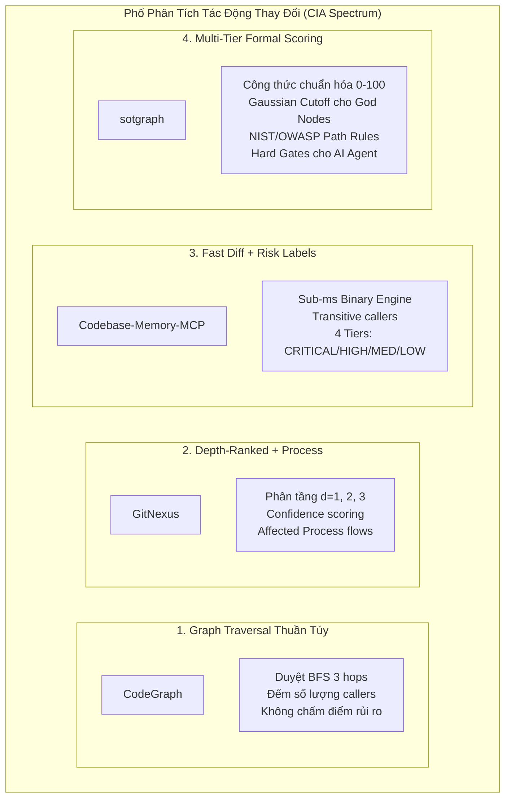
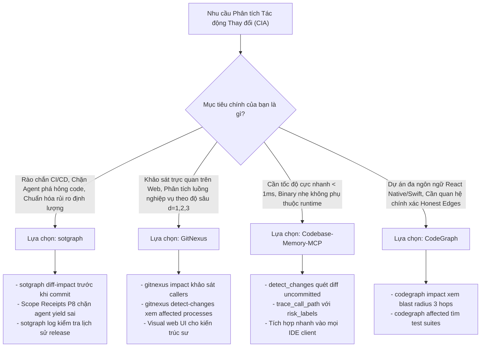

# Báo Cáo So Sánh Chuyên Sâu: Đánh Giá Tác Động Thay Đổi (Change Impact Analysis) & Phân Loại Rủi Ro giữa sotgraph, GitNexus, CodeGraph và Codebase-Memory-MCP

> **Tài liệu Phân tích Kỹ thuật & Đối chiếu Khung Đánh giá Tác động (CIA Framework Benchmark)**  
> **Phiên bản:** 1.0.0  
> **Phạm vi đối chiếu:** `sotgraph`, `gitnexus`, `codegraph`, `codebase-memory-mcp`.  
> **Đối tượng:** Software Architects, Tech Leads, Security Engineers, AI Coding Agent Developers.

---

## 📑 Mục Lục
1. [Bối cảnh & Tóm tắt Điều hành](#1-bối-cảnh--tóm-tắt-điều-hành)
2. [Chi tiết Kiến trúc & Phương pháp Đánh giá của Từng Hệ thống](#2-chi-tiết-kiến-trúc--phương-pháp-đánh-giá-của-từng-hệ-thống)
   - [2.1. sotgraph: Đa Tầng, Chuẩn Hóa Điểm Định Lượng & Rào Chắn Nghiêm Ngặt](#21-sotgraph-đa-tầng-chuẩn-hóa-điểm-định-lượng--rào-chắn-nghiêm-ngặt)
   - [2.2. GitNexus: Bán Kính Nổ Theo Tầng Sâu & Trọng Số Tin Cậy](#22-gitnexus-bán-kính-nổ-theo-tầng-sâu--trọng-số-tin-cậy)
   - [2.3. CodeGraph: Duyệt Đồ Thị Thuần Túy & Nguyên Tắc "Honest Edges"](#23-codegraph-duyệt-đồ-thị-thuần-túy--nguyên-tắc-honest-edges)
   - [2.4. Codebase-Memory-MCP: Lập Bản Đồ Diff Siêu Tốc & Gắn Nhãn Rủi Ro 4 Cấp](#24-codebase-memory-mcp-lập-bản-đồ-diff-siêu-tốc--gắn-nhãn-rủi-ro-4-cấp)
3. [Bảng Đối Chiếu Kỹ Thuật 10 Chiều (10-Dimension Architectural Comparison Matrix)](#3-bảng-đối-chiếu-kỹ-thuật-10-chiều-10-dimension-architectural-comparison-matrix)
4. [So sánh Chuyên sâu về Thuật toán & Mô hình Toán học](#4-so-sánh-chuyên-sâu-về-thuật-toán--mô-hình-toán-học)
5. [Kịch bản Ứng dụng Thực tế & Hướng dẫn Lựa chọn (Decision Framework)](#5-kịch-bản-ứng-dụng-thực-tế--hướng-dẫn-lựa-chọn-decision-framework)
6. [Tài liệu Tham chiếu Chéo](#6-tài-liệu-tham-chiếu-chéo)

---

## 1. Bối cảnh & Tóm tắt Điều hành

Khi các AI Coding Agent (Oh My Pi, Claude Code, Cursor, OpenCode, Codex, Gemini CLI) thực hiện các thay đổi mã nguồn quy mô lớn hoặc tái cấu trúc (refactoring), câu hỏi quan trọng nhất đối với hệ thống CI/CD và Tech Lead là:
> **"Thay đổi này có làm gãy vỡ hệ thống không? Bán kính nổ (blast radius) là bao nhiêu, và mức độ rủi ro thuộc cấp độ nào?"**

Các công cụ Code Intelligence Graph hiện đại đã giải quyết bài toán này qua cơ chế **Phân tích Tác động Thay đổi (Change Impact Analysis - CIA)**, nhưng hướng tiếp cận giữa các giải pháp có sự phân hóa rõ rệt:

### Tóm tắt nhanh:
1. **`sotgraph`**: Sở hữu hệ thống đánh giá tác động **toàn diện và có cơ sở toán học / tiêu chuẩn bảo mật khắt khe nhất** (kết hợp Tiền kiểm pre-merge 0-100 điểm, Hồi cứu commit history, Chẩn đoán kiến trúc vĩ mô phân phối chuẩn Gaussian, và Rào chắn Scope Receipts P8).
2. **`gitnexus`**: Tập trung vào **độ sâu lan tỏa (d = 1, 2, 3) và tác động lên luồng nghiệp vụ (Business Processes)**, gắn điểm tin cậy phần trăm (*confidence score*) cho từng liên kết để loại trừ quan hệ mập mờ.
3. **`codebase-memory-mcp`**: Tối ưu hóa **tốc độ thực thi siêu nhanh (sub-millisecond)** bằng binary tĩnh viết bằng C/Go, tự động quét Git diff chưa commit và gán nhãn rủi ro 4 mức (`CRITICAL`, `HIGH`, `MEDIUM`, `LOW`) dựa trên độ sâu gọi và các điểm nóng (*hotspots*).
4. **`codegraph`**: Tiếp cận theo hướng **đo đạc hình học thuần túy (Graph Traversal Metrics)**, trả về số lượng caller, số file bị chạm trong 3 hops và file test liên quan; **hoàn toàn không có bộ chấm điểm hay phân loại mức độ rủi ro**.
---

## 2. Chi tiết Kiến trúc & Phương pháp Đánh giá của Từng Hệ thống

### 2.1. sotgraph: Đa Tầng, Chuẩn Hóa Điểm Định Lượng & Rào Chắn Nghiêm Ngặt

sotgraph (Single Source of Truth Knowledge Graph) triển khai cơ chế CIA theo 3 cơ chế độc lập nhưng tương hỗ (được định nghĩa chi tiết tại `docs/SOT_GRAPH_IMPACT_ASSESSMENT_REPORT.md`):

#### A. Tiền kiểm Mã Nguồn (`sotgraph diff-impact` / `xd://mcp__sot_graph_sot_diff_impact`)
- **Đầu vào:** Working tree chưa commit, staged diff, hoặc commit range (`git diff`).
- **Quy trình 4 bước:**
  1. *Git Delta Extraction:* Tách các diff hunks và khoảng dòng thay đổi `[start_line, end_line]`.
  2. *AST Coordinate Mapping:* Ánh xạ khoảng dòng với tọa độ vật lý của các hàm/lớp trong CSDL `.sot/sot.db`.
  3. *BFS Reverse Call-Graph Traversal:* Truy vết ngược đồ thị theo các quan hệ `calls`, `extends`, `implements`, `uses`, `imports` để tìm toàn bộ inward callers bị ảnh hưởng gián tiếp.
  4. *API Cross-Bindings & Test Discovery:* Đối chiếu với bảng ánh xạ Frontend URI ↔ Backend Controller, đồng thời phát hiện các test suite liên quan.
- **Công thức tính điểm rủi ro (0 – 100 điểm):**
  > `Risk Score = S_files + S_nodes + S_callers + S_apis`
  - `S_files = min(total_files × 5, 25)`
  - `S_nodes = min(total_direct_nodes × 8, 30)`
  - `S_callers = min(total_callers × 4, 25)`
  - `S_apis = min(total_apis × 10, 20)`
- **Phân loại Rủi ro & Hard Gates:**
  - 🔴 **HIGH:** `Risk Score ≥ 60` HOẶC `total_apis ≥ 3` HOẶC `total_callers ≥ 10`. Bắt buộc chạy toàn bộ test suite hồi quy, chặn tự động hoàn thành phiên làm việc của AI agent.
  - 🟡 **MEDIUM:** `Risk Score ≥ 25` HOẶC `total_callers ≥ 3` HOẶC `total_apis ≥ 1`. Yêu cầu chạy targeted unit tests.
  - 🟢 **LOW:** `Risk Score < 25`, `total_callers < 3`, `total_apis = 0`. Cho phép merge nhanh.

#### B. Hồi cứu Lịch sử Commit (`sotgraph log` / `sot_git_history`)
- Đánh giá độ rủi ro của từng commit trong lịch sử dựa trên thang Heuristic tích lũy (0 – 15+ điểm):
  - Kích thước commit (File Blast Radius): > 5 files (+1), > 15 files (+2).
  - Biến động mã nguồn (Code Churn): > 250 dòng (+1), > 800 dòng (+2).
  - Đường dẫn nhạy cảm (Security & Persistence Patterns - NIST SP 800-218): Chạm file auth/crypto (+3), database/migration (+2), build config/Dockerfile (+2).
  - Symbol trọng yếu: Sửa hàm/lớp có In-Degree ≥ 5 (+2).
- **Phân loại:** 🟢 LOW (< 2 điểm) \| 🟡 MEDIUM (2 – 4 điểm) \| 🔴 HIGH (≥ 5 điểm).

#### C. Chẩn đoán Rủi ro Kiến trúc Vĩ mô ("God Node Risk" trong `sotgraph report`)
- Sử dụng phân phối chuẩn Gaussian bậc liên kết (`d = in + out`), tính ngưỡng cắt `Cutoff = max(4, μ + 1.5σ)` và đo bán kính nổ 2 bước (`k ≤ 2`).
- **Phân loại:**
  - 🟢 **MEDIUM:** `d ≥ Cutoff`, bán kính nổ < 15%.
  - 🟡 **HIGH:** `d ≥ μ + 2.0σ` hoặc bán kính nổ ≥ 15%.
  - 🔴 **CRITICAL:** `d ≥ μ + 3.0σ` hoặc bán kính nổ ≥ 30%.

---

### 2.2. GitNexus: Bán Kính Nổ Theo Tầng Sâu & Trọng Số Tin Cậy

GitNexus (`abhigyanpatwari/GitNexus`) là công cụ Code Intelligence chạy client-side (trên trình duyệt hoặc qua MCP Server), sử dụng Tree-sitter AST kết hợp LadybugDB và thuật toán gom cụm **Leiden Community Detection**.

#### Cơ chế Thực hiện & Phương pháp:
1. **Lệnh Phân tích:** `gitnexus impact <symbol>` và `gitnexus detect-changes`.
2. **Phân rã Tác động theo Độ sâu Gọi (Depth-Ranked Blast Radius):**
   - Thay vì chấm một thang điểm tổng quát 0-100, GitNexus nhóm các caller theo khoảng cách đồ thị:
     - **d = 1 (Direct Callers):** Các hàm gọi trực tiếp symbol mục tiêu. Rủi ro gãy vỡ (*breakage risk*) cao nhất nếu chữ ký hàm hoặc kiểu trả về thay đổi.
     - **d = 2 (Secondary Callers):** Các hàm phụ thuộc gián tiếp qua 1 bước trung gian. Khả năng cao cần điều chỉnh logic nghiệp vụ.
     - **d = 3 (Tertiary Callers):** Tác động ở biên ngoài cùng, đóng vai trò xác định phạm vi chạy integration test.
3. **Trọng số Tin cậy của Cạnh (Edge Confidence Scores):**
   - Mỗi quan hệ trong đồ thị (`CALLS`, `IMPORTS`, `EXTENDS`, `IMPLEMENTS`) được gán nhãn tin cậy (ví dụ `handleLogin [CALLS 90%]`, `UserController [CALLS 85%]`). Điều này giúp AI Agent ưu tiên xử lý các đường truyền chắc chắn, lọc bớt nhiễu từ các mối quan hệ lỏng.
4. **Ánh xạ Thay đổi vào Tiến trình Nghiệp vụ (Execution Flows & Processes):**
   - GitNexus tiền tính toán (*pre-computes*) các luồng thực thi và quy trình nghiệp vụ quan trọng. Khi chạy `detect-changes`, hệ thống đối chiếu git diff với các luồng này và phân loại rủi ro dựa trên **số lượng tiến trình (processes) bị ảnh hưởng**.

---

### 2.3. CodeGraph: Duyệt Đồ Thị Thuần Túy & Nguyên Tắc "Honest Edges"

CodeGraph (`colbymchenry/codegraph`) là giải pháp Code Knowledge Graph tập trung vào hiệu năng truy vấn cục bộ, hỗ trợ giải quyết tham chiếu đa ngôn ngữ (cross-language bridge như React Native, Swift/Objective-C).

#### Cơ chế Thực hiện & Phương pháp:
1. **Lệnh Phân tích:** `codegraph impact <symbol> --depth <N>`, `codegraph affected <file>`, `codegraph_impact` (MCP tool).
2. **Thuật toán BFS Traversal:**
   - Dùng engine `GraphTraverser` duyệt ngược từ symbol đích qua các quan hệ callers, importers, dependents với tham số độ sâu tùy chọn (mặc định là 3 hops).
3. **Thống kê Bán Kính Nổ Định Lượng Hình Học (Raw Graph Metrics):**
   - Số lượng phụ thuộc trực tiếp (*direct dependents*).
   - Tổng số symbol và file mã nguồn nằm trong bán kính 3 hops.
   - Danh sách các file kiểm thử bị ảnh hưởng (*affected test files*).
4. **Nguyên tắc "Honest Edges":**
   - CodeGraph không đoán bừa quan hệ. Nếu độ phân giải tham chiếu không chắc chắn (dynamic dispatch, dynamic imports), cạnh sẽ được gắn cờ `"uncertain"` thay vì xuất hiện như một quan hệ chắc chắn.
5. **Điểm Khuyết Thiếu:**
   - **Hoàn toàn KHÔNG có hệ thống chấm điểm rủi ro (Risk Scoring Engine)**.
   - **Hoàn toàn KHÔNG phân cấp rủi ro (No Risk Tiers: LOW/MED/HIGH/CRITICAL)**.
   - Không hỗ trợ kiểm tra lịch sử commit (`sotgraph log`), không kiểm tra vỡ hợp đồng API, và không tính toán độ tập trung mã nguồn (God Nodes qua Gaussian).

---

### 2.4. Codebase-Memory-MCP: Lập Bản Đồ Diff Siêu Tốc & Gắn Nhãn Rủi Ro 4 Cấp

`codebase-memory-mcp` (phát triển bởi DeusData / iflow-mcp) là MCP Server hiệu năng cao viết bằng binary tĩnh đơn lẻ (C/Go), hướng tới tốc độ phản hồi cực nhanh (< 1ms) và tiết kiệm token cho AI Coding Agents.

#### Cơ chế Thực hiện & Phương pháp:
1. **Lệnh Phân tích:** `detect_changes` (quét uncommitted diff), `trace_call_path (risk_labels=true)`.
2. **Git Diff Mapping sang Symbol AST:**
   - Khi gọi `detect_changes`, engine quét diff đang mở trong working tree, đối chiếu từng dòng sửa đổi với bảng symbol trong đồ thị để xác định danh sách symbol trực tiếp bị sửa.
   - Thực hiện BFS mở rộng bán kính nổ tìm các callers bắc cầu (*transitive callers*).
3. **Phân loại Rủi ro 4 Cấp (Risk Classification):**
   - Phân loại rủi ro thành 4 mức: **`CRITICAL`**, **`HIGH`**, **`MEDIUM`**, **`LOW`**.
   - Bộ quy tắc phân loại dựa trên 3 tiêu chí:
     - *Độ sâu gọi (Call Depth):* Thay đổi lan truyền qua bao nhiêu tầng gọi hàm.
     - *Số lượng Caller phụ thuộc:* Số lượng module và hàm phụ thuộc vào symbol bị sửa.
     - *Phát hiện Điểm Nóng Kiến Trúc (Hotspots):* Nếu symbol bị sửa nằm trong danh sách các nút có In-Degree cao (nút hội tụ), rủi ro tự động bị nâng lên mức `HIGH` hoặc `CRITICAL`.
4. **Risk-Classified Tracing:**
   - Công cụ `trace_call_path` cho phép bật cờ `risk_labels=true`, tự động đánh dấu nhãn rủi ro lên từng chặng trong đồ thị đường đi thực thi, giúp agent nhận diện chính xác mắt xích nào dễ tổn thương nhất.

---

## 3. Bảng Đối Chiếu Kỹ Thuật 10 Chiều (10-Dimension Architectural Comparison Matrix)

| # | Chiều Kỹ Thuật (Dimension) | **sotgraph** | **GitNexus** | **CodeGraph** | **Codebase-Memory-MCP** |
| :---: | :--- | :--- | :--- | :--- | :--- |
| **1** | **Ngôn ngữ & Runtime Engine** | Python 3.10+ / Embedded SQLite WAL | TypeScript / Node.js + WASM | TypeScript / Node.js (100% Local) | Single Static Binary (C / Go) |
| **2** | **Phân tích Diff Chưa Commit (Pre-merge CIA)** | **CÓ** (`sotgraph diff-impact` / `xd://mcp__...`) | **CÓ** (`gitnexus detect-changes`) | **CÓ** (`codegraph affected / impact`) | **CÓ** (`detect_changes`) |
| **3** | **Đánh giá Lịch sử Commit (Post-commit CIA)** | **CÓ** (`sotgraph log` - Churn, NIST paths, Core in-degree) | **KHÔNG** (Chỉ kiểm tra commit-staleness) | **KHÔNG** | **KHÔNG** |
| **4** | **Chẩn đoán Rủi ro Kiến trúc Vĩ mô** | **CÓ** (Phân phối chuẩn Gaussian μ + 2σ, 3σ) | **CÓ** (Leiden Community Clustering) | **KHÔNG** | **CÓ** (Hotspots Detection) |
| **5** | **Thang Điểm Rủi Ro (Scoring Engine)** | **Công thức chuẩn hóa toán học (0 - 100)** | **Ma trận Rủi ro định tính** (Dựa trên Depth + Process) | **KHÔNG CÓ** (Chỉ xuất số lượng raw metrics) | **Thang Heuristic Phân cấp** (Dựa trên Depth + Hotspot) |
| **6** | **Phân Loại Mức Độ Rủi Ro (Risk Tiers)** | 🟢 LOW / 🟡 MEDIUM / 🔴 HIGH / 🟣 CRITICAL | LOW / MEDIUM / HIGH (theo độ sâu d = 1, 2, 3) | **KHÔNG CÓ** | 🟢 LOW / 🟡 MEDIUM / 🔴 HIGH / 🔴 CRITICAL |
| **7** | **Phát Hiện Vỡ Hợp Đồng API (API Contracts)** | **CÓ** (Ánh xạ chéo FE URI ↔ BE Controller) | **GIÁN TIẾP** (Qua API route process nodes) | **KHÔNG** | **KHÔNG** |
| **8** | **Tự Động Phát Hiện Test Case Bị Ảnh Hưởng** | **CÓ** (`impacted_tests` theo naming + DB refs) | **CÓ** (`includeTests: true`) | **CÓ** (`affected-test discovery`) | **GIÁN TIẾP** (Lọc qua caller paths) |
| **9** | **Trọng Số Tin Cậy Liên Kết (Confidence/Honest)** | **Trust Verdicts** (`[STRONG]`, `[WEAK]`, `[REBUILT]`) | **Edge Confidence %** (`CALLS [90%]`) | **Honest Edges** (Gắn cờ `"uncertain"`) | Binary Edge Matching |
| **10** | **Cơ Chế Rào Chắn CI/CD & AI Agent (Hard Gates)** | **CÓ** (Scope Receipts P8, chặn yield nếu rủi ro cao) | **CÓ** (Agent Skills: impact & refactor guidelines) | **KHÔNG** (Agent tự đọc diff thô) | **CÓ** (Cảnh báo nhãn `CRITICAL`) |

---

## 4. So sánh Chuyên sâu về Thuật toán & Mô hình Toán học

### 4.1. Khác biệt giữa Tính điểm Chuẩn hóa (sotgraph) vs Phân tầng Độ sâu (GitNexus)
- **sotgraph áp dụng Mô hình Lũy tích Độc lập (Independent Additive Model with Sub-caps):**
  > `Risk Score = min(F × 5, 25) + min(N × 8, 30) + min(C × 4, 25) + min(A × 10, 20)`
  
  *Ưu điểm:* Cho ra một con số vô hướng duy nhất (0 – 100). Dễ dàng cấu hình ngưỡng chặn tự động trong pipeline CI/CD (`if score >= 60 then fail_pipeline`). Tránh hiện tượng một chỉ số cực lớn (ví dụ đổi tên 1 file làm ảnh hưởng 100 callers) làm che lấp các chiều rủi ro khác nhờ cơ chế điểm trần (*sub-caps*).
- **GitNexus áp dụng Mô hình Phân cấp Không gian (Spatial Stratified Model):**
  > `Blast Radius = { Callers_(d=1), Callers_(d=2), Callers_(d=3) }`
  
  *Ưu điểm:* Rất trực quan cho lập trình viên và AI Agent khi tái cấu trúc mã nguồn. Agent biết chính xác phải sửa chữ ký hàm ở đâu (`d = 1`) và chỉ cần kiểm tra test ở đâu (`d = 3`).

### 4.2. Cơ sở Khoa học và Tiêu chuẩn Bảo mật
- **sotgraph** được thiết kế bám sát các tiêu chuẩn nghiên cứu khoa học:
  - *Microsoft Research (Nagappan & Ball - ICSE 2005):* Chứng minh tương quan giữa mức độ phân tán code churn với tỷ lệ lỗi sau phát hành.
  - *Just-In-Time Quality Assurance (Kamei et al. - IEEE TSE 2013):* Đánh giá rủi ro trực tiếp trên từng delta thay vì toàn bộ repository.
  - *NIST SP 800-218 (Secure Software Development Framework - SSDF):* Giám sát nghiêm ngặt các thay đổi chạm vào tệp cấu hình triển khai, phân quyền và cơ sở dữ liệu.
  - *OWASP ASVS v4.0 (Application Security Verification Standard):* Rào chắn bảo vệ API Contract và dữ liệu người dùng.
- **GitNexus, CodeGraph, Codebase-Memory-MCP** thuần túy tiếp cận theo góc nhìn **Code Intelligence & Graph Navigation** (tập trung vào việc giúp LLM định vị mã nguồn nhanh mà không bị cạn token).

---

## 5. Kịch bản Ứng dụng Thực tế & Hướng dẫn Lựa chọn (Decision Framework)

### Khuyến nghị Phối hợp Đa Công cụ (Multi-Tool Synergistic Pattern):
Trong một dự án quy mô lớn, các công cụ trên có thể phối hợp nhịp nhàng theo chu trình phát triển của AI Agent:
1. **Giai đoạn Thiết kế & Khảo sát (Exploration & Design):**
   - Sử dụng **`GitNexus`** hoặc **`CodeGraph`** để khảo sát trực quan luồng nghiệp vụ, kiểm tra độ sâu các quan hệ gọi hàm (d = 1, 2, 3).
2. **Giai đoạn Thực thi & Sửa mã (Active Coding Loop):**
   - Sử dụng **`codebase-memory-mcp`** để truy vấn ký hiệu tức thời (< 1ms) với lượng tiêu thụ token tối thiểu.
3. **Giai đoạn Nghiệm thu, Kiểm soát Rủi ro & Gatekeeper (Verification & Pre-merge Gate):**
   - Bắt buộc kích hoạt **`sotgraph` (`sotgraph diff-impact`)** để tính điểm rủi ro 0 – 100, khóa hợp đồng API Frontend-Backend, phát hiện toàn bộ test suites cần chạy, và phát hành Scope Receipt đảm bảo AI Agent không bỏ sót lỗi tiềm ẩn.

---

## 6. Tài liệu Tham chiếu Chéo
- 📘 **Báo cáo Khung Đánh giá Rủi ro sotgraph:** [`docs/SOT_GRAPH_IMPACT_ASSESSMENT_REPORT.md`](SOT_GRAPH_IMPACT_ASSESSMENT_REPORT.md)
- ⚖️ **So sánh Chi tiết GitNexus vs sotgraph:** [`docs/GITNEXUS_VS_SOT_GRAPH.md`](GITNEXUS_VS_SOT_GRAPH.md)
- 📊 **So sánh Đa bên sotgraph vs Graphify vs GitNexus:** [`docs/COMPARISONS.md`](COMPARISONS.md)
- 🏛️ **Báo cáo Kiến trúc Tổng thể sotgraph:** [`docs/ARCHITECTURE_REPORT.md`](ARCHITECTURE_REPORT.md)

---
*Bản quyền tài liệu thuộc về Dự án sotgraph (Single Source of Truth Knowledge Graph). Biên soạn năm 2026.*
