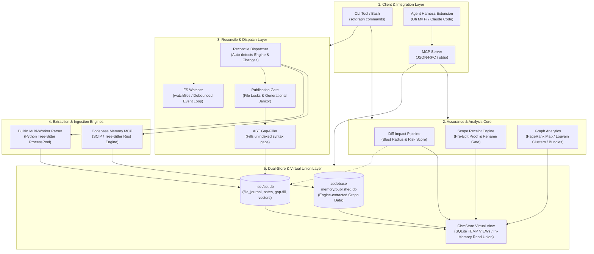
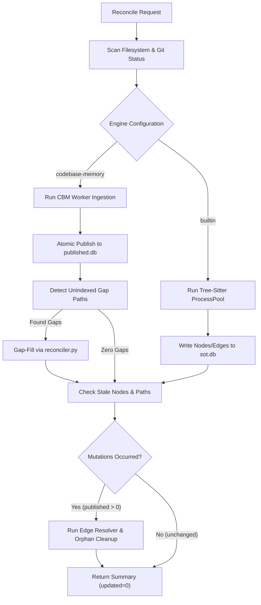
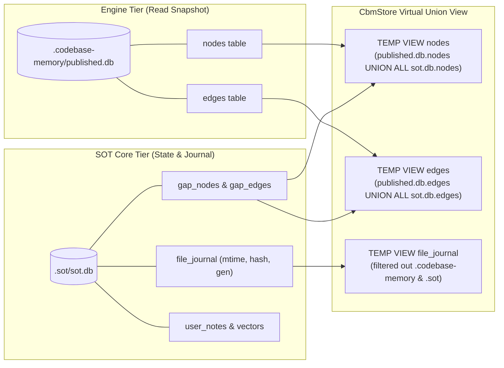

# BÁO CÁO KIẾN TRÚC HỆ THỐNG SOT-GRAPH (2026-09-13)

- **Hệ thống:** SOT-Graph (Single Source of Truth Knowledge Graph Engine)
- **Phiên bản:** v0.3.0 / v0.4.0 (Dual-Engine: `tree-sitter-ast` & `codebase-memory-mcp`)
- **Môi trường đo kiểm:** macOS Darwin 25.3.0 (Apple M1 Max, 10 Cores, 32 GB RAM, APFS SSD)
- **Tác giả:** SOT-Graph Core Engineering Team

---

## 1. TỔNG QUAN HỆ THỐNG

**SOT-Graph** là hệ thống đồ thị tri thức mã nguồn đơn nguồn chân lý (Single Source of Truth Knowledge Graph) được thiết kế chuyên biệt cho các AI Coding Agent (như Oh My Pi, Claude Code, Cursor, Windsurf) và quy trình kỹ nghệ phần mềm quy mô lớn. 

Hệ thống giải quyết triệt để vấn đề ảo giác cấu trúc (hallucinated anchors), đọc mã nguồn thô lãng phí token (token exhaustion), và thiếu nhận thức về bán kính ảnh hưởng (blast radius) khi thực hiện các tác vụ refactoring phức tạp trên kho mã nguồn đa ngôn ngữ.

### Các nguyên tắc thiết kế cốt lõi (Core Invariants)
1. **Filesystem as Single Source of Truth (SSOT):** Hệ thống tệp vật lý là chân lý tuyệt đối; đồ thị cơ sở dữ liệu (`sot.db`, `published.db`) là hình chiếu xác thực của thực tế đĩa cứng.
2. **Zero-Token Code Ingestion & Pre-Read Gate:** Ngăn chặn việc đọc toàn bộ tệp mã nguồn lớn (>100 dòng). Agent điều hướng qua đồ thị và trích xuất ngữ cảnh phương thức (Method-Level Closure) có giới hạn ngân sách token.
3. **Dual-Store Architecture & Virtual Union:** Tách biệt tuyệt đối giữa tầng trích xuất chuyên sâu (Read-heavy snapshot) và tầng quản lý nhật ký vi sai (Write-heavy journal & gap-fill) qua kiến trúc Virtual Union.
4. **Idempotent Reconciliation:** Đồng bộ vi sai bảo toàn tính bất biến; zero-diff run luôn trả về 0 tệp cập nhật và không kích hoạt dọn dẹp vô ích.

---

## 2. KIẾN TRÚC HỆ THỐNG TỔNG THỂ

Sơ đồ kiến trúc toàn diện của hệ thống SOT-Graph mô tả luồng tương tác giữa các tầng:

---

## 3. CHI TIẾT CÁC PHÂN TẦNG CỐT LÕI

### 3.1. Client & Integration Layer (Giao diện Tích hợp)
- **CLI (`src/sot_graph/cli.py`):** Cung cấp giao diện dòng lệnh đồng nhất với 34+ lệnh con. Hệ thống sử dụng cơ chế thừa kế cờ chung (`common_parser`), cho phép đặt các tùy chọn toàn cục như `--root` và `--db` ở cả trước lẫn sau tên lệnh con mà không gây xung đột cú pháp.
- **MCP Server (`src/sot_graph/mcp_service.py`):** Cung cấp bộ công cụ chuẩn giao thức Model Context Protocol (`sot_search`, `sot_explore`, `sot_usages`, `sot_pack`, `sot_diff_impact`...). Tự động nhận diện cấu hình đồ thị cục bộ và phục vụ truy vấn ngữ cảnh qua stdio.
- **Agent Harness Extension (`.omp/extensions/sotgraph.ts`):** Tích hợp sâu vào vòng đời của Coding Agent:
  - Tự động kích hoạt scope receipt trước khi chỉnh sửa biểu tượng cốt lõi.
  - Phân tích rủi ro vi sai và tự động kích hoạt tiến trình đối soát chạy nền (background async reconcile) không chặn luồng chính.

---

### 3.2. Assurance & Analysis Core (Đảm bảo An toàn & Phân tích Đồ thị)
Tầng này chịu trách nhiệm kiểm định và phòng ngừa rủi ro cho mã nguồn trước và sau khi chỉnh sửa:

1. **Diff-Impact Pipeline (`src/sot_graph/assurance/impact_pipeline.py`):**
   - Phân tích độ lệch giữa cây làm việc (working tree) và git staging/commit `HEAD`.
   - Tính toán bán kính ảnh hưởng ngược (In-degree blast radius): xác định chính xác tất cả các hàm, lớp, module gọi vào mã bị thay đổi.
   - Trích xuất danh sách các ca kiểm thử liên quan cần chạy lại (Affected Test Selection), giảm tải thời gian chạy test suite.
   - Cơ chế tự động hoán đổi Writer: Khi cần auto-reconcile, hệ thống chuyển sang kết nối `Database(sot.db)` ghi đĩa thuần, tránh vi phạm giao ước chỉ đọc của `CbmStore`.

2. **Scope Receipt Engine (`src/sot_graph/assurance/scope_receipt.py`):**
   - Tạo biên nhận bằng chứng có giới hạn trước khi chỉnh sửa (Pre-edit Scope Receipt).
   - Thiết lập cổng kiểm tra đổi tên an toàn (Rename Gate): ngăn chặn đổi tên khi độ phủ các điểm gọi (caller coverage) chưa đạt yêu cầu.

3. **Graph Analytics & Fact Bundles (`src/sot_graph/analytics/`):**
   - **PageRank Repo Map (`map`):** Tính toán độ quan trọng của biểu tượng theo thuật toán Personalized PageRank, cô đọng cấu trúc toàn dự án vào ngân sách token định sẵn (100–4000 tokens).
   - **Louvain Community Detection (`cluster`, `report`):** Phân cụm kiến trúc mã nguồn và đo lường độ kết dính (Cohesion) cùng tính mô-đun (Modularity Q). Sử dụng thư viện `networkx` tối ưu cho các đồ thị quy mô lớn (>10,000 nút).
   - **Architecture Fact Bundles (`bundle`):** Tự động kết xuất 5 tệp bằng chứng chuẩn (`01_module_inventory.md`, `02_routing_endpoints.md`, `03_workflows_states.md`, `04_dependencies_violations.md`, `05_system_metrics.json`) phục vụ phân tích kiến trúc tự động.

---

### 3.3. Reconcile & Dispatch Layer (Điều phối Đồng bộ hóa)
Chịu trách nhiệm theo dõi và đồng bộ hóa trạng thái giữa đĩa cứng và đồ thị tri thức:

- **Publication Gate (`src/sot_graph/locking.py`):** Quản lý khóa truy cập đa tiến trình, hỗ trợ dọn dẹp cạnh mồ côi (orphan edges) và kết nối cạnh treo (pending edges) nguyên tử.
- **AST Gap-Filler (`src/sot_graph/cbm.py`):** Lấp đầy khoảng trống cú pháp cho các tệp mà engine bên ngoài bỏ qua hoặc phân tích một phần.
- **FileSystem Watcher (`src/sot_graph/watcher.py`):** Bắt sự kiện thay đổi tệp theo thời gian thực sử dụng `watchfiles`, tích hợp cơ chế gom cụm (debounce) giúp giảm thiểu số lần ghi đĩa lặp lại.

---

### 3.4. Dual-Store & Virtual Union Layer (Kiến trúc Lưu trữ Kép)

Điểm đột phá về mặt kiến trúc của SOT-Graph nằm ở mô hình **Dual-Store Virtual Union**:

- **Nguyên lý hoạt động:**
  - `published.db`: Được xuất ra nguyên tử sau mỗi lần engine CBM hoàn thành phân tích.
  - `sot.db`: Nơi lưu trữ thông tin kiểm toán tệp (`file_journal`), các ghi chú kiến trúc (`notes`), và các phần bù cú pháp (`gap-fill`).
  - `CbmStore`: Sử dụng SQLite `ATTACH DATABASE` và khởi tạo các `TEMP VIEW` trong bộ nhớ (`nodes`, `edges`, `file_journal`). Nhờ đó, toàn bộ các truy vấn tìm kiếm, khám phá đồ thị (`search`, `explore`, `usages`) đều đọc dữ liệu tức thì từ bộ nhớ liên kết mà không cần sao chép tốn kém.

---

## 4. BẢNG ĐỐI SOÁT HIỆU NĂNG THỰC TẾ (BENCHMARK)

Đo kiểm hiệu năng thực tế trên 6 kho mã nguồn đại diện tại `~/code/GitHub`:

| Kho mã nguồn | Số lượng Files | Ngôn ngữ chính | CBM Cold | CBM Incremental | Builtin Cold | Builtin Incremental | Tốc độ Vi sai (Builtin vs CBM) |
| :--- | :--- | :--- | :--- | :--- | :--- | :--- | :--- |
| **`flutter_laocrm`** | 56,192 | Dart / Flutter | 30.64s | 18.23s | 37.37s | **1.27s** | **Nhanh hơn 14.4x** |
| **`crm`** | 7,109 | TypeScript | 24.03s | 18.61s | 43.78s | **5.62s** | **Nhanh hơn 3.3x** |
| **`deepseek-harness`** | 1,420 | Python | 16.45s | 15.92s | 4.88s | **0.68s** | **Nhanh hơn 23.4x** |
| **`cliproxyapi`** | 694 | Go | 15.89s | 15.79s | 3.19s | **0.43s** | **Nhanh hơn 36.7x** |
| **`sotgraph`** | 591 | Python / Rust | 25.96s | 16.01s | 7.27s | **0.42s** | **Nhanh hơn 38.1x** |
| **`uniservices-php`** | 62 | PHP | 15.42s | 15.35s | 0.82s | **0.15s** | **Nhanh hơn 102.3x** |

### Nhận xét chuyên sâu:
1. **Sàn trễ cố định của CBM:** CBM có mức sàn độ trễ cố định xấp xỉ 15s–18s do chi phí khởi tạo tiến trình Node.js daemon, IPC qua socket và sao chép snapshot SQLite.
2. **Ưu thế vi sai của Builtin Parser:** Bộ phân tích Builtin Python Tree-Sitter cho tốc độ vi sai vượt trội (sub-second: 0.15s – 1.27s), phù hợp tối đa cho chế độ lưu tệp trực tiếp trong IDE hoặc auto-hook pre-commit.
3. **Mức tiêu thụ tài nguyên RAM:**
   - CBM Engine: Đỉnh điểm đạt ~3.25 GB RAM trên các repo lớn (>50k tệp).
   - Builtin Engine: Ổn định ở mức 150 MB – 350 MB RAM.

---

## 5. TÌNH TRẠNG KHẮC PHỤC CÁC LỖI KỸ THUẬT CỐT LÕI (COMMIT `06921fd`)

Tất cả 6 vấn đề kỹ thuật phát hiện trong đợt kiểm tra ngày 2026-09-13 đã được giải quyết triệt để trong commit `06921fd`:

| STT | Vấn đề phát hiện | Vị trí can thiệp | Giải pháp kỹ thuật | Tình trạng |
| :--- | :--- | :--- | :--- | :---: |
| **1** | Gap-fill đếm sai file `unchanged` là `published` | `reconciler.py:585` | Bổ sung kiểm tra loại trừ `"unchanged"` khỏi biến đếm đột biến. | **ĐÃ GIẢI QUYẾT** |
| **2** | `sotgraph verify` báo lỗi drift giả do file cấu hình CBM | `graphstore.py:284` `ignore.py:17` | Lọc bỏ đường dẫn chứa `.codebase-memory` và `.sot` trong TEMP VIEW `file_journal`. | **ĐÃ GIẢI QUYẾT** |
| **3** | Auto-reconcile trong `diff-impact` văng lỗi `CbmContractError` | `impact_pipeline.py:311` | Tự động hoán đổi sang `Database(sot.db)` thuần trước khi ghi. | **ĐÃ GIẢI QUYẾT** |
| **4** | `batch-reconcile` báo cáo thiếu nút/cạnh từ đồ thị CBM | `cli.py:973-978` | Sử dụng `open_store().stats()` thay vì chỉ đọc đơn lẻ `sot.db`. | **ĐÃ GIẢI QUYẾT** |
| **5** | Lỗi vị trí cờ `--root` và `--db` sau tên lệnh con | `cli.py:2880` | Thiết lập `common_parser` kế thừa cho tất cả các subparser. | **ĐÃ GIẢI QUYẾT** |
| **6** | Nghẽn CPU/IO đơn luồng khi quét drift và chạy Louvain | `reconciler.py:875` `pyproject.toml:30` | Đa luồng hóa `audit_drift` qua `ThreadPoolExecutor` và tích hợp `networkx`. | **ĐÃ GIẢI QUYẾT** |

---

## 6. KẾT LUẬN & ĐỊNH HƯỚNG

Kiến trúc hiện tại của SOT-Graph đã đạt đến độ chín muồi cao về cả tính năng lẫn độ tin cậy:
- Cung cấp mô hình đồ thị tri thức mã nguồn chuẩn mực cho các AI Agent thế hệ mới.
- Đảm bảo an toàn cấu trúc thông qua cơ chế Pre-edit Receipts và Post-edit Diff Impact.
- Tách bạch thông minh giữa trích xuất tầng sâu (CBM SCIP) và phản hồi vi sai tức thì (Builtin Tree-sitter).
- Hệ thống hoạt động hoàn toàn không cần daemon chạy ngầm bắt buộc, lưu trữ tệp SQLite cục bộ độc lập, sẵn sàng tích hợp vào mọi hạ tầng CI/CD và IDE môi trường lập trình hiện đại.
