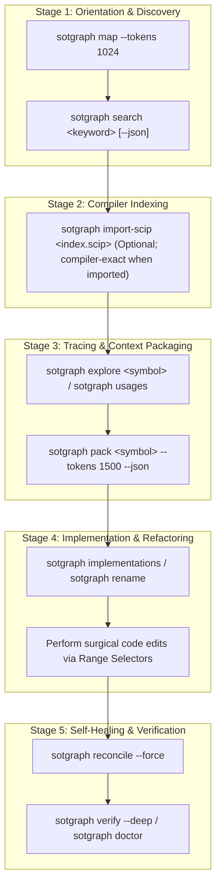

# SOT-Graph Agent Workflow & Operational Guidelines (v0.3.0)

> **Standard Operating Procedures (SOP) and Behavioral Protocols for AI Coding Agents utilizing `sot-graph` as a Verified Single Source of Truth (SSOT) Multi-Provider Knowledge Layer (Schema v8).**

---

## 📑 Table of Contents

1. [Overview & Core Philosophy](#1-overview--core-philosophy)
2. [Multi-Provider Evidence Ledger & Trust Veracity](#2-multi-provider-evidence-ledger--trust-veracity)
3. [North-Star Response Envelope Contract](#3-north-star-response-envelope-contract)
4. [SOT-Graph 5-Stage Agent Operational Protocol](#4-sot-graph-5-stage-agent-operational-protocol)
   - [Stage 1: Orientation & Discovery](#stage-1-orientation--discovery)
   - [Stage 2: Compiler Indexing & SCIP Ingestion](#stage-2-compiler-indexing--scip-ingestion)
   - [Stage 3: Dependency Tracing & Context Packaging](#stage-3-dependency-tracing--context-packaging)
   - [Stage 4: Safe Implementation & Refactoring](#stage-4-safe-implementation--refactoring)
   - [Stage 5: Self-Healing, Note Retention & Verification](#stage-5-self-healing-note-retention--verification)
5. [Practical Walkthrough: 5-Step Task Impact Scoping](#5-practical-walkthrough-5-step-task-impact-scoping)
6. [Comprehensive Command & Tool Reference](#6-comprehensive-command--tool-reference)
7. [Multi-Harness Configuration Directives](#7-multi-harness-configuration-directives)
   - [Oh My Pi (OMP) Rules & Skills](#oh-my-pi-omp-rules--skills)
   - [Claude Code, OpenCode & Gemini Directives](#claude-code-opencode--gemini-directives)
8. [Best Practices & Anti-Patterns](#8-best-practices--anti-patterns)
9. [Dual-Target Markdown, LaTeX & Unicode Rendering Rules](#9-dual-target-markdown-latex--unicode-rendering-rules)

---

## 1. Overview & Core Philosophy

Autonomous AI coding agents operating across multi-thousand-line codebases often fail due to three primary failure modes:
1. **Path & Symbol Hallucinations ("Phantom Anchors"):** Generating edits or referencing files and functions that no longer exist or have been moved.
2. **Context Window Exhaustion:** Ingesting dozens of raw source files sequentially (>100 lines each) to discover relationships, wasting thousands of input tokens.
3. **Refactoring Blind Spots:** Modifying a core symbol without auditing upstream callers, causing subtle cross-module breakage.

`sot-graph` addresses these challenges by establishing the **Physical Filesystem as the Absolute Ground Truth**, mapped through an embedded, zero-daemon SQLite storage layer (Schema v8) with sub-millisecond retrieval, deterministic AST parsing across 12+ languages, SCIP compiler index ingestion, and a real-time **Multi-Provider Trust Verdict Engine**.

---

## 2. Multi-Provider Evidence Ledger & Trust Veracity

`sot-graph` maintains a structured evidence ledger distinguishing fast heuristic extractions from compiler-backed semantic indices:

```json
{
  "verdict": "STRONG",
  "evidence": {
    "freshness": "FRESH",
    "relevance": "EXACT_SPAN",
    "resolution": "EXACT",
    "completeness": "COMPLETE_WITHIN_INDEX_CAPABILITY",
    "confidence": 1.0,
    "provenance": "ast_visitor:exact_span",
    "file_path": "src/module/service.py",
    "file_hash": "sha256:...",
    "details": { "mtime_ms": 1787548621000, "stale": false }
  }
}
```

### The Trust Verdict Hierarchy

| Verdict | Definition | Agent Action Required |
| :--- | :--- | :--- |
| `[STRONG]` | Anchor + span physically verified on disk. | High confidence for existence/navigation; semantic fit still requires reading the snippet. Not an absence or exhaustiveness guarantee. |
| `[WEAK]` | Semantic or partial match; low lexical coverage. | **Inspect snippet range** before relying on symbol. |
| `[REBUILT]` | File moved or renamed; auto-rehomed by atomic content-hash matching. | **Use updated path** reported in result. |
| `[REMOVED]` | Node deleted on disk; scheduled for purge. | **Do NOT use.** Symbol no longer exists. |
| `[NOPATH]` | Virtual or inline node without a physical file backing. | **Context-only.** Verify origin. |

---

## 3. North-Star Response Envelope Contract

All CLI commands supporting `--json` (`search`, `explore`, `usages`, `pack`, `doctor`) and all MCP tool responses wrap data inside a standardized envelope:

```json
{
  "schema_version": "2.0.0",
  "snapshot_generation": 1,
  "manifest_digest": "sha256:...",
  "completeness": "COMPLETE_WITHIN_INDEX_CAPABILITY",
  "providers": [
    { "name": "tree-sitter-ast", "version": "0.26.0", "capability": "AST_HEURISTIC_PARSER" }
  ],
  "fallbacks_applied": [],
  "conflicts_detected": [],
  "data": { ... }
}
```

Agents MUST extract output from `.data` while checking `.completeness` and `.providers` to distinguish static heuristics from compiler-grounded indices.

---

## 4. SOT-Graph 5-Stage Agent Operational Protocol



---

### Stage 1: Orientation & Discovery
1. **Top-Down Repository Mapping:**
   Run PageRank-based repository mapping to identify top architectural landmark symbols:
   ```bash
   sotgraph map --focus "auth,billing" --tokens 2000
   ```
2. **Ground Truth Symbol Search:**
   Search for targeted classes, methods, or database models:
   ```bash
   sotgraph search "PaymentProcessor" -n 5 --json
   ```

### Stage 2: Compiler Indexing & SCIP Ingestion
When working with complex cross-package types (TypeScript, Go, Java, Rust, Python):
```bash
sotgraph import-scip index.scip --provider-version "v1.0.0"
```

### Stage 3: Dependency Tracing & Context Packaging
1. **Call Graph & Blast Radius Audit:**
   ```bash
   sotgraph explore "PaymentProcessor.charge" --depth 2 --json
   ```
2. **Call-Site Precision Audit:**
   ```bash
   sotgraph usages "PaymentProcessor.charge" --json
   ```
3. **Hard-Budget Subgraph Packaging (`sotgraph pack`):**
   Extract a self-contained, token-efficient YAML or JSON context bundle:
   ```bash
   sotgraph pack "PaymentProcessor" --tokens 1500 --json
   ```

### Stage 4: Safe Implementation & Refactoring
1. **Polymorphic & Interface Tracking:**
   ```bash
   sotgraph implementations "IPaymentGateway"
   ```
2. **Safe Multi-File Symbol Renaming:**
   ```bash
   sotgraph rename "oldMethodName" --to "newMethodName"
   ```

### Stage 5: Self-Healing, Note Retention & Verification
1. **Incremental Database Reconciliation:**
   ```bash
   sotgraph reconcile --workers 4
   ```
2. **Database Health & Note Preservation:**
   ```bash
   sotgraph doctor --json
   sotgraph clean --all  # Purges disposable index while preserving kind == 'note'
   ```
3. **Knowledge Retention (ADR):**
   ```bash
   sotgraph insert --title "Postpaid Limit Check Bypass" \
              --body "Route credit limit checks to BCCS DataSource instead of local Ledger DB." \
              --keywords "bccs,postpaid,credit-limit"
   ```

---

## 5. Practical Walkthrough: 5-Step Task Impact Scoping

When assigned an enterprise task, follow this standard 5-step analysis pattern:

```
  [1. SOT Reconcile & Search] ──────► Locate file/symbol with [STRONG] Trust Verdict
              │
  [2. Git Impact Scoping]     ──────► Filter Commits & Diffs by Ticket & Symbol
              │
  [3. SOT Explore & Pack]     ──────► Extract Call Graph, Inbound/Outbound, Datasources
              │
  [4. Workflow Reconstruction]──────► Synthesize Mermaid Sequence Diagrams
              │
  [5. SOT Bundle Synthesis]   ──────► Generate 5 Fact Bundles for Documentation
```

---

## 6. Comprehensive Command & Tool Reference

| Category | CLI Command | Native MCP Tool | Purpose |
| :--- | :--- | :--- | :--- |
| **Discovery** | `sotgraph search "<query>" [-n 5] [--json]` | `sot_search` | Pure-read verified AST symbol & knowledge search with North-Star envelope. |
| **Orientation** | `sotgraph map [--focus <areas>] [--tokens 2000]` | `sot_map` | PageRank-weighted architectural repo map. |
| **Call Graph** | `sotgraph explore "<symbol>" [--depth 2] [--json]` | `sot_explore` | 2-way incoming callers and outgoing dependencies with 2-Hop collapse. |
| **Call-Sites** | `sotgraph usages "<symbol>" [--json]` | `sot_usages` | Exact line-anchored invocations across codebase with pending candidate semantics. |
| **SCIP Ingestion**| `sotgraph import-scip <path> [--provider-version v1]` | CLI | Ingest compiler-backed SCIP index into multi-provider evidence ledger. |
| **Polymorphism**| `sotgraph implementations "<interface>"` | `sot_implementations` | Concrete classes implementing an interface/trait. |
| **Refactoring** | `sotgraph rename "<old>" --to "<new>"` | `sot_rename` | Structural symbol renaming blast radius analysis. |
| **Packaging** | `sotgraph pack "<symbol>" [--tokens 1500] [--json]`| `sot_pack` | Extracts k-hop subgraph into token-efficient ContextBundle with hard token ceiling. |
| **Fact Bundle** | `sotgraph bundle [--module <m>] [-o <dir>]` | `sot_bundle` | Generates 5 fact markdown/json bundle files for reports (confined path). |
| **Communities** | `sotgraph cluster [--scope <path>]` | `sot_cluster` | Louvain / Label Propagation modularity analysis with Newman-Girvan Q. |
| **Diagnostics** | `sotgraph report [-o <path>]` | `sot_report` | Detects God Nodes, 2-hop Blast Radius, and layer violations. |
| **Visualizer** | `sotgraph viz [-o graph.html]` | `sot_viz` | Interactive standalone HTML force-directed graph. |
| **Export** | `sotgraph export -f <obsidian\|graphrag\|scip>` | `sot_export` | Exports graph to Obsidian Vault, GraphRAG JSON, or SCIP. |
| **Sync** | `sotgraph reconcile [--workers 4] [--force]` | `sot_reconcile` | Incremental AST sync with SHA-256 dirty checking and atomic rehoming. |
| **Drift Audit** | `sotgraph verify [--deep]` | `sot_verify` | Audits physical existence and detects phantom nodes. |
| **Knowledge** | `sotgraph insert --title "..." --body "..."` | `sot_insert` | Persists Architecture Decision Records into SQLite (preserved on reset). |
| **Health** | `sotgraph doctor [--json]` | `sot_doctor` | SQLite page count, freelist, journal mode, schema v8 health. |
| **Clean** | `sotgraph clean [--all] [--include-notes]` | `sot_clean` | Purges stale records and deleted file nodes. |
| **Vacuum** | `sotgraph vacuum [--analyze]` | `sot_vacuum` | Reclaims unallocated SQLite freelist pages under maintenance lock. |
| **Provision** | `sotgraph setup [--harness omp\|claude\|all]` | CLI | Installs skills, rules, and MCP configurations. |

---

## 7. Multi-Harness Configuration Directives

### Oh My Pi (OMP) Rules & Skills
Install configurations via `sotgraph setup --harness omp`.

### Claude Code, OpenCode & Gemini Directives
Configure MCP in `~/.claude/mcp.json` or `.cursor/mcp.json`:

```json
{
  "mcpServers": {
    "sot-graph": {
      "command": "sotgraph",
      "args": ["mcp"],
      "env": {}
    }
  }
}
```

---

## 8. Best Practices & Anti-Patterns

### ❌ Anti-Patterns to Avoid
1. **Sequential Raw File Ingestion:** DO NOT sequentially read 10+ raw files (>100 lines) with generic file read tools. Use `sotgraph map` -> `sotgraph search` -> `sotgraph pack`.
2. **Text Grep for Symbol Navigation:** DO NOT rely solely on regex grep for symbol renames or references. Grep misses aliased imports and matches dead comments. Use `sotgraph usages` and `sotgraph rename`.
3. **Blind Assumptions on Renamed Files:** DO NOT assume a file path exists based on historical prompt memory. Verify with `sotgraph verify` or `sotgraph search`.

### ✅ Best Practices
1. **Always Check Trust Verdicts & Providers:** Prioritize `[STRONG]` results; inspect `[WEAK]` results; verify provider capability (`AST_HEURISTIC_PARSER` vs `COMPILER_SCIP_INDEX`).
2. **Pack Before Slicing:** Extract subgraphs via `sotgraph pack "<symbol>" --tokens 1500 --json` when delegating tasks to worker subagents.
3. **Reconcile on Exit:** Always run `sotgraph reconcile` after completing code generation to ensure the next session inherits a clean, synchronized state.

---

## 9. Dual-Target Markdown, LaTeX & Unicode Rendering Rules

All AI Agents and reports generated using SOT-Graph MUST adhere to these rendering guardrails:

### 1. Mermaid Diagrams
- **Double Quote Labels:** Wrap every Node label and Subgraph title in double quotes: `NODE["Label"]`, `subgraph ID ["Title"]`.
- **No Raw Pipes:** Never use unescaped pipe `|` inside node labels (use `/` or `\\|`).
- **Block Separation:** Maintain at least one blank line before and after ````mermaid` code blocks.

### 2. Mathematical & Unicode Symbols
- **Clean Unicode:** Use clean Unicode directly: `Q ≥ 0.650`, `Q = 0.371`, `≈ 400`, `State ∈ { Initial, Loading, Success(data), Failure(error) }`.
- **No Raw Math in Tables/Headers:** NEVER use raw `$ ... $` or `$$ ... $$` math syntax inside Markdown table cells, headers, or bullet items. This ensures flawless display across GitHub GFM, VS Code Preview, Obsidian, md2docx, and Typora.

### 3. Markdown Tables & Formatting
- **Escape Comparison Operators:** In table cells, escape `<` and `>` as `&lt;` and `&gt;` or use Unicode `≤`, `≥`.
- **Escape Table Pipes:** Always escape column pipe characters `\\|` inside table cell text to avoid collapsing table rows.
