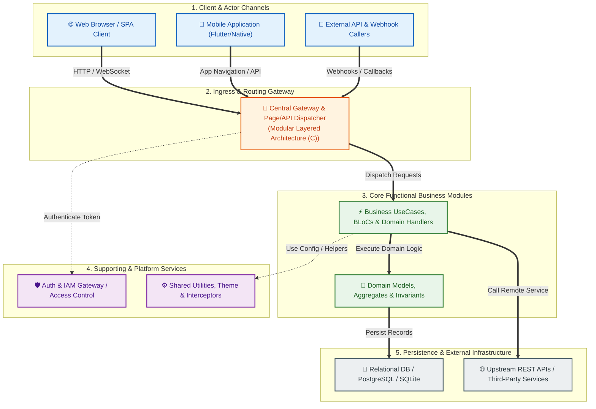
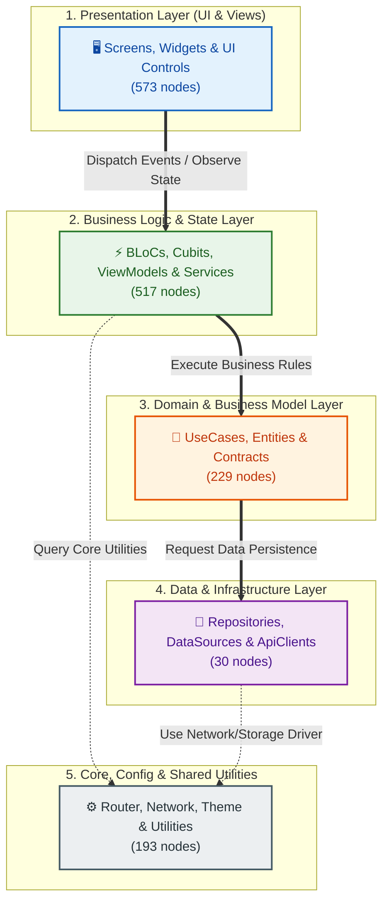
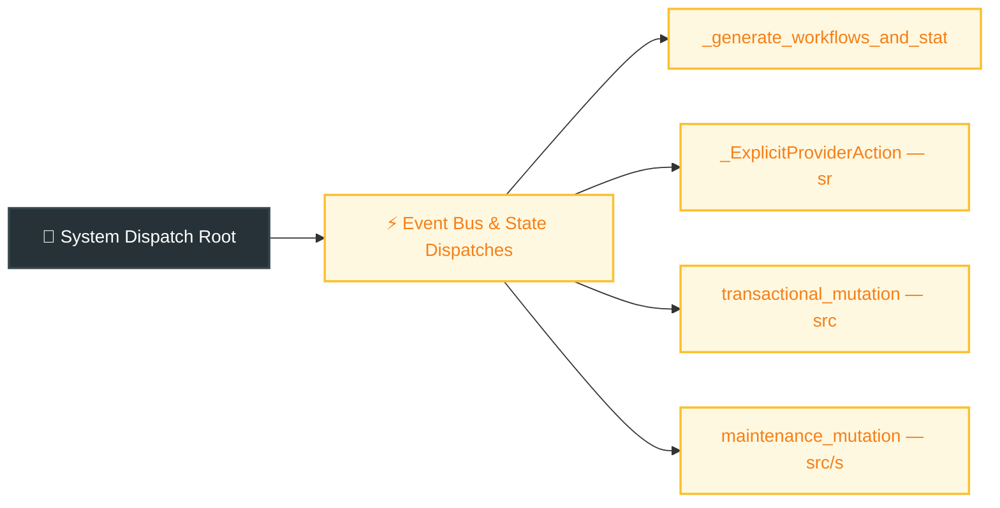
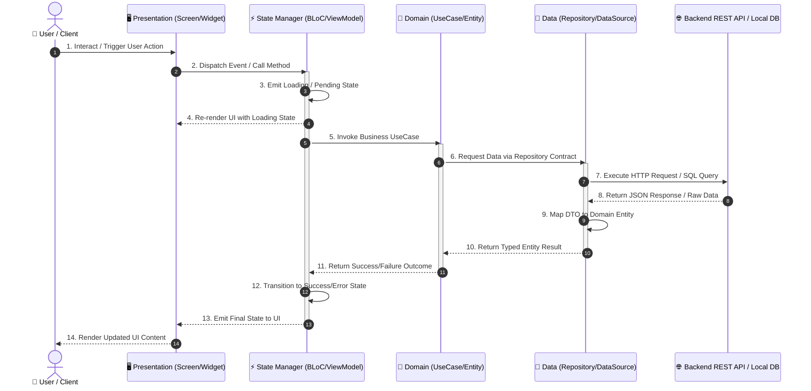
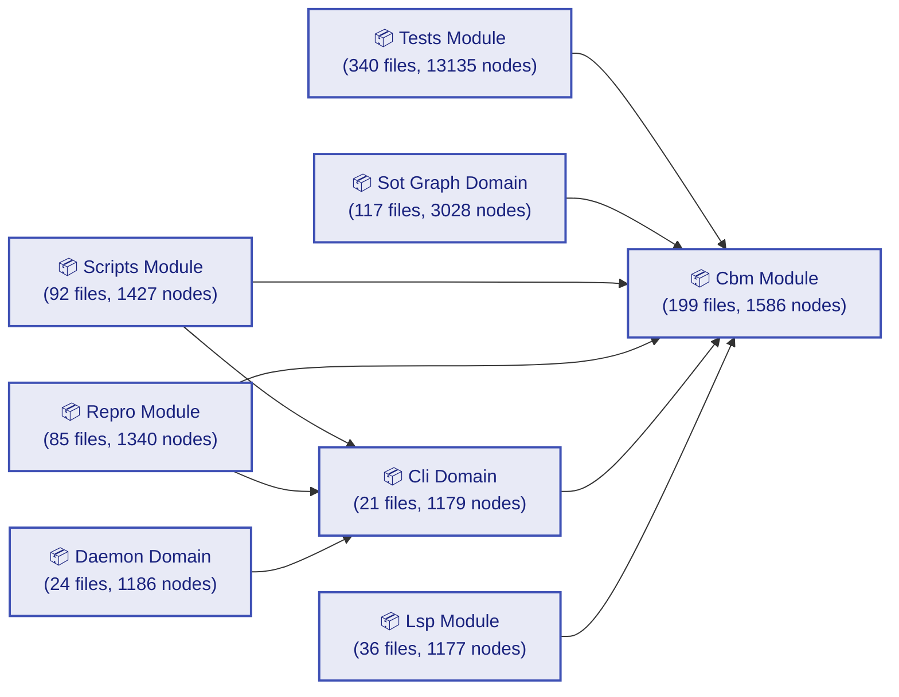

# Architectural Knowledge Graph Report: sotgraph

> **Generated on:** `2026-09-19 04:05:29 UTC` by `sotgraph` | **Engine:** `v3.0 Architectural Intelligence (Dual-Target: Human & AI)`

---

## 1. Executive Summary & Architecture Topology

| Architecture Dimension | Profile Assessment | Key Evidence / Metric |
| :--- | :--- | :--- |
| **Primary Architectural Pattern** | **Modular Layered Architecture (C)** | Heuristically inferred from AST signatures & layer directory conventions; not a verified declared pattern. |
| **Language & Framework Stack** | `C` | Frameworks: *Standard Ecosystem* |
| **Architectural Modularity** | 🟢 **STRONG MODULARITY (Q = 0.780)** - System exhibits distinct, loosely-coupled architectural boundaries. | Louvain Community Quality Score ($Q$) |
| **Total System Entities** | `36267` Nodes (`1554` files, `34713` symbols) | Complete indexed codebase graph surface |
| **Dependency & Call Edges** | `164955` Relationships | Density: `0.000125` (Avg degree: `9.10`) |
| **Functional Business Domains** | `158` High-Level Domains | Aggregated from `113` topological clusters |
| **Functional Modules (Features)** | `158` Structured Modules | Feature taxonomy with responsibilities & core models |
| **Routing & Entrypoints** | `4` Endpoints | HTTP APIs, UI Pages & Event Dispatches |
| **Architectural Integrity** | `5` heuristic candidate finding(s) | Scoped detector candidates (LAYER_BYPASS, INVERTED_DEPENDENCY); not verified against a declared layer policy |

---

## 2. High-Level Design (HLD) & System Context Diagram

The C4-Container style system context below illustrates client channels, central gateway dispatching, core business domains, supporting platforms, and storage tiers:



---

## 3. High-Level Architectural Layer Boundary Diagram

The diagram below reflects the multi-tier separation of concerns and allowed unidirectional dependency flow:



---

## 4. Comprehensive Routing & Dispatch Architecture

System ingress routing, HTTP API endpoints, UI page navigations, and event dispatches mapped across the codebase:

### 4.1 Routing & Dispatch Topology Tree



### 4.2 Endpoint Inventory & Access Control Matrix

| Route Type | Method | Path / Pattern | Handler & Source File Anchor | Auth Guard | Target Layer |
| :-: | :-: | :--- | :--- | :--- | :--- |
| ⚡ `EVENT` | `EVENT_EMIT` | `Event::_generate_workflows_and_states — src/sot_graph/analytics/bundle.py:261` | `def _generate_workflows_and_states — src/sot_graph/analytics/bundle.py:261`<br/>*(/Users/giapminh79/code/GitHub/sotgraph/src/sot_graph/analytics/bundle.py:261)* | `Domain Scope` | `General / Unclassified` |
| ⚡ `EVENT` | `EVENT_EMIT` | `Event::_ExplicitProviderAction — src/sot_graph/cli.py:225` | `class _ExplicitProviderAction — src/sot_graph/cli.py:225`<br/>*(/Users/giapminh79/code/GitHub/sotgraph/src/sot_graph/cli.py:225)* | `Domain Scope` | `General / Unclassified` |
| ⚡ `EVENT` | `EVENT_EMIT` | `Event::transactional_mutation — src/sot_graph/db.py:554` | `def transactional_mutation — src/sot_graph/db.py:554`<br/>*(/Users/giapminh79/code/GitHub/sotgraph/src/sot_graph/db.py:554)* | `Domain Scope` | `General / Unclassified` |
| ⚡ `EVENT` | `EVENT_EMIT` | `Event::maintenance_mutation — src/sot_graph/db.py:560` | `def maintenance_mutation — src/sot_graph/db.py:560`<br/>*(/Users/giapminh79/code/GitHub/sotgraph/src/sot_graph/db.py:560)* | `Domain Scope` | `General / Unclassified` |

---

## 5. Functional Module Breakdown & Feature Taxonomy

Comprehensive decomposition of codebase into bounded functional modules, outlining responsibilities, core domain models, entrypoints, and dependencies:

| Functional Module | Category | Primary Responsibility | Core Entities / Models | Entrypoints / Handlers | Key Dependencies | Files / Nodes |
| :--- | :--- | :--- | :--- | :--- | :--- | :-: |
| **Tests Module** | `Core Business` | Encapsulates Tests domain business rules, entities, state machines, and data processing workflows. | `Class` | *(Service)* | `Benchmark Module`, `Benchmarks Module` | `340 f / 13135 n` |
| **Sot Graph Domain** | `Core Business` | Encapsulates Sot Graph domain business rules, entities, state machines, and data processing workflows. | `Class` | `def sanitize_transport_value — src/sot_graph/mcp_service.py:40`, `class McpServiceError — src/sot_graph/mcp_service.py:66` | `0.8.1 Module`, `Benchmark Module` | `117 f / 3028 n` |
| **Cbm Module** | `Core Business` | Encapsulates Cbm domain business rules, entities, state machines, and data processing workflows. | *(Internal)* | *(Service)* | `Benchmarks Module`, `Cbm Golden Module` | `199 f / 1586 n` |
| **Scripts Module** | `Core Business` | Encapsulates Scripts domain business rules, entities, state machines, and data processing workflows. | *(Internal)* | *(Service)* | `Benchmarks Module`, `Cbm Golden Module` | `92 f / 1427 n` |
| **Repro Module** | `Core Business` | Encapsulates Repro domain business rules, entities, state machines, and data processing workflows. | *(Internal)* | *(Service)* | `Benchmarks Module`, `Cbm Golden Module` | `85 f / 1340 n` |
| **Daemon Domain** | `Core Business` | Encapsulates Daemon domain business rules, entities, state machines, and data processing workflows. | *(Internal)* | *(Service)* | `.Github Module`, `Cbm Golden Module` | `24 f / 1186 n` |
| **Cli Domain** | `Core Business` | Encapsulates Cli domain business rules, entities, state machines, and data processing workflows. | *(Internal)* | *(Service)* | `.Github Module`, `Cbm Golden Module` | `21 f / 1179 n` |
| **Lsp Module** | `Core Business` | Encapsulates Lsp domain business rules, entities, state machines, and data processing workflows. | *(Internal)* | *(Service)* | `0.8.1 Module`, `Benchmarks Module` | `36 f / 1177 n` |
| **Pipeline Domain** | `Core Business` | Encapsulates Pipeline domain business rules, entities, state machines, and data processing workflows. | *(Internal)* | *(Service)* | `Benchmarks Module`, `Cbm Golden Module` | `40 f / 1121 n` |
| **Foundation Domain** | `Core Business` | Encapsulates Foundation domain business rules, entities, state machines, and data processing workflows. | *(Internal)* | *(Service)* | `Benchmarks Module`, `Cbm Golden Module` | `65 f / 961 n` |
| **Docs Module** | `Core Business` | Encapsulates Docs domain business rules, entities, state machines, and data processing workflows. | *(Internal)* | *(Service)* | `Adr Module`, `Global / Root Domain` | `40 f / 836 n` |
| **Per Repo Module** | `Core Business` | Encapsulates Per Repo domain business rules, entities, state machines, and data processing workflows. | *(Internal)* | *(Service)* | *(Independent)* | `11 f / 626 n` |
| **Src Module** | `Core Business` | Encapsulates Src domain business rules, entities, state machines, and data processing workflows. | *(Internal)* | *(Service)* | `Api Domain`, `Cbm Golden Module` | `34 f / 607 n` |
| **Continuation Native Module** | `Core Business` | Encapsulates Continuation Native domain business rules, entities, state machines, and data processing workflows. | *(Internal)* | *(Service)* | `Benchmarks Module`, `Holdout Unseen Module` | `42 f / 591 n` |
| **Mcp Domain** | `Core Business` | Encapsulates Mcp domain business rules, entities, state machines, and data processing workflows. | *(Internal)* | *(Service)* | `Benchmarks Module`, `Cbm Golden Module` | `7 f / 445 n` |
| *... and 143 more smaller modules* | - | - | - | - | - | - |

---

## 6. Core Lifecycle Execution & Data Flow Diagram

The sequence flow below illustrates the standard end-to-end execution lifecycle from user interaction to data persistence:



---

## 7. Multi-Layer Component Breakdown & Inventory

Distribution of codebase components across the 5 canonical architectural layers:

| Architectural Layer | Nodes | Files | Key Responsibilities | Sample Symbols & File Anchors |
| :--- | :-: | :-: | :--- | :--- |
| **Presentation (UI / View)** | `573` | `54` | Screens, Widgets, Views, UI State Rendering, User Interaction Handling | `Section`, `Section`, `Section` |
| **Business Logic (State / Services)** | `517` | `16` | BLoCs, Cubits, ViewModels, Application Services, State Machine Transitions | `Route`, `Folder`, `Module` |
| **Domain (Entities / UseCases)** | `229` | `22` | Domain Entities, UseCases, Business Invariants, Core Interfaces/Contracts | `Section`, `Section`, `Section` |
| **Data & Infrastructure (Repository / DB / API)** | `30` | `10` | Repositories, DataSources, REST/GraphQL Clients, Local Storage, DTO Models | `Route`, `Route`, `Route` |
| **Core & Utilities (Config / Common / Router)** | `193` | `17` | App Router, DI Container, Theme, Constants, Security, Shared Utilities | `Section`, `Module`, `Function` |

---

## 8. High-Level Business Domains & Subsystems

Components aggregated into distinct functional domains based on module boundaries and topological cohesion:

| Domain Subsystem | Category | Nodes | Files | Cohesion | Key Domain Dependencies | Sample Core Entities / Symbols |
| :--- | :--- | :-: | :-: | :-: | :--- | :--- |
| **Tests Module** | `Core Business Domain` | `13135` | `340` | `61%` | `Benchmark Module`, `Benchmarks Module` | `Module`, `Class`, `Method` |
| **Sot Graph Domain** | `Core Business Domain` | `3028` | `117` | `39%` | `0.8.1 Module`, `Benchmark Module` | `Module`, `Variable`, `Variable` |
| **Cbm Module** | `Core Business Domain` | `1586` | `199` | `35%` | `Benchmarks Module`, `Cbm Golden Module` | `Module`, `Class`, `Macro` |
| **Scripts Module** | `Core Business Domain` | `1427` | `92` | `43%` | `Benchmarks Module`, `Cbm Golden Module` | `Module`, `Section`, `Section` |
| **Repro Module** | `Core Business Domain` | `1340` | `85` | `75%` | `Benchmarks Module`, `Cbm Golden Module` | `Module`, `Function`, `Function` |
| **Daemon Domain** | `Core Business Domain` | `1186` | `24` | `67%` | `.Github Module`, `Cbm Golden Module` | `Module`, `Class`, `Macro` |
| **Cli Domain** | `Core Business Domain` | `1179` | `21` | `77%` | `.Github Module`, `Cbm Golden Module` | `Module`, `Class`, `Macro` |
| **Lsp Module** | `Core Business Domain` | `1177` | `36` | `65%` | `0.8.1 Module`, `Benchmarks Module` | `Module`, `Function`, `Function` |
| **Pipeline Domain** | `Core Business Domain` | `1121` | `40` | `60%` | `Benchmarks Module`, `Cbm Golden Module` | `Module`, `Macro`, `Macro` |
| **Foundation Domain** | `Core Business Domain` | `961` | `65` | `38%` | `Benchmarks Module`, `Cbm Golden Module` | `Module`, `Function`, `Function` |
| **Docs Module** | `Core Business Domain` | `836` | `40` | `93%` | `Adr Module`, `Global / Root Domain` | `Module`, `Section`, `Section` |
| **Per Repo Module** | `Core Business Domain` | `626` | `11` | `95%` | *(Independent)* | `Module`, `Variable`, `Variable` |
| *... and 146 more smaller domain modules* | - | - | - | - | - | - |

### 8.1 Domain Interaction Matrix



---

## 9. Architectural Violations & Structural Warnings

Evidence policy: this section reports ONLY what the scoped rule detector observed. The detector cannot observe the project's declared layer policy (none is ingested); layer roles are heuristic (`AST_PATH_HEURISTIC`). Findings are `HEURISTIC_RULE_CANDIDATES` — candidate matches, NOT verified violations. Absence of findings is NOT evidence of conformance.

- **Conformance status:** `VIOLATIONS_DETECTED` — 5 candidate finding(s) from heuristic rules; each is anchored to the observed edge (source/target symbols and paths) and is NOT verified against any declared layer policy.
- **Detector coverage:** assessed edges `3589` / `164955` (`0.0218`); classified nodes `1542` / `36267` (`0.0425`)
- **Supported rules:** `LAYER_BYPASS`, `INVERTED_DEPENDENCY`
- **Limitations:**
  - Layer policy is not observable: no declared architecture-rules artifact is ingested; layer roles are inferred from path/label/keyword heuristics.
  - Only LAYER_BYPASS (Presentation->Data) and INVERTED_DEPENDENCY (Data/Domain->Presentation) rules are supported; all other constraint types are out of scope.
  - Edges with any UNKNOWN-layer endpoint are not assessed; assessed_edge_fraction publishes the denominator. Absence of findings is NOT evidence of conformance.

### 9.1 Candidate Rule Findings (heuristic; within supported scope)

| Severity | Violation Type | Source Component | Target Component | Description & Remediation |
| :-: | :--- | :--- | :--- | :--- |
| 🟠 **HIGH** | `INVERTED_DEPENDENCY` | `File`<br/>*(/Users/giapminh79/code/GitHub/sotgraph/scripts/check_repository_identity.py)* | `Function`<br/>*(/Users/giapminh79/code/GitHub/sotgraph/engines/codebase-memory-mcp/graph-ui/src/components/StatsTab.test.tsx)* | Lower architectural layer 'Domain (Entities / UseCases)' (File) depends on higher Presentation layer (Function).<br/>👉 **Fix:** Invert dependency using interfaces, callbacks, or reactive streams. Lower layers must never reference UI widgets or screens. |
| 🟠 **HIGH** | `INVERTED_DEPENDENCY` | `File`<br/>*(/Users/giapminh79/code/GitHub/sotgraph/scripts/bench_provider_identity.py)* | `Function`<br/>*(/Users/giapminh79/code/GitHub/sotgraph/engines/codebase-memory-mcp/graph-ui/src/components/StatsTab.test.tsx)* | Lower architectural layer 'Domain (Entities / UseCases)' (File) depends on higher Presentation layer (Function).<br/>👉 **Fix:** Invert dependency using interfaces, callbacks, or reactive streams. Lower layers must never reference UI widgets or screens. |
| 🟡 **MEDIUM** | `LAYER_BYPASS` | `File`<br/>*(/Users/giapminh79/code/GitHub/sotgraph/engines/codebase-memory-mcp/graph-ui/src/components/NodeDetailPanel.tsx)* | `Module`<br/>*(/Users/giapminh79/code/GitHub/sotgraph/engines/codebase-memory-mcp/graph-ui/src/api/rpc.ts)* | UI component 'File' directly calls Data layer entity 'Module', bypassing the Business Logic / BLoC / Service layer.<br/>👉 **Fix:** Route interaction through a dedicated BLoC event, ViewModel, or UseCase. Prevent direct repository or API client instantiation in UI widgets. |
| 🟡 **MEDIUM** | `LAYER_BYPASS` | `Module`<br/>*(/Users/giapminh79/code/GitHub/sotgraph/engines/codebase-memory-mcp/graph-ui/src/components/NodeDetailPanel.test.tsx)* | `Class`<br/>*(/Users/giapminh79/code/GitHub/sotgraph/engines/codebase-memory-mcp/graph-ui/src/api/rpc.ts)* | UI component 'Module' directly calls Data layer entity 'Class', bypassing the Business Logic / BLoC / Service layer.<br/>👉 **Fix:** Route interaction through a dedicated BLoC event, ViewModel, or UseCase. Prevent direct repository or API client instantiation in UI widgets. |
| 🟡 **MEDIUM** | `LAYER_BYPASS` | `Function`<br/>*(/Users/giapminh79/code/GitHub/sotgraph/engines/codebase-memory-mcp/src/ui/http_server.c)* | `Route`<br/>*(/Users/giapminh79/code/GitHub/sotgraph/)* | UI component 'Function' directly calls Data layer entity 'Route', bypassing the Business Logic / BLoC / Service layer.<br/>👉 **Fix:** Route interaction through a dedicated BLoC event, ViewModel, or UseCase. Prevent direct repository or API client instantiation in UI widgets. |

---

## 10. Critical God Nodes & Blast Radius Assessment

Hyper-connected hub components that represent potential architectural bottlenecks and blast radius risks:

| Node / Symbol | Layer / Kind | Location | Degree (In / Out) | 2-Hop Blast Radius | Risk Rating | Centrality Score |
| :--- | :--- | :--- | :-: | :-: | :-: | :-: |
| `CBMFileResult` | `class` | `/Users/giapminh79/code/GitHub/sotgraph/engines/codebase-memory-mcp/internal/cbm/cbm.h:472` | `3293` (`3293` / `0`) | `5297 nodes` | 🔴 **CRITICAL** | `97.66σ` |
| `str` | `class` | `/Users/giapminh79/code/GitHub/sotgraph/<python-builtins>:1` | `2327` (`2327` / `0`) | `7708 nodes` | 🔴 **CRITICAL** | `68.93σ` |
| `len` | `function` | `/Users/giapminh79/code/GitHub/sotgraph/<python-builtins>:1` | `1185` (`1185` / `0`) | `8378 nodes` | 🔴 **CRITICAL** | `34.97σ` |
| `TSNode` | `class` | `/Users/giapminh79/code/GitHub/sotgraph/engines/codebase-memory-mcp/src/semantic/ast_profile.h:18` | `1059` (`1059` / `0`) | `1844 nodes` | 🔴 **CRITICAL** | `31.22σ` |
| `test_c_lsp.c` | `file` | `/Users/giapminh79/code/GitHub/sotgraph/engines/codebase-memory-mcp/tests/test_c_lsp.c` | `864` (`1` / `863`) | `5596 nodes` | 🔴 **CRITICAL** | `25.42σ` |
| `d3.v7.min.js` | `file` | `/Users/giapminh79/code/GitHub/sotgraph/src/sot_graph/export/d3.v7.min.js` | `831` (`1` / `830`) | `3985 nodes` | 🔴 **CRITICAL** | `24.44σ` |
| `c_lsp` | `function` | `/Users/giapminh79/code/GitHub/sotgraph/engines/codebase-memory-mcp/tests/test_c_lsp.c:16054` | `762` (`2` / `760`) | `1028 nodes` | 🔴 **CRITICAL** | `22.39σ` |
| `os` | `variable` | `/Users/giapminh79/code/GitHub/sotgraph/benchmarks/performance_baseline.json:5` | `716` (`716` / `0`) | `3775 nodes` | 🔴 **CRITICAL** | `21.02σ` |
| `find_resolved` | `function` | `/Users/giapminh79/code/GitHub/sotgraph/engines/codebase-memory-mcp/tests/test_c_lsp.c:37` | `688` (`679` / `9`) | `3674 nodes` | 🔴 **CRITICAL** | `20.19σ` |
| `count` | `field` | `/Users/giapminh79/code/GitHub/sotgraph/engines/codebase-memory-mcp/src/foundation/str_intern.c:41` | `681` (`681` / `0`) | `6440 nodes` | 🔴 **CRITICAL** | `19.98σ` |

---

## 11. Prioritized Architectural Refactoring Roadmap

Actionable refactoring recommendations prioritized by structural risk, blast radius, and maintainability:

### 🔴 Priority P0 — Critical Architectural Invariants & Blast Radius
- **[Break Inverted Dependency]** Decouple `File` from Presentation layer `Function`. Invert dependency using interfaces, callbacks, or reactive streams. Lower layers must never reference UI widgets or screens.
- **[Break Inverted Dependency]** Decouple `File` from Presentation layer `Function`. Invert dependency using interfaces, callbacks, or reactive streams. Lower layers must never reference UI widgets or screens.

### 🟠 Priority P1 — Architectural Hygiene & Layer Separation
- **[Enforce Clean Layer Boundaries]** Found 3 UI-to-Data direct calls. Introduce BLoC events or UseCases to encapsulate data access (e.g. `File` -> `Module`).

### 🟡 Priority P2 — Modularity, Decoupling & Package Isolation
- **[Domain Package Isolation]** Extract Core Domain modules (Tests Module, Sot Graph Domain) into independent internal packages/libraries with explicit public API export boundaries.

---

## 12. Machine-Readable Architecture Schema (JSON-LD)

Structured architectural metadata for AI coding agents, context injection, and automated CI/CD gating:

```json
{
  "@context": "https://schema.org/",
  "@type": "SoftwareApplicationArchitecture",
  "name": "sotgraph",
  "engine": "sotgraph v3.0 Architectural Intelligence",
  "timestamp": "2026-09-19T04:05:36.618522+00:00",
  "primaryPattern": "Modular Layered Architecture (C)",
  "primaryPatternNote": "Heuristically inferred from AST signatures & layer directory conventions; not a verified declared pattern.",
  "primaryLanguage": "C",
  "frameworks": [],
  "metrics": {
    "nodeCount": 36267,
    "edgeCount": 164955,
    "fileCount": 1554,
    "symbolCount": 34713,
    "modularityScore": 0.7796,
    "density": 0.000125,
    "communityCount": 113
  },
  "functionalModules": [
    {
      "@type": "SoftwareModule",
      "name": "Tests Module",
      "category": "Core Business",
      "responsibility": "Encapsulates Tests domain business rules, entities, state machines, and data processing workflows.",
      "fileCount": 340,
      "nodeCount": 13135,
      "coreEntities": [
        "Class"
      ],
      "entrypoints": [],
      "dependencies": [
        "Benchmark Module",
        "Benchmarks Module",
        "Cbm Golden Module",
        "Cbm Module",
        "Ci Module",
        "Claims Module"
      ]
    },
    {
      "@type": "SoftwareModule",
      "name": "Sot Graph Domain",
      "category": "Core Business",
      "responsibility": "Encapsulates Sot Graph domain business rules, entities, state machines, and data processing workflows.",
      "fileCount": 117,
      "nodeCount": 3028,
      "coreEntities": [
        "Class"
      ],
      "entrypoints": [
        "def sanitize_transport_value — src/sot_graph/mcp_service.py:40",
        "class McpServiceError — src/sot_graph/mcp_service.py:66",
        "def __init__ — src/sot_graph/mcp_service.py:69",
        "def as_dict — src/sot_graph/mcp_service.py:75",
        "def resolve_and_validate_output_path — src/sot_graph/mcp_service.py:82"
      ],
      "dependencies": [
        "0.8.1 Module",
        "Benchmark Module",
        "Benchmarks Module",
        "Cbm Golden Module",
        "Cbm Module",
        "Ci Module"
      ]
    },
    {
      "@type": "SoftwareModule",
      "name": "Cbm Module",
      "category": "Core Business",
      "responsibility": "Encapsulates Cbm domain business rules, entities, state machines, and data processing workflows.",
      "fileCount": 199,
      "nodeCount": 1586,
      "coreEntities": [],
      "entrypoints": [],
      "dependencies": [
        "Benchmarks Module",
        "Cbm Golden Module",
        "Ci Module",
        "Codebase Memory Mcp Module",
        "Continuation Native Module",
        "Cypher Domain"
      ]
    },
    {
      "@type": "SoftwareModule",
      "name": "Scripts Module",
      "category": "Core Business",
      "responsibility": "Encapsulates Scripts domain business rules, entities, state machines, and data processing workflows.",
      "fileCount": 92,
      "nodeCount": 1427,
      "coreEntities": [],
      "entrypoints": [],
      "dependencies": [
        "Benchmarks Module",
        "Cbm Golden Module",
        "Cbm Module",
        "Ci Module",
        "Claims Module",
        "Cli Domain"
      ]
    },
    {
      "@type": "SoftwareModule",
      "name": "Repro Module",
      "category": "Core Business",
      "responsibility": "Encapsulates Repro domain business rules, entities, state machines, and data processing workflows.",
      "fileCount": 85,
      "nodeCount": 1340,
      "coreEntities": [],
      "entrypoints": [],
      "dependencies": [
        "Benchmarks Module",
        "Cbm Golden Module",
        "Cbm Module",
        "Ci Module",
        "Cli Domain",
        "Codebase Memory Mcp Module"
      ]
    },
    {
      "@type": "SoftwareModule",
      "name": "Daemon Domain",
      "category": "Core Business",
      "responsibility": "Encapsulates Daemon domain business rules, entities, state machines, and data processing workflows.",
      "fileCount": 24,
      "nodeCount": 1186,
      "coreEntities": [],
      "entrypoints": [],
      "dependencies": [
        ".Github Module",
        "Cbm Golden Module",
        "Cli Domain",
        "Continuation Native Module",
        "Cypher Domain",
        "Discover Domain"
      ]
    },
    {
      "@type": "SoftwareModule",
      "name": "Cli Domain",
      "category": "Core Business",
      "responsibility": "Encapsulates Cli domain business rules, entities, state machines, and data processing workflows.",
      "fileCount": 21,
      "nodeCount": 1179,
      "coreEntities": [],
      "entrypoints": [],
      "dependencies": [
        ".Github Module",
        "Cbm Golden Module",
        "Cbm Module",
        "Ci Module",
        "Codebase Memory Mcp Module",
        "Continuation Native Module"
      ]
    },
    {
      "@type": "SoftwareModule",
      "name": "Lsp Module",
      "category": "Core Business",
      "responsibility": "Encapsulates Lsp domain business rules, entities, state machines, and data processing workflows.",
      "fileCount": 36,
      "nodeCount": 1177,
      "coreEntities": [],
      "entrypoints": [],
      "dependencies": [
        "0.8.1 Module",
        "Benchmarks Module",
        "Cbm Golden Module",
        "Cbm Module",
        "Ci Module",
        "Codebase Memory Mcp Module"
      ]
    },
    {
      "@type": "SoftwareModule",
      "name": "Pipeline Domain",
      "category": "Core Business",
      "responsibility": "Encapsulates Pipeline domain business rules, entities, state machines, and data processing workflows.",
      "fileCount": 40,
      "nodeCount": 1121,
      "coreEntities": [],
      "entrypoints": [],
      "dependencies": [
        "Benchmarks Module",
        "Cbm Golden Module",
        "Cbm Module",
        "Ci Module",
        "Cli Domain",
        "Codebase Memory Mcp Module"
      ]
    },
    {
      "@type": "SoftwareModule",
      "name": "Foundation Domain",
      "category": "Core Business",
      "responsibility": "Encapsulates Foundation domain business rules, entities, state machines, and data processing workflows.",
      "fileCount": 65,
      "nodeCount": 961,
      "coreEntities": [],
      "entrypoints": [],
      "dependencies": [
        "Benchmarks Module",
        "Cbm Golden Module",
        "Cbm Module",
        "Ci Module",
        "Codebase Memory Mcp Module",
        "Continuation Native Module"
      ]
    },
    {
      "@type": "SoftwareModule",
      "name": "Docs Module",
      "category": "Core Business",
      "responsibility": "Encapsulates Docs domain business rules, entities, state machines, and data processing workflows.",
      "fileCount": 40,
      "nodeCount": 836,
      "coreEntities": [],
      "entrypoints": [],
      "dependencies": [
        "Adr Module",
        "Global / Root Domain",
        "Plans Module",
        "Sot Graph Domain",
        "Tests Module"
      ]
    },
    {
      "@type": "SoftwareModule",
      "name": "Per Repo Module",
      "category": "Core Business",
      "responsibility": "Encapsulates Per Repo domain business rules, entities, state machines, and data processing workflows.",
      "fileCount": 11,
      "nodeCount": 626,
      "coreEntities": [],
      "entrypoints": [],
      "dependencies": []
    },
    {
      "@type": "SoftwareModule",
      "name": "Src Module",
      "category": "Core Business",
      "responsibility": "Encapsulates Src domain business rules, entities, state machines, and data processing workflows.",
      "fileCount": 34,
      "nodeCount": 607,
      "coreEntities": [],
      "entrypoints": [],
      "dependencies": [
        "Api Domain",
        "Cbm Golden Module",
        "Cbm Module",
        "Cli Domain",
        "Codebase Memory Mcp Domain",
        "Codebase Memory Mcp Module"
      ]
    },
    {
      "@type": "SoftwareModule",
      "name": "Continuation Native Module",
      "category": "Core Business",
      "responsibility": "Encapsulates Continuation Native domain business rules, entities, state machines, and data processing workflows.",
      "fileCount": 42,
      "nodeCount": 591,
      "coreEntities": [],
      "entrypoints": [],
      "dependencies": [
        "Benchmarks Module",
        "Holdout Unseen Module",
        "Lsp Module",
        "Scripts Module",
        "Sot Graph Domain",
        "Sotgraph Module"
      ]
    },
    {
      "@type": "SoftwareModule",
      "name": "Mcp Domain",
      "category": "Core Business",
      "responsibility": "Encapsulates Mcp domain business rules, entities, state machines, and data processing workflows.",
      "fileCount": 7,
      "nodeCount": 445,
      "coreEntities": [],
      "entrypoints": [],
      "dependencies": [
        "Benchmarks Module",
        "Cbm Golden Module",
        "Ci Module",
        "Cli Domain",
        "Codebase Memory Mcp Module",
        "Continuation Native Module"
      ]
    },
    {
      "@type": "SoftwareModule",
      "name": "Codebase Memory Mcp Module",
      "category": "Core Business",
      "responsibility": "Encapsulates Codebase Memory Mcp domain business rules, entities, state machines, and data processing workflows.",
      "fileCount": 28,
      "nodeCount": 342,
      "coreEntities": [],
      "entrypoints": [],
      "dependencies": [
        ".Github Module",
        "Benchmarks Module",
        "Cbm Golden Module",
        "Cbm Module",
        "Ci Module",
        "Cli Domain"
      ]
    },
    {
      "@type": "SoftwareModule",
      "name": "Global / Root Domain",
      "category": "Core Business",
      "responsibility": "Encapsulates Global / Root domain business rules, entities, state machines, and data processing workflows.",
      "fileCount": 0,
      "nodeCount": 320,
      "coreEntities": [],
      "entrypoints": [],
      "dependencies": []
    },
    {
      "@type": "SoftwareModule",
      "name": "Store Domain",
      "category": "Core Business",
      "responsibility": "Encapsulates Store domain business rules, entities, state machines, and data processing workflows.",
      "fileCount": 2,
      "nodeCount": 311,
      "coreEntities": [],
      "entrypoints": [],
      "dependencies": [
        "Benchmarks Module",
        "Cbm Golden Module",
        "Ci Module",
        "Codebase Memory Mcp Module",
        "Continuation Native Module",
        "Cypher Domain"
      ]
    },
    {
      "@type": "SoftwareModule",
      "name": "Evidence Module",
      "category": "Core Business",
      "responsibility": "Encapsulates Evidence domain business rules, entities, state machines, and data processing workflows.",
      "fileCount": 33,
      "nodeCount": 310,
      "coreEntities": [],
      "entrypoints": [],
      "dependencies": [
        "Benchmarks Module",
        "Cbm Golden Module",
        "Completion Goals Module",
        "Continuation Native Module",
        "Cypher Domain",
        "Daemon Domain"
      ]
    },
    {
      "@type": "SoftwareModule",
      "name": "Ui Domain",
      "category": "Core Business",
      "responsibility": "Encapsulates Ui domain business rules, entities, state machines, and data processing workflows.",
      "fileCount": 26,
      "nodeCount": 291,
      "coreEntities": [],
      "entrypoints": [],
      "dependencies": [
        "Benchmarks Module",
        "Cbm Golden Module",
        "Cbm Module",
        "Ci Module",
        "Cli Domain",
        "Codebase Memory Mcp Module"
      ]
    },
    {
      "@type": "SoftwareModule",
      "name": "Github Module",
      "category": "Core Business",
      "responsibility": "Encapsulates Github domain business rules, entities, state machines, and data processing workflows.",
      "fileCount": 1,
      "nodeCount": 279,
      "coreEntities": [],
      "entrypoints": [],
      "dependencies": []
    },
    {
      "@type": "SoftwareModule",
      "name": "Benchmarks Module",
      "category": "Core Business",
      "responsibility": "Encapsulates Benchmarks domain business rules, entities, state machines, and data processing workflows.",
      "fileCount": 15,
      "nodeCount": 279,
      "coreEntities": [],
      "entrypoints": [],
      "dependencies": [
        "Ci Module",
        "Continuation Native Module",
        "Daemon Domain",
        "Exit Gates Module",
        "Github Module",
        "Global / Root Domain"
      ]
    },
    {
      "@type": "SoftwareModule",
      "name": "Plan Module",
      "category": "Core Business",
      "responsibility": "Encapsulates Plan domain business rules, entities, state machines, and data processing workflows.",
      "fileCount": 13,
      "nodeCount": 277,
      "coreEntities": [],
      "entrypoints": [],
      "dependencies": [
        "Python C Monorepo Module"
      ]
    },
    {
      "@type": "SoftwareModule",
      "name": "Ci Module",
      "category": "Core Business",
      "responsibility": "Encapsulates Ci domain business rules, entities, state machines, and data processing workflows.",
      "fileCount": 26,
      "nodeCount": 251,
      "coreEntities": [],
      "entrypoints": [],
      "dependencies": [
        "Benchmarks Module",
        "Cbm Golden Module",
        "Cbm Module",
        "Cli Domain",
        "Codebase Memory Mcp Module",
        "Continuation Native Module"
      ]
    },
    {
      "@type": "SoftwareModule",
      "name": "Sotgraph Module",
      "category": "Core Business",
      "responsibility": "Encapsulates Sotgraph domain business rules, entities, state machines, and data processing workflows.",
      "fileCount": 32,
      "nodeCount": 231,
      "coreEntities": [],
      "entrypoints": [],
      "dependencies": [
        ".Gemini Module",
        ".Github Module",
        ".Omp Module",
        ".Opencode Module",
        "Benchmarks Module",
        "Bin Module"
      ]
    },
    {
      "@type": "SoftwareModule",
      "name": "Tree Sitter Domain",
      "category": "Core Business",
      "responsibility": "Encapsulates Tree Sitter domain business rules, entities, state machines, and data processing workflows.",
      "fileCount": 6,
      "nodeCount": 214,
      "coreEntities": [],
      "entrypoints": [],
      "dependencies": [
        "Daemon Domain",
        "Foundation Domain",
        "Sot Graph Domain",
        "Src Module"
      ]
    },
    {
      "@type": "SoftwareModule",
      "name": "Cypher Domain",
      "category": "Core Business",
      "responsibility": "Encapsulates Cypher domain business rules, entities, state machines, and data processing workflows.",
      "fileCount": 2,
      "nodeCount": 208,
      "coreEntities": [],
      "entrypoints": [],
      "dependencies": [
        "Benchmarks Module",
        "Cbm Golden Module",
        "Ci Module",
        "Codebase Memory Mcp Module",
        "Continuation Native Module",
        "Daemon Domain"
      ]
    },
    {
      "@type": "SoftwareModule",
      "name": "Exit Gates Module",
      "category": "Core Business",
      "responsibility": "Encapsulates Exit Gates domain business rules, entities, state machines, and data processing workflows.",
      "fileCount": 12,
      "nodeCount": 205,
      "coreEntities": [],
      "entrypoints": [],
      "dependencies": [
        "Benchmarks Module",
        "Cbm Golden Module",
        "Cli Domain",
        "Continuation Native Module",
        "Cypher Domain",
        "Diff Impact Module"
      ]
    },
    {
      "@type": "SoftwareModule",
      "name": "External Module",
      "category": "Core Business",
      "responsibility": "Encapsulates External domain business rules, entities, state machines, and data processing workflows.",
      "fileCount": 5,
      "nodeCount": 195,
      "coreEntities": [],
      "entrypoints": [],
      "dependencies": [
        "Per Repo Module"
      ]
    },
    {
      "@type": "SoftwareModule",
      "name": "Three Gates Module",
      "category": "Core Business",
      "responsibility": "Encapsulates Three Gates domain business rules, entities, state machines, and data processing workflows.",
      "fileCount": 6,
      "nodeCount": 191,
      "coreEntities": [],
      "entrypoints": [],
      "dependencies": []
    },
    {
      "@type": "SoftwareModule",
      "name": "Workflows Module",
      "category": "Core Business",
      "responsibility": "Encapsulates Workflows domain business rules, entities, state machines, and data processing workflows.",
      "fileCount": 29,
      "nodeCount": 185,
      "coreEntities": [],
      "entrypoints": [],
      "dependencies": [
        "Oracle Module",
        "Scripts Module"
      ]
    },
    {
      "@type": "SoftwareModule",
      "name": "Python C Monorepo Module",
      "category": "Core Business",
      "responsibility": "Encapsulates Python C Monorepo domain business rules, entities, state machines, and data processing workflows.",
      "fileCount": 17,
      "nodeCount": 160,
      "coreEntities": [],
      "entrypoints": [],
      "dependencies": [
        "Evidence Module"
      ]
    },
    {
      "@type": "SoftwareModule",
      "name": "Holdout Unseen Module",
      "category": "Core Business",
      "responsibility": "Encapsulates Holdout Unseen domain business rules, entities, state machines, and data processing workflows.",
      "fileCount": 5,
      "nodeCount": 134,
      "coreEntities": [],
      "entrypoints": [],
      "dependencies": []
    },
    {
      "@type": "SoftwareModule",
      "name": "Semantic Domain",
      "category": "Core Business",
      "responsibility": "Encapsulates Semantic domain business rules, entities, state machines, and data processing workflows.",
      "fileCount": 6,
      "nodeCount": 129,
      "coreEntities": [],
      "entrypoints": [],
      "dependencies": [
        "Benchmarks Module",
        "Cbm Golden Module",
        "Displaysettingsmenu.Tsx Domain",
        "Evidence Module",
        "Foundation Domain",
        "Github Module"
      ]
    },
    {
      "@type": "SoftwareModule",
      "name": "Holdout Module",
      "category": "Core Business",
      "responsibility": "Encapsulates Holdout domain business rules, entities, state machines, and data processing workflows.",
      "fileCount": 3,
      "nodeCount": 122,
      "coreEntities": [],
      "entrypoints": [],
      "dependencies": []
    },
    {
      "@type": "SoftwareModule",
      "name": "Vm Module",
      "category": "Core Business",
      "responsibility": "Encapsulates Vm domain business rules, entities, state machines, and data processing workflows.",
      "fileCount": 8,
      "nodeCount": 116,
      "coreEntities": [],
      "entrypoints": [],
      "dependencies": [
        "Ci Module",
        "Continuation Native Module",
        "Displaysettingsmenu.Tsx Domain",
        "Foundation Domain",
        "Oracle Module",
        "Scripts Module"
      ]
    },
    {
      "@type": "SoftwareModule",
      "name": "Cbm Golden Module",
      "category": "Core Business",
      "responsibility": "Encapsulates Cbm Golden domain business rules, entities, state machines, and data processing workflows.",
      "fileCount": 8,
      "nodeCount": 114,
      "coreEntities": [],
      "entrypoints": [],
      "dependencies": []
    },
    {
      "@type": "SoftwareModule",
      "name": "Discover Domain",
      "category": "Core Business",
      "responsibility": "Encapsulates Discover domain business rules, entities, state machines, and data processing workflows.",
      "fileCount": 6,
      "nodeCount": 110,
      "coreEntities": [],
      "entrypoints": [],
      "dependencies": [
        "Cbm Module",
        "Ci Module",
        "Codebase Memory Mcp Module",
        "Evidence Module",
        "External Module",
        "Foundation Domain"
      ]
    },
    {
      "@type": "SoftwareModule",
      "name": "Sg202 Followup Module",
      "category": "Core Business",
      "responsibility": "Encapsulates Sg202 Followup domain business rules, entities, state machines, and data processing workflows.",
      "fileCount": 3,
      "nodeCount": 107,
      "coreEntities": [],
      "entrypoints": [],
      "dependencies": [
        "Benchmarks Module",
        "Continuation Native Module",
        "Evidence Module",
        "External Module",
        "Landmark Module",
        "Sot Graph Domain"
      ]
    },
    {
      "@type": "SoftwareModule",
      "name": "Graph Buffer Domain",
      "category": "Core Business",
      "responsibility": "Encapsulates Graph Buffer domain business rules, entities, state machines, and data processing workflows.",
      "fileCount": 2,
      "nodeCount": 103,
      "coreEntities": [],
      "entrypoints": [],
      "dependencies": [
        "Cbm Module",
        "Ci Module",
        "Codebase Memory Mcp Module",
        "Continuation Native Module",
        "Cypher Domain",
        "Evidence Module"
      ]
    },
    {
      "@type": "SoftwareModule",
      "name": "Oracle Module",
      "category": "Core Business",
      "responsibility": "Encapsulates Oracle domain business rules, entities, state machines, and data processing workflows.",
      "fileCount": 2,
      "nodeCount": 99,
      "coreEntities": [],
      "entrypoints": [],
      "dependencies": [
        "Scripts Module"
      ]
    },
    {
      "@type": "SoftwareModule",
      "name": "Windows Module",
      "category": "Core Business",
      "responsibility": "Encapsulates Windows domain business rules, entities, state machines, and data processing workflows.",
      "fileCount": 9,
      "nodeCount": 92,
      "coreEntities": [],
      "entrypoints": [],
      "dependencies": [
        "Benchmarks Module",
        "Cbm Golden Module",
        "Cbm Module",
        "Ci Module",
        "Codebase Memory Mcp Module",
        "Continuation Native Module"
      ]
    },
    {
      "@type": "SoftwareModule",
      "name": "Codebase Memory Mcp Domain",
      "category": "Core Business",
      "responsibility": "Encapsulates Codebase Memory Mcp domain business rules, entities, state machines, and data processing workflows.",
      "fileCount": 3,
      "nodeCount": 91,
      "coreEntities": [],
      "entrypoints": [],
      "dependencies": [
        "Benchmarks Module",
        "Cbm Golden Module",
        "Cbm Module",
        "Cli Domain",
        "Codebase Memory Mcp Module",
        "Daemon Domain"
      ]
    },
    {
      "@type": "SoftwareModule",
      "name": "Plans Module",
      "category": "Core Business",
      "responsibility": "Encapsulates Plans domain business rules, entities, state machines, and data processing workflows.",
      "fileCount": 3,
      "nodeCount": 86,
      "coreEntities": [],
      "entrypoints": [],
      "dependencies": []
    },
    {
      "@type": "SoftwareModule",
      "name": "Generated Module",
      "category": "Core Business",
      "responsibility": "Encapsulates Generated domain business rules, entities, state machines, and data processing workflows.",
      "fileCount": 12,
      "nodeCount": 81,
      "coreEntities": [],
      "entrypoints": [],
      "dependencies": [
        "Cbm Module",
        "Cypher Domain",
        "Github Module",
        "Lsp Module",
        "Semantic Domain",
        "Sot Graph Domain"
      ]
    },
    {
      "@type": "SoftwareModule",
      "name": "Watcher Domain",
      "category": "Core Business",
      "responsibility": "Encapsulates Watcher domain business rules, entities, state machines, and data processing workflows.",
      "fileCount": 2,
      "nodeCount": 76,
      "coreEntities": [],
      "entrypoints": [],
      "dependencies": [
        "Cbm Module",
        "Daemon Domain",
        "Evidence Module",
        "Exit Gates Module",
        "External Module",
        "Foundation Domain"
      ]
    },
    {
      "@type": "SoftwareModule",
      "name": "Lib Domain",
      "category": "Core Business",
      "responsibility": "Encapsulates Lib domain business rules, entities, state machines, and data processing workflows.",
      "fileCount": 7,
      "nodeCount": 71,
      "coreEntities": [],
      "entrypoints": [],
      "dependencies": [
        "Cbm Golden Module",
        "Codebase Memory Mcp Module",
        "Daemon Domain",
        "Exit Gates Module",
        "External Module",
        "Foundation Domain"
      ]
    },
    {
      "@type": "SoftwareModule",
      "name": "Tree Sitter Magma Module",
      "category": "Core Business",
      "responsibility": "Encapsulates Tree Sitter Magma domain business rules, entities, state machines, and data processing workflows.",
      "fileCount": 3,
      "nodeCount": 70,
      "coreEntities": [],
      "entrypoints": [],
      "dependencies": [
        "Src Module"
      ]
    },
    {
      "@type": "SoftwareModule",
      "name": "Npm Module",
      "category": "Core Business",
      "responsibility": "Encapsulates Npm domain business rules, entities, state machines, and data processing workflows.",
      "fileCount": 4,
      "nodeCount": 69,
      "coreEntities": [],
      "entrypoints": [],
      "dependencies": [
        "Benchmarks Module",
        "Cbm Golden Module",
        "Cbm Module",
        "Continuation Native Module",
        "Daemon Domain",
        "External Module"
      ]
    },
    {
      "@type": "SoftwareModule",
      "name": "Tree Sitter Form Module",
      "category": "Core Business",
      "responsibility": "Encapsulates Tree Sitter Form domain business rules, entities, state machines, and data processing workflows.",
      "fileCount": 3,
      "nodeCount": 53,
      "coreEntities": [],
      "entrypoints": [],
      "dependencies": [
        "Src Module",
        "Tree Sitter Magma Module"
      ]
    },
    {
      "@type": "SoftwareModule",
      "name": "Simhash Domain",
      "category": "Core Business",
      "responsibility": "Encapsulates Simhash domain business rules, entities, state machines, and data processing workflows.",
      "fileCount": 2,
      "nodeCount": 47,
      "coreEntities": [],
      "entrypoints": [],
      "dependencies": [
        "Foundation Domain",
        "Pipeline Domain",
        "Sot Graph Domain",
        "Sotgraph Module",
        "Three Gates Module"
      ]
    },
    {
      "@type": "SoftwareModule",
      "name": "0.8.1 Module",
      "category": "Core Business",
      "responsibility": "Encapsulates 0.8.1 domain business rules, entities, state machines, and data processing workflows.",
      "fileCount": 3,
      "nodeCount": 42,
      "coreEntities": [],
      "entrypoints": [],
      "dependencies": []
    },
    {
      "@type": "SoftwareModule",
      "name": "Benchmark Module",
      "category": "Core Business",
      "responsibility": "Encapsulates Benchmark domain business rules, entities, state machines, and data processing workflows.",
      "fileCount": 5,
      "nodeCount": 39,
      "coreEntities": [],
      "entrypoints": [],
      "dependencies": [
        "Benchmarks Module",
        "Ci Module",
        "Continuation Native Module",
        "Diff Impact Module",
        "Github Module",
        "Global / Root Domain"
      ]
    },
    {
      "@type": "SoftwareModule",
      "name": ".Github Module",
      "category": "Core Business",
      "responsibility": "Encapsulates .Github domain business rules, entities, state machines, and data processing workflows.",
      "fileCount": 11,
      "nodeCount": 35,
      "coreEntities": [],
      "entrypoints": [],
      "dependencies": [
        "Issue Template Module",
        "Workflows Module"
      ]
    },
    {
      "@type": "SoftwareModule",
      "name": "Pypi Module",
      "category": "Core Business",
      "responsibility": "Encapsulates Pypi domain business rules, entities, state machines, and data processing workflows.",
      "fileCount": 4,
      "nodeCount": 31,
      "coreEntities": [],
      "entrypoints": [],
      "dependencies": [
        "Tests Module"
      ]
    },
    {
      "@type": "SoftwareModule",
      "name": "Wrong Edge Corpus Module",
      "category": "Core Business",
      "responsibility": "Encapsulates Wrong Edge Corpus domain business rules, entities, state machines, and data processing workflows.",
      "fileCount": 5,
      "nodeCount": 30,
      "coreEntities": [],
      "entrypoints": [],
      "dependencies": [
        "Sot Graph Domain",
        "Sotgraph Module"
      ]
    },
    {
      "@type": "SoftwareModule",
      "name": "Graph Ui Module",
      "category": "Core Business",
      "responsibility": "Encapsulates Graph Ui domain business rules, entities, state machines, and data processing workflows.",
      "fileCount": 5,
      "nodeCount": 28,
      "coreEntities": [],
      "entrypoints": [],
      "dependencies": [
        "Cbm Module",
        "Exit Gates Module",
        "Foundation Domain",
        "Pipeline Domain",
        "Sot Graph Domain",
        "Src Module"
      ]
    },
    {
      "@type": "SoftwareModule",
      "name": "Test Module",
      "category": "Core Business",
      "responsibility": "Encapsulates Test domain business rules, entities, state machines, and data processing workflows.",
      "fileCount": 3,
      "nodeCount": 28,
      "coreEntities": [],
      "entrypoints": [],
      "dependencies": [
        "Benchmarks Module",
        "Cbm Golden Module",
        "Cbm Module",
        "Codebase Memory Mcp Module",
        "Continuation Native Module",
        "External Module"
      ]
    },
    {
      "@type": "SoftwareModule",
      "name": "Fixtures Module",
      "category": "Core Business",
      "responsibility": "Encapsulates Fixtures domain business rules, entities, state machines, and data processing workflows.",
      "fileCount": 12,
      "nodeCount": 28,
      "coreEntities": [],
      "entrypoints": [],
      "dependencies": [
        "C Module",
        "Cbm Golden Module",
        "Cbm Sample Repo Module",
        "Cpp Include Module",
        "Cpp Module",
        "Go Module"
      ]
    },
    {
      "@type": "SoftwareModule",
      "name": "Hooks Domain",
      "category": "Core Business",
      "responsibility": "Encapsulates Hooks domain business rules, entities, state machines, and data processing workflows.",
      "fileCount": 3,
      "nodeCount": 22,
      "coreEntities": [],
      "entrypoints": [],
      "dependencies": [
        "Api Domain",
        "Cbm Golden Module",
        "Codebase Memory Mcp Module",
        "Daemon Domain",
        "External Module",
        "Foundation Domain"
      ]
    },
    {
      "@type": "SoftwareModule",
      "name": "Parallel Integration Module",
      "category": "Core Business",
      "responsibility": "Encapsulates Parallel Integration domain business rules, entities, state machines, and data processing workflows.",
      "fileCount": 3,
      "nodeCount": 22,
      "coreEntities": [],
      "entrypoints": [],
      "dependencies": []
    },
    {
      "@type": "SoftwareModule",
      "name": "Fault Module",
      "category": "Core Business",
      "responsibility": "Encapsulates Fault domain business rules, entities, state machines, and data processing workflows.",
      "fileCount": 2,
      "nodeCount": 22,
      "coreEntities": [],
      "entrypoints": [],
      "dependencies": [
        "Benchmarks Module",
        "Cli Domain",
        "Continuation Native Module",
        "Daemon Domain",
        "Github Module",
        "Global / Root Domain"
      ]
    },
    {
      "@type": "SoftwareModule",
      "name": "Rendered Module",
      "category": "Core Business",
      "responsibility": "Encapsulates Rendered domain business rules, entities, state machines, and data processing workflows.",
      "fileCount": 22,
      "nodeCount": 22,
      "coreEntities": [],
      "entrypoints": [],
      "dependencies": []
    },
    {
      "@type": "SoftwareModule",
      "name": "Graphify Module",
      "category": "Core Business",
      "responsibility": "Encapsulates Graphify domain business rules, entities, state machines, and data processing workflows.",
      "fileCount": 2,
      "nodeCount": 22,
      "coreEntities": [],
      "entrypoints": [],
      "dependencies": []
    },
    {
      "@type": "SoftwareModule",
      "name": "Git Domain",
      "category": "Core Business",
      "responsibility": "Encapsulates Git domain business rules, entities, state machines, and data processing workflows.",
      "fileCount": 2,
      "nodeCount": 20,
      "coreEntities": [],
      "entrypoints": [],
      "dependencies": [
        "Daemon Domain",
        "External Module",
        "Foundation Domain",
        "Sot Graph Domain",
        "Sotgraph Module"
      ]
    },
    {
      "@type": "SoftwareModule",
      "name": "Extensions Module",
      "category": "Core Business",
      "responsibility": "Encapsulates Extensions domain business rules, entities, state machines, and data processing workflows.",
      "fileCount": 1,
      "nodeCount": 19,
      "coreEntities": [],
      "entrypoints": [],
      "dependencies": [
        "0.8.1 Module",
        "Benchmarks Module",
        "Cbm Golden Module",
        "Cbm Module",
        "Codebase Memory Mcp Module",
        "Continuation Native Module"
      ]
    },
    {
      "@type": "SoftwareModule",
      "name": ".Omp Module",
      "category": "Core Business",
      "responsibility": "Encapsulates .Omp domain business rules, entities, state machines, and data processing workflows.",
      "fileCount": 4,
      "nodeCount": 18,
      "coreEntities": [],
      "entrypoints": [],
      "dependencies": [
        "Extensions Module",
        "Rules Module"
      ]
    },
    {
      "@type": "SoftwareModule",
      "name": "Parallel Latency Module",
      "category": "Core Business",
      "responsibility": "Encapsulates Parallel Latency domain business rules, entities, state machines, and data processing workflows.",
      "fileCount": 1,
      "nodeCount": 17,
      "coreEntities": [],
      "entrypoints": [],
      "dependencies": [
        "Benchmarks Module",
        "Cbm Golden Module",
        "Cbm Module",
        "Continuation Native Module",
        "Evidence Module",
        "External Module"
      ]
    },
    {
      "@type": "SoftwareModule",
      "name": "Issue Template Module",
      "category": "Core Business",
      "responsibility": "Encapsulates Issue Template domain business rules, entities, state machines, and data processing workflows.",
      "fileCount": 3,
      "nodeCount": 16,
      "coreEntities": [],
      "entrypoints": [],
      "dependencies": []
    },
    {
      "@type": "SoftwareModule",
      "name": "Property Module",
      "category": "Core Business",
      "responsibility": "Encapsulates Property domain business rules, entities, state machines, and data processing workflows.",
      "fileCount": 1,
      "nodeCount": 16,
      "coreEntities": [],
      "entrypoints": [],
      "dependencies": [
        "Benchmarks Module",
        "Cli Domain",
        "Github Module",
        "Global / Root Domain",
        "Holdout Unseen Module",
        "Lsp Module"
      ]
    },
    {
      "@type": "SoftwareModule",
      "name": "Rules Module",
      "category": "Core Business",
      "responsibility": "Encapsulates Rules domain business rules, entities, state machines, and data processing workflows.",
      "fileCount": 1,
      "nodeCount": 15,
      "coreEntities": [],
      "entrypoints": [],
      "dependencies": []
    },
    {
      "@type": "SoftwareModule",
      "name": "Scoop Module",
      "category": "Core Business",
      "responsibility": "Encapsulates Scoop domain business rules, entities, state machines, and data processing workflows.",
      "fileCount": 1,
      "nodeCount": 15,
      "coreEntities": [],
      "entrypoints": [],
      "dependencies": []
    },
    {
      "@type": "SoftwareModule",
      "name": "Cpp Include Module",
      "category": "Core Business",
      "responsibility": "Encapsulates Cpp Include domain business rules, entities, state machines, and data processing workflows.",
      "fileCount": 5,
      "nodeCount": 15,
      "coreEntities": [],
      "entrypoints": [],
      "dependencies": []
    },
    {
      "@type": "SoftwareModule",
      "name": "Evaluation Module",
      "category": "Core Business",
      "responsibility": "Encapsulates Evaluation domain business rules, entities, state machines, and data processing workflows.",
      "fileCount": 7,
      "nodeCount": 15,
      "coreEntities": [],
      "entrypoints": [],
      "dependencies": [
        "Benchmarks Module",
        "Cbm Module",
        "Exit Gates Module",
        "Fixtures Module",
        "Github Module",
        "Global / Root Domain"
      ]
    },
    {
      "@type": "SoftwareModule",
      "name": "Nodelabels.Tsx Domain",
      "category": "Core Business",
      "responsibility": "Encapsulates Nodelabels.Tsx domain business rules, entities, state machines, and data processing workflows.",
      "fileCount": 1,
      "nodeCount": 14,
      "coreEntities": [],
      "entrypoints": [],
      "dependencies": [
        "Codebase Memory Mcp Module",
        "Daemon Domain",
        "Foundation Domain",
        "Global / Root Domain",
        "Graph Buffer Domain",
        "Lib Domain"
      ]
    },
    {
      "@type": "SoftwareModule",
      "name": "Graphtab.Tsx Domain",
      "category": "Core Business",
      "responsibility": "Encapsulates Graphtab.Tsx domain business rules, entities, state machines, and data processing workflows.",
      "fileCount": 1,
      "nodeCount": 13,
      "coreEntities": [],
      "entrypoints": [],
      "dependencies": [
        "Cbm Golden Module",
        "Codebase Memory Mcp Module",
        "Cpp Module",
        "Daemon Domain",
        "Displaysettingsmenu.Tsx Domain",
        "Errorboundary.Tsx Domain"
      ]
    },
    {
      "@type": "SoftwareModule",
      "name": "Statstab.Tsx Domain",
      "category": "Core Business",
      "responsibility": "Encapsulates Statstab.Tsx domain business rules, entities, state machines, and data processing workflows.",
      "fileCount": 1,
      "nodeCount": 13,
      "coreEntities": [],
      "entrypoints": [],
      "dependencies": [
        "Codebase Memory Mcp Module",
        "Daemon Domain",
        "Evidence Module",
        "External Module",
        "Foundation Domain",
        "Graph Buffer Domain"
      ]
    },
    {
      "@type": "SoftwareModule",
      "name": "Adr Module",
      "category": "Core Business",
      "responsibility": "Encapsulates Adr domain business rules, entities, state machines, and data processing workflows.",
      "fileCount": 1,
      "nodeCount": 12,
      "coreEntities": [],
      "entrypoints": [],
      "dependencies": []
    },
    {
      "@type": "SoftwareModule",
      "name": "Graphscene.Tsx Domain",
      "category": "Core Business",
      "responsibility": "Encapsulates Graphscene.Tsx domain business rules, entities, state machines, and data processing workflows.",
      "fileCount": 1,
      "nodeCount": 12,
      "coreEntities": [],
      "entrypoints": [],
      "dependencies": [
        "Cbm Golden Module",
        "Daemon Domain",
        "Edgelines.Tsx Domain",
        "Foundation Domain",
        "Global / Root Domain",
        "Graph Buffer Domain"
      ]
    },
    {
      "@type": "SoftwareModule",
      "name": "Nodedetailpanel.Tsx Domain",
      "category": "Core Business",
      "responsibility": "Encapsulates Nodedetailpanel.Tsx domain business rules, entities, state machines, and data processing workflows.",
      "fileCount": 1,
      "nodeCount": 12,
      "coreEntities": [],
      "entrypoints": [],
      "dependencies": [
        "Api Domain",
        "Codebase Memory Mcp Module",
        "Daemon Domain",
        "Evidence Module",
        "Exit Gates Module",
        "Foundation Domain"
      ]
    },
    {
      "@type": "SoftwareModule",
      "name": "Glama Module",
      "category": "Core Business",
      "responsibility": "Encapsulates Glama domain business rules, entities, state machines, and data processing workflows.",
      "fileCount": 2,
      "nodeCount": 12,
      "coreEntities": [],
      "entrypoints": [],
      "dependencies": [
        "Continuation Native Module",
        "Displaysettingsmenu.Tsx Domain"
      ]
    },
    {
      "@type": "SoftwareModule",
      "name": "Nodecloud.Tsx Domain",
      "category": "Core Business",
      "responsibility": "Encapsulates Nodecloud.Tsx domain business rules, entities, state machines, and data processing workflows.",
      "fileCount": 1,
      "nodeCount": 11,
      "coreEntities": [],
      "entrypoints": [],
      "dependencies": [
        "Benchmarks Module",
        "Daemon Domain",
        "Foundation Domain",
        "Graph Buffer Domain",
        "Lib Domain",
        "Sot Graph Domain"
      ]
    },
    {
      "@type": "SoftwareModule",
      "name": "Landmark Module",
      "category": "Core Business",
      "responsibility": "Encapsulates Landmark domain business rules, entities, state machines, and data processing workflows.",
      "fileCount": 2,
      "nodeCount": 10,
      "coreEntities": [],
      "entrypoints": [],
      "dependencies": []
    },
    {
      "@type": "SoftwareModule",
      "name": "Traces Domain",
      "category": "Core Business",
      "responsibility": "Encapsulates Traces domain business rules, entities, state machines, and data processing workflows.",
      "fileCount": 2,
      "nodeCount": 10,
      "coreEntities": [],
      "entrypoints": [],
      "dependencies": [
        "Foundation Domain",
        "Lsp Module",
        "Sot Graph Domain"
      ]
    },
    {
      "@type": "SoftwareModule",
      "name": "Calculator.Py Domain",
      "category": "Core Business",
      "responsibility": "Encapsulates Calculator.Py domain business rules, entities, state machines, and data processing workflows.",
      "fileCount": 1,
      "nodeCount": 10,
      "coreEntities": [],
      "entrypoints": [],
      "dependencies": [
        "Core Module",
        "Sotgraph Module"
      ]
    },
    {
      "@type": "SoftwareModule",
      "name": "Schema Module",
      "category": "Core Business",
      "responsibility": "Encapsulates Schema domain business rules, entities, state machines, and data processing workflows.",
      "fileCount": 1,
      "nodeCount": 10,
      "coreEntities": [
        "Class"
      ],
      "entrypoints": [],
      "dependencies": [
        "Continuation Native Module",
        "Github Module",
        "Holdout Unseen Module",
        "Oracle Module",
        "Scripts Module",
        "Sot Graph Domain"
      ]
    },
    {
      "@type": "SoftwareModule",
      "name": "Errorboundary.Tsx Domain",
      "category": "Core Business",
      "responsibility": "Encapsulates Errorboundary.Tsx domain business rules, entities, state machines, and data processing workflows.",
      "fileCount": 1,
      "nodeCount": 9,
      "coreEntities": [],
      "entrypoints": [],
      "dependencies": [
        "Daemon Domain",
        "External Module",
        "Lsp Module",
        "Sot Graph Domain",
        "Src Module"
      ]
    },
    {
      "@type": "SoftwareModule",
      "name": "Missedcallout.Tsx Domain",
      "category": "Core Business",
      "responsibility": "Encapsulates Missedcallout.Tsx domain business rules, entities, state machines, and data processing workflows.",
      "fileCount": 1,
      "nodeCount": 9,
      "coreEntities": [],
      "entrypoints": [],
      "dependencies": [
        "Codebase Memory Mcp Module",
        "Daemon Domain",
        "Global / Root Domain",
        "Lib Domain",
        "Pipeline Domain",
        "Scripts Module"
      ]
    },
    {
      "@type": "SoftwareModule",
      "name": "Sidebar.Tsx Domain",
      "category": "Core Business",
      "responsibility": "Encapsulates Sidebar.Tsx domain business rules, entities, state machines, and data processing workflows.",
      "fileCount": 1,
      "nodeCount": 9,
      "coreEntities": [],
      "entrypoints": [],
      "dependencies": [
        "Benchmarks Module",
        "Codebase Memory Mcp Module",
        "Daemon Domain",
        "Foundation Domain",
        "Global / Root Domain",
        "Graph Buffer Domain"
      ]
    },
    {
      "@type": "SoftwareModule",
      "name": "Module Scope Module",
      "category": "Core Business",
      "responsibility": "Encapsulates Module Scope domain business rules, entities, state machines, and data processing workflows.",
      "fileCount": 1,
      "nodeCount": 9,
      "coreEntities": [],
      "entrypoints": [],
      "dependencies": [
        "Global / Root Domain",
        "Scripts Module"
      ]
    },
    {
      "@type": "SoftwareModule",
      "name": "20260906T M1 Phase V1 Module",
      "category": "Core Business",
      "responsibility": "Encapsulates 20260906T M1 Phase V1 domain business rules, entities, state machines, and data processing workflows.",
      "fileCount": 3,
      "nodeCount": 9,
      "coreEntities": [],
      "entrypoints": [],
      "dependencies": []
    },
    {
      "@type": "SoftwareModule",
      "name": "Cbm Sample Repo Module",
      "category": "Core Business",
      "responsibility": "Encapsulates Cbm Sample Repo domain business rules, entities, state machines, and data processing workflows.",
      "fileCount": 5,
      "nodeCount": 9,
      "coreEntities": [],
      "entrypoints": [],
      "dependencies": [
        "App Module",
        "Core Module",
        "Generated Module",
        "Scripts Module"
      ]
    },
    {
      "@type": "SoftwareModule",
      "name": "Pkg Module",
      "category": "Core Business",
      "responsibility": "Encapsulates Pkg domain business rules, entities, state machines, and data processing workflows.",
      "fileCount": 8,
      "nodeCount": 8,
      "coreEntities": [],
      "entrypoints": [],
      "dependencies": [
        "Glama Module",
        "Go Module",
        "Npm Module",
        "Pypi Module",
        "Scoop Module"
      ]
    },
    {
      "@type": "SoftwareModule",
      "name": "Diff Impact Module",
      "category": "Core Business",
      "responsibility": "Encapsulates Diff Impact domain business rules, entities, state machines, and data processing workflows.",
      "fileCount": 1,
      "nodeCount": 7,
      "coreEntities": [],
      "entrypoints": [],
      "dependencies": []
    },
    {
      "@type": "SoftwareModule",
      "name": "Edgelines.Tsx Domain",
      "category": "Core Business",
      "responsibility": "Encapsulates Edgelines.Tsx domain business rules, entities, state machines, and data processing workflows.",
      "fileCount": 1,
      "nodeCount": 7,
      "coreEntities": [],
      "entrypoints": [],
      "dependencies": [
        "Codebase Memory Mcp Module",
        "Daemon Domain",
        "Graph Buffer Domain",
        "Lib Domain",
        "Pipeline Domain",
        "Scripts Module"
      ]
    },
    {
      "@type": "SoftwareModule",
      "name": "Graphloader.Tsx Domain",
      "category": "Core Business",
      "responsibility": "Encapsulates Graphloader.Tsx domain business rules, entities, state machines, and data processing workflows.",
      "fileCount": 1,
      "nodeCount": 7,
      "coreEntities": [],
      "entrypoints": [],
      "dependencies": [
        "Daemon Domain",
        "Foundation Domain",
        "Graph Ui Module",
        "Holdout Unseen Module",
        "Hooks Domain",
        "Sot Graph Domain"
      ]
    },
    {
      "@type": "SoftwareModule",
      "name": "Nodedetailpanel.Test.Tsx Domain",
      "category": "Core Business",
      "responsibility": "Encapsulates Nodedetailpanel.Test.Tsx domain business rules, entities, state machines, and data processing workflows.",
      "fileCount": 1,
      "nodeCount": 7,
      "coreEntities": [],
      "entrypoints": [],
      "dependencies": [
        "Api Domain",
        "Codebase Memory Mcp Module",
        "Daemon Domain",
        "Global / Root Domain",
        "Graph Buffer Domain",
        "Lib Domain"
      ]
    },
    {
      "@type": "SoftwareModule",
      "name": "Cpp Module",
      "category": "Core Business",
      "responsibility": "Encapsulates Cpp domain business rules, entities, state machines, and data processing workflows.",
      "fileCount": 1,
      "nodeCount": 7,
      "coreEntities": [],
      "entrypoints": [],
      "dependencies": []
    },
    {
      "@type": "SoftwareModule",
      "name": "Api Domain",
      "category": "Core Business",
      "responsibility": "Encapsulates Api domain business rules, entities, state machines, and data processing workflows.",
      "fileCount": 1,
      "nodeCount": 6,
      "coreEntities": [
        "Class"
      ],
      "entrypoints": [],
      "dependencies": [
        "Daemon Domain",
        "Evidence Module",
        "External Module",
        "Issue Template Module",
        "Mcp Domain",
        "Scripts Module"
      ]
    },
    {
      "@type": "SoftwareModule",
      "name": "Controltab.Tsx Domain",
      "category": "Core Business",
      "responsibility": "Encapsulates Controltab.Tsx domain business rules, entities, state machines, and data processing workflows.",
      "fileCount": 1,
      "nodeCount": 6,
      "coreEntities": [],
      "entrypoints": [],
      "dependencies": [
        "Ci Module",
        "Foundation Domain",
        "Graph Ui Module",
        "Lib Domain",
        "Scripts Module",
        "Sot Graph Domain"
      ]
    },
    {
      "@type": "SoftwareModule",
      "name": "Graphtab.Deadcode.Test.Tsx Domain",
      "category": "Core Business",
      "responsibility": "Encapsulates Graphtab.Deadcode.Test.Tsx domain business rules, entities, state machines, and data processing workflows.",
      "fileCount": 1,
      "nodeCount": 6,
      "coreEntities": [],
      "entrypoints": [],
      "dependencies": [
        "Codebase Memory Mcp Module",
        "Daemon Domain",
        "Graph Buffer Domain",
        "Graphtab.Filters.Test.Tsx Domain",
        "Graphtab.Tsx Domain",
        "Lib Domain"
      ]
    },
    {
      "@type": "SoftwareModule",
      "name": "Graphtab.Filters.Test.Tsx Domain",
      "category": "Core Business",
      "responsibility": "Encapsulates Graphtab.Filters.Test.Tsx domain business rules, entities, state machines, and data processing workflows.",
      "fileCount": 1,
      "nodeCount": 6,
      "coreEntities": [],
      "entrypoints": [],
      "dependencies": [
        "Codebase Memory Mcp Module",
        "Daemon Domain",
        "Graph Buffer Domain",
        "Graphtab.Tsx Domain",
        "Lib Domain",
        "Pipeline Domain"
      ]
    },
    {
      "@type": "SoftwareModule",
      "name": "Tools Module",
      "category": "Core Business",
      "responsibility": "Encapsulates Tools domain business rules, entities, state machines, and data processing workflows.",
      "fileCount": 4,
      "nodeCount": 6,
      "coreEntities": [],
      "entrypoints": [],
      "dependencies": [
        "Tree Sitter Form Module",
        "Tree Sitter Magma Module"
      ]
    },
    {
      "@type": "SoftwareModule",
      "name": "Go Module",
      "category": "Core Business",
      "responsibility": "Encapsulates Go domain business rules, entities, state machines, and data processing workflows.",
      "fileCount": 3,
      "nodeCount": 6,
      "coreEntities": [],
      "entrypoints": [],
      "dependencies": [
        "Daemon Domain",
        "Fixtures Module"
      ]
    },
    {
      "@type": "SoftwareModule",
      "name": "Java Module",
      "category": "Core Business",
      "responsibility": "Encapsulates Java domain business rules, entities, state machines, and data processing workflows.",
      "fileCount": 1,
      "nodeCount": 6,
      "coreEntities": [],
      "entrypoints": [],
      "dependencies": [
        "Fixtures Module"
      ]
    },
    {
      "@type": "SoftwareModule",
      "name": "App Module",
      "category": "Core Business",
      "responsibility": "Encapsulates App domain business rules, entities, state machines, and data processing workflows.",
      "fileCount": 2,
      "nodeCount": 6,
      "coreEntities": [],
      "entrypoints": [],
      "dependencies": [
        "Core Module",
        "Sotgraph Module",
        "Tests Module",
        "Three Gates Module"
      ]
    },
    {
      "@type": "SoftwareModule",
      "name": ".Gemini Module",
      "category": "Core Business",
      "responsibility": "Encapsulates .Gemini domain business rules, entities, state machines, and data processing workflows.",
      "fileCount": 2,
      "nodeCount": 5,
      "coreEntities": [],
      "entrypoints": [],
      "dependencies": [
        ".Opencode Module"
      ]
    },
    {
      "@type": "SoftwareModule",
      "name": ".Opencode Module",
      "category": "Core Business",
      "responsibility": "Encapsulates .Opencode domain business rules, entities, state machines, and data processing workflows.",
      "fileCount": 2,
      "nodeCount": 5,
      "coreEntities": [],
      "entrypoints": [],
      "dependencies": []
    },
    {
      "@type": "SoftwareModule",
      "name": "Claims Module",
      "category": "Core Business",
      "responsibility": "Encapsulates Claims domain business rules, entities, state machines, and data processing workflows.",
      "fileCount": 1,
      "nodeCount": 5,
      "coreEntities": [],
      "entrypoints": [],
      "dependencies": []
    },
    {
      "@type": "SoftwareModule",
      "name": "Filterpanel.Tsx Domain",
      "category": "Core Business",
      "responsibility": "Encapsulates Filterpanel.Tsx domain business rules, entities, state machines, and data processing workflows.",
      "fileCount": 1,
      "nodeCount": 5,
      "coreEntities": [],
      "entrypoints": [],
      "dependencies": [
        "Codebase Memory Mcp Module",
        "Exit Gates Module",
        "Foundation Domain",
        "Github Module",
        "Graph Buffer Domain",
        "Graph Ui Module"
      ]
    },
    {
      "@type": "SoftwareModule",
      "name": "Nodetooltip.Tsx Domain",
      "category": "Core Business",
      "responsibility": "Encapsulates Nodetooltip.Tsx domain business rules, entities, state machines, and data processing workflows.",
      "fileCount": 1,
      "nodeCount": 5,
      "coreEntities": [],
      "entrypoints": [],
      "dependencies": [
        "Codebase Memory Mcp Module",
        "Global / Root Domain",
        "Graph Ui Module",
        "Lib Domain",
        "Scripts Module",
        "Sot Graph Domain"
      ]
    },
    {
      "@type": "SoftwareModule",
      "name": "Projectcard.Tsx Domain",
      "category": "Core Business",
      "responsibility": "Encapsulates Projectcard.Tsx domain business rules, entities, state machines, and data processing workflows.",
      "fileCount": 1,
      "nodeCount": 5,
      "coreEntities": [],
      "entrypoints": [],
      "dependencies": [
        "Codebase Memory Mcp Module",
        "Foundation Domain",
        "Graph Buffer Domain",
        "Graph Ui Module",
        "Lib Domain",
        "Scripts Module"
      ]
    },
    {
      "@type": "SoftwareModule",
      "name": "Statstab.Test.Tsx Domain",
      "category": "Core Business",
      "responsibility": "Encapsulates Statstab.Test.Tsx domain business rules, entities, state machines, and data processing workflows.",
      "fileCount": 1,
      "nodeCount": 5,
      "coreEntities": [],
      "entrypoints": [],
      "dependencies": [
        "Cbm Golden Module",
        "Cbm Module",
        "Codebase Memory Mcp Module",
        "Evidence Module",
        "External Module",
        "Foundation Domain"
      ]
    },
    {
      "@type": "SoftwareModule",
      "name": "Formula Module",
      "category": "Core Business",
      "responsibility": "Encapsulates Formula domain business rules, entities, state machines, and data processing workflows.",
      "fileCount": 1,
      "nodeCount": 5,
      "coreEntities": [],
      "entrypoints": [],
      "dependencies": [
        "Scoop Module"
      ]
    },
    {
      "@type": "SoftwareModule",
      "name": "Rust Module",
      "category": "Core Business",
      "responsibility": "Encapsulates Rust domain business rules, entities, state machines, and data processing workflows.",
      "fileCount": 1,
      "nodeCount": 5,
      "coreEntities": [],
      "entrypoints": [],
      "dependencies": []
    },
    {
      "@type": "SoftwareModule",
      "name": "Completion Goals Module",
      "category": "Core Business",
      "responsibility": "Encapsulates Completion Goals domain business rules, entities, state machines, and data processing workflows.",
      "fileCount": 5,
      "nodeCount": 5,
      "coreEntities": [],
      "entrypoints": [],
      "dependencies": []
    },
    {
      "@type": "SoftwareModule",
      "name": "Bin Module",
      "category": "Core Business",
      "responsibility": "Encapsulates Bin domain business rules, entities, state machines, and data processing workflows.",
      "fileCount": 1,
      "nodeCount": 4,
      "coreEntities": [],
      "entrypoints": [],
      "dependencies": [
        "Displaysettingsmenu.Tsx Domain"
      ]
    },
    {
      "@type": "SoftwareModule",
      "name": "Resizehandle.Tsx Domain",
      "category": "Core Business",
      "responsibility": "Encapsulates Resizehandle.Tsx domain business rules, entities, state machines, and data processing workflows.",
      "fileCount": 1,
      "nodeCount": 4,
      "coreEntities": [],
      "entrypoints": [],
      "dependencies": [
        "Pipeline Domain"
      ]
    },
    {
      "@type": "SoftwareModule",
      "name": "C Module",
      "category": "Core Business",
      "responsibility": "Encapsulates C domain business rules, entities, state machines, and data processing workflows.",
      "fileCount": 1,
      "nodeCount": 4,
      "coreEntities": [],
      "entrypoints": [],
      "dependencies": [
        "Sot Graph Domain"
      ]
    },
    {
      "@type": "SoftwareModule",
      "name": "Controllers Module",
      "category": "Core Business",
      "responsibility": "Encapsulates Controllers domain business rules, entities, state machines, and data processing workflows.",
      "fileCount": 1,
      "nodeCount": 4,
      "coreEntities": [],
      "entrypoints": [],
      "dependencies": [
        "Models Module",
        "Sot Graph Domain"
      ]
    },
    {
      "@type": "SoftwareModule",
      "name": "Models Module",
      "category": "Core Business",
      "responsibility": "Encapsulates Models domain business rules, entities, state machines, and data processing workflows.",
      "fileCount": 1,
      "nodeCount": 4,
      "coreEntities": [],
      "entrypoints": [],
      "dependencies": [
        "Sot Graph Domain"
      ]
    },
    {
      "@type": "SoftwareModule",
      "name": "Skills Module",
      "category": "Core Business",
      "responsibility": "Encapsulates Skills domain business rules, entities, state machines, and data processing workflows.",
      "fileCount": 3,
      "nodeCount": 3,
      "coreEntities": [],
      "entrypoints": [],
      "dependencies": [
        "Sotgraph Module"
      ]
    },
    {
      "@type": "SoftwareModule",
      "name": "20260906 Managed Dispatch V1 Module",
      "category": "Core Business",
      "responsibility": "Encapsulates 20260906 Managed Dispatch V1 domain business rules, entities, state machines, and data processing workflows.",
      "fileCount": 1,
      "nodeCount": 3,
      "coreEntities": [],
      "entrypoints": [],
      "dependencies": []
    },
    {
      "@type": "SoftwareModule",
      "name": "20260906 Recovery V1 Module",
      "category": "Core Business",
      "responsibility": "Encapsulates 20260906 Recovery V1 domain business rules, entities, state machines, and data processing workflows.",
      "fileCount": 1,
      "nodeCount": 3,
      "coreEntities": [],
      "entrypoints": [],
      "dependencies": []
    },
    {
      "@type": "SoftwareModule",
      "name": "20260906 Surface V1 Module",
      "category": "Core Business",
      "responsibility": "Encapsulates 20260906 Surface V1 domain business rules, entities, state machines, and data processing workflows.",
      "fileCount": 1,
      "nodeCount": 3,
      "coreEntities": [],
      "entrypoints": [],
      "dependencies": []
    },
    {
      "@type": "SoftwareModule",
      "name": "Graphscene.Test.Ts Domain",
      "category": "Core Business",
      "responsibility": "Encapsulates Graphscene.Test.Ts domain business rules, entities, state machines, and data processing workflows.",
      "fileCount": 1,
      "nodeCount": 2,
      "coreEntities": [],
      "entrypoints": [],
      "dependencies": [
        "Graphscene.Tsx Domain"
      ]
    },
    {
      "@type": "SoftwareModule",
      "name": "Graphtab.Test.Ts Domain",
      "category": "Core Business",
      "responsibility": "Encapsulates Graphtab.Test.Ts domain business rules, entities, state machines, and data processing workflows.",
      "fileCount": 1,
      "nodeCount": 2,
      "coreEntities": [],
      "entrypoints": [],
      "dependencies": [
        "Codebase Memory Mcp Module",
        "Graph Buffer Domain",
        "Graphtab.Tsx Domain",
        "Lib Domain",
        "Sot Graph Domain"
      ]
    },
    {
      "@type": "SoftwareModule",
      "name": "Tabbar.Tsx Domain",
      "category": "Core Business",
      "responsibility": "Encapsulates Tabbar.Tsx domain business rules, entities, state machines, and data processing workflows.",
      "fileCount": 1,
      "nodeCount": 2,
      "coreEntities": [],
      "entrypoints": [],
      "dependencies": []
    },
    {
      "@type": "SoftwareModule",
      "name": "Styles Domain",
      "category": "Core Business",
      "responsibility": "Encapsulates Styles domain business rules, entities, state machines, and data processing workflows.",
      "fileCount": 1,
      "nodeCount": 2,
      "coreEntities": [],
      "entrypoints": [],
      "dependencies": []
    },
    {
      "@type": "SoftwareModule",
      "name": "Git Hooks Module",
      "category": "Core Business",
      "responsibility": "Encapsulates Git Hooks domain business rules, entities, state machines, and data processing workflows.",
      "fileCount": 1,
      "nodeCount": 2,
      "coreEntities": [],
      "entrypoints": [],
      "dependencies": [
        "Test Module"
      ]
    },
    {
      "@type": "SoftwareModule",
      "name": "Hooks Module",
      "category": "Core Business",
      "responsibility": "Encapsulates Hooks domain business rules, entities, state machines, and data processing workflows.",
      "fileCount": 1,
      "nodeCount": 2,
      "coreEntities": [],
      "entrypoints": [],
      "dependencies": [
        "Displaysettingsmenu.Tsx Domain",
        "Repro Module"
      ]
    },
    {
      "@type": "SoftwareModule",
      "name": "Ui Readiness Module",
      "category": "Core Business",
      "responsibility": "Encapsulates Ui Readiness domain business rules, entities, state machines, and data processing workflows.",
      "fileCount": 1,
      "nodeCount": 2,
      "coreEntities": [],
      "entrypoints": [],
      "dependencies": []
    },
    {
      "@type": "SoftwareModule",
      "name": "Python Module",
      "category": "Core Business",
      "responsibility": "Encapsulates Python domain business rules, entities, state machines, and data processing workflows.",
      "fileCount": 2,
      "nodeCount": 2,
      "coreEntities": [],
      "entrypoints": [],
      "dependencies": [
        "Calculator.Py Domain",
        "Core Module"
      ]
    },
    {
      "@type": "SoftwareModule",
      "name": "Typescript Module",
      "category": "Core Business",
      "responsibility": "Encapsulates Typescript domain business rules, entities, state machines, and data processing workflows.",
      "fileCount": 2,
      "nodeCount": 2,
      "coreEntities": [],
      "entrypoints": [],
      "dependencies": [
        "Controllers Module",
        "Models Module"
      ]
    },
    {
      "@type": "SoftwareModule",
      "name": "Actions Module",
      "category": "Core Business",
      "responsibility": "Encapsulates Actions domain business rules, entities, state machines, and data processing workflows.",
      "fileCount": 1,
      "nodeCount": 1,
      "coreEntities": [],
      "entrypoints": [],
      "dependencies": [
        "Diff Impact Module"
      ]
    },
    {
      "@type": "SoftwareModule",
      "name": ".Hermes Module",
      "category": "Core Business",
      "responsibility": "Encapsulates .Hermes domain business rules, entities, state machines, and data processing workflows.",
      "fileCount": 1,
      "nodeCount": 1,
      "coreEntities": [],
      "entrypoints": [],
      "dependencies": [
        "Plans Module"
      ]
    },
    {
      "@type": "SoftwareModule",
      "name": "Engines Module",
      "category": "Core Business",
      "responsibility": "Encapsulates Engines domain business rules, entities, state machines, and data processing workflows.",
      "fileCount": 1,
      "nodeCount": 1,
      "coreEntities": [],
      "entrypoints": [],
      "dependencies": [
        "Codebase Memory Mcp Module"
      ]
    },
    {
      "@type": "SoftwareModule",
      "name": "@ Module",
      "category": "Core Business",
      "responsibility": "Encapsulates @ domain business rules, entities, state machines, and data processing workflows.",
      "fileCount": 1,
      "nodeCount": 1,
      "coreEntities": [],
      "entrypoints": [],
      "dependencies": []
    },
    {
      "@type": "SoftwareModule",
      "name": "Internal Module",
      "category": "Core Business",
      "responsibility": "Encapsulates Internal domain business rules, entities, state machines, and data processing workflows.",
      "fileCount": 1,
      "nodeCount": 1,
      "coreEntities": [],
      "entrypoints": [],
      "dependencies": [
        "Cbm Module"
      ]
    },
    {
      "@type": "SoftwareModule",
      "name": "Chocolatey Module",
      "category": "Core Business",
      "responsibility": "Encapsulates Chocolatey domain business rules, entities, state machines, and data processing workflows.",
      "fileCount": 1,
      "nodeCount": 1,
      "coreEntities": [],
      "entrypoints": [],
      "dependencies": [
        "Tools Module"
      ]
    },
    {
      "@type": "SoftwareModule",
      "name": "Cmd Module",
      "category": "Core Business",
      "responsibility": "Encapsulates Cmd domain business rules, entities, state machines, and data processing workflows.",
      "fileCount": 1,
      "nodeCount": 1,
      "coreEntities": [],
      "entrypoints": [],
      "dependencies": [
        "Codebase Memory Mcp Module"
      ]
    },
    {
      "@type": "SoftwareModule",
      "name": "Homebrew Module",
      "category": "Core Business",
      "responsibility": "Encapsulates Homebrew domain business rules, entities, state machines, and data processing workflows.",
      "fileCount": 1,
      "nodeCount": 1,
      "coreEntities": [],
      "entrypoints": [],
      "dependencies": [
        "Formula Module"
      ]
    },
    {
      "@type": "SoftwareModule",
      "name": "Winget Module",
      "category": "Core Business",
      "responsibility": "Encapsulates Winget domain business rules, entities, state machines, and data processing workflows.",
      "fileCount": 1,
      "nodeCount": 1,
      "coreEntities": [],
      "entrypoints": [],
      "dependencies": []
    },
    {
      "@type": "SoftwareModule",
      "name": "Manifests Module",
      "category": "Core Business",
      "responsibility": "Encapsulates Manifests domain business rules, entities, state machines, and data processing workflows.",
      "fileCount": 1,
      "nodeCount": 1,
      "coreEntities": [],
      "entrypoints": [],
      "dependencies": []
    },
    {
      "@type": "SoftwareModule",
      "name": "D Module",
      "category": "Core Business",
      "responsibility": "Encapsulates D domain business rules, entities, state machines, and data processing workflows.",
      "fileCount": 1,
      "nodeCount": 1,
      "coreEntities": [],
      "entrypoints": [],
      "dependencies": []
    },
    {
      "@type": "SoftwareModule",
      "name": "Deusdata Module",
      "category": "Core Business",
      "responsibility": "Encapsulates Deusdata domain business rules, entities, state machines, and data processing workflows.",
      "fileCount": 1,
      "nodeCount": 1,
      "coreEntities": [],
      "entrypoints": [],
      "dependencies": []
    },
    {
      "@type": "SoftwareModule",
      "name": "Codebasememorymcp Module",
      "category": "Core Business",
      "responsibility": "Encapsulates Codebasememorymcp domain business rules, entities, state machines, and data processing workflows.",
      "fileCount": 1,
      "nodeCount": 1,
      "coreEntities": [],
      "entrypoints": [],
      "dependencies": [
        "0.8.1 Module"
      ]
    },
    {
      "@type": "SoftwareModule",
      "name": "M1 Module",
      "category": "Core Business",
      "responsibility": "Encapsulates M1 domain business rules, entities, state machines, and data processing workflows.",
      "fileCount": 1,
      "nodeCount": 1,
      "coreEntities": [],
      "entrypoints": [],
      "dependencies": [
        "20260906T M1 Phase V1 Module"
      ]
    },
    {
      "@type": "SoftwareModule",
      "name": "M3A Module",
      "category": "Core Business",
      "responsibility": "Encapsulates M3A domain business rules, entities, state machines, and data processing workflows.",
      "fileCount": 1,
      "nodeCount": 1,
      "coreEntities": [],
      "entrypoints": [],
      "dependencies": [
        "20260906 Trusted Config V1 Module"
      ]
    },
    {
      "@type": "SoftwareModule",
      "name": "M3B Module",
      "category": "Core Business",
      "responsibility": "Encapsulates M3B domain business rules, entities, state machines, and data processing workflows.",
      "fileCount": 1,
      "nodeCount": 1,
      "coreEntities": [],
      "entrypoints": [],
      "dependencies": [
        "20260906 Managed Dispatch V1 Module"
      ]
    },
    {
      "@type": "SoftwareModule",
      "name": "M3C Module",
      "category": "Core Business",
      "responsibility": "Encapsulates M3C domain business rules, entities, state machines, and data processing workflows.",
      "fileCount": 1,
      "nodeCount": 1,
      "coreEntities": [],
      "entrypoints": [],
      "dependencies": [
        "20260906 Recovery V1 Module"
      ]
    },
    {
      "@type": "SoftwareModule",
      "name": "M4 Module",
      "category": "Core Business",
      "responsibility": "Encapsulates M4 domain business rules, entities, state machines, and data processing workflows.",
      "fileCount": 1,
      "nodeCount": 1,
      "coreEntities": [],
      "entrypoints": [],
      "dependencies": [
        "20260906 Surface V1 Module"
      ]
    },
    {
      "@type": "SoftwareModule",
      "name": "Upstream Release Module",
      "category": "Core Business",
      "responsibility": "Encapsulates Upstream Release domain business rules, entities, state machines, and data processing workflows.",
      "fileCount": 1,
      "nodeCount": 1,
      "coreEntities": [],
      "entrypoints": [],
      "dependencies": []
    },
    {
      "@type": "SoftwareModule",
      "name": ".Claude Module",
      "category": "Core Business",
      "responsibility": "Encapsulates .Claude domain business rules, entities, state machines, and data processing workflows.",
      "fileCount": 1,
      "nodeCount": 1,
      "coreEntities": [],
      "entrypoints": [],
      "dependencies": []
    },
    {
      "@type": "SoftwareModule",
      "name": "Displaysettingsmenu.Tsx Domain",
      "category": "Supporting & Service",
      "responsibility": "Provides supporting capabilities for Displaysettingsmenu.Tsx, including authentication, permissions, or specialized services.",
      "fileCount": 1,
      "nodeCount": 9,
      "coreEntities": [],
      "entrypoints": [],
      "dependencies": [
        "Codebase Memory Mcp Module",
        "Cpp Module",
        "Daemon Domain",
        "Foundation Domain",
        "Lib Domain",
        "Pipeline Domain"
      ]
    },
    {
      "@type": "SoftwareModule",
      "name": "Test Infrastructure Module",
      "category": "Platform & Infrastructure",
      "responsibility": "Provides core foundation, shared utilities, configurations, and common infrastructure for Test Infrastructure.",
      "fileCount": 6,
      "nodeCount": 35,
      "coreEntities": [],
      "entrypoints": [],
      "dependencies": [
        "Ci Module",
        "Continuation Native Module",
        "Displaysettingsmenu.Tsx Domain",
        "Scripts Module",
        "Sot Graph Domain",
        "Test Module"
      ]
    },
    {
      "@type": "SoftwareModule",
      "name": "Core Module",
      "category": "Platform & Infrastructure",
      "responsibility": "Provides core foundation, shared utilities, configurations, and common infrastructure for Core.",
      "fileCount": 4,
      "nodeCount": 15,
      "coreEntities": [],
      "entrypoints": [],
      "dependencies": [
        "Holdout Unseen Module",
        "Sotgraph Module"
      ]
    },
    {
      "@type": "SoftwareModule",
      "name": "20260906 Trusted Config V1 Module",
      "category": "Platform & Infrastructure",
      "responsibility": "Provides core foundation, shared utilities, configurations, and common infrastructure for 20260906 Trusted Config V1.",
      "fileCount": 1,
      "nodeCount": 3,
      "coreEntities": [],
      "entrypoints": [],
      "dependencies": []
    }
  ],
  "routingArchitecture": {
    "totalRoutes": 4,
    "routes": [
      {
        "@type": "NavigationRoute",
        "routeType": "EVENT_DISPATCH",
        "path": "Event::_generate_workflows_and_states — src/sot_graph/analytics/bundle.py:261",
        "handler": "def _generate_workflows_and_states — src/sot_graph/analytics/bundle.py:261",
        "fileAnchor": "/Users/giapminh79/code/GitHub/sotgraph/src/sot_graph/analytics/bundle.py:261",
        "method": "EVENT_EMIT",
        "authGuard": "Domain Scope",
        "targetLayer": "General / Unclassified"
      },
      {
        "@type": "NavigationRoute",
        "routeType": "EVENT_DISPATCH",
        "path": "Event::_ExplicitProviderAction — src/sot_graph/cli.py:225",
        "handler": "class _ExplicitProviderAction — src/sot_graph/cli.py:225",
        "fileAnchor": "/Users/giapminh79/code/GitHub/sotgraph/src/sot_graph/cli.py:225",
        "method": "EVENT_EMIT",
        "authGuard": "Domain Scope",
        "targetLayer": "General / Unclassified"
      },
      {
        "@type": "NavigationRoute",
        "routeType": "EVENT_DISPATCH",
        "path": "Event::transactional_mutation — src/sot_graph/db.py:554",
        "handler": "def transactional_mutation — src/sot_graph/db.py:554",
        "fileAnchor": "/Users/giapminh79/code/GitHub/sotgraph/src/sot_graph/db.py:554",
        "method": "EVENT_EMIT",
        "authGuard": "Domain Scope",
        "targetLayer": "General / Unclassified"
      },
      {
        "@type": "NavigationRoute",
        "routeType": "EVENT_DISPATCH",
        "path": "Event::maintenance_mutation — src/sot_graph/db.py:560",
        "handler": "def maintenance_mutation — src/sot_graph/db.py:560",
        "fileAnchor": "/Users/giapminh79/code/GitHub/sotgraph/src/sot_graph/db.py:560",
        "method": "EVENT_EMIT",
        "authGuard": "Domain Scope",
        "targetLayer": "General / Unclassified"
      }
    ]
  },
  "criticalHubs": [
    {
      "@type": "CentralComponent",
      "id": "cbm:30849",
      "symbol": "CBMFileResult",
      "fqn": "Users-giapminh79-code-GitHub-sotgraph.engines.codebase-memory-mcp.internal.cbm.cbm.CBMFileResult",
      "kind": "class",
      "location": "/Users/giapminh79/code/GitHub/sotgraph/engines/codebase-memory-mcp/internal/cbm/cbm.h:472",
      "degree": 3293,
      "blastRadiusNodes": 5297,
      "riskLevel": "CRITICAL",
      "centralityScore": 97.66
    },
    {
      "@type": "CentralComponent",
      "id": "cbm:2900",
      "symbol": "str",
      "fqn": "builtins.str",
      "kind": "class",
      "location": "/Users/giapminh79/code/GitHub/sotgraph/<python-builtins>:1",
      "degree": 2327,
      "blastRadiusNodes": 7708,
      "riskLevel": "CRITICAL",
      "centralityScore": 68.93
    },
    {
      "@type": "CentralComponent",
      "id": "cbm:2898",
      "symbol": "len",
      "fqn": "builtins.len",
      "kind": "function",
      "location": "/Users/giapminh79/code/GitHub/sotgraph/<python-builtins>:1",
      "degree": 1185,
      "blastRadiusNodes": 8378,
      "riskLevel": "CRITICAL",
      "centralityScore": 34.97
    },
    {
      "@type": "CentralComponent",
      "id": "cbm:4828",
      "symbol": "TSNode",
      "fqn": "Users-giapminh79-code-GitHub-sotgraph.engines.codebase-memory-mcp.src.semantic.ast_profile.TSNode",
      "kind": "class",
      "location": "/Users/giapminh79/code/GitHub/sotgraph/engines/codebase-memory-mcp/src/semantic/ast_profile.h:18",
      "degree": 1059,
      "blastRadiusNodes": 1844,
      "riskLevel": "CRITICAL",
      "centralityScore": 31.22
    },
    {
      "@type": "CentralComponent",
      "id": "cbm:949",
      "symbol": "test_c_lsp.c",
      "fqn": "Users-giapminh79-code-GitHub-sotgraph.engines.codebase-memory-mcp.tests.test_c_lsp.c.__file__",
      "kind": "file",
      "location": "/Users/giapminh79/code/GitHub/sotgraph/engines/codebase-memory-mcp/tests/test_c_lsp.c:0",
      "degree": 864,
      "blastRadiusNodes": 5596,
      "riskLevel": "CRITICAL",
      "centralityScore": 25.42
    },
    {
      "@type": "CentralComponent",
      "id": "cbm:70",
      "symbol": "d3.v7.min.js",
      "fqn": "Users-giapminh79-code-GitHub-sotgraph.src.sot_graph.export.d3.v7.min.js.__file__",
      "kind": "file",
      "location": "/Users/giapminh79/code/GitHub/sotgraph/src/sot_graph/export/d3.v7.min.js:0",
      "degree": 831,
      "blastRadiusNodes": 3985,
      "riskLevel": "CRITICAL",
      "centralityScore": 24.44
    },
    {
      "@type": "CentralComponent",
      "id": "cbm:25845",
      "symbol": "c_lsp",
      "fqn": "Users-giapminh79-code-GitHub-sotgraph.engines.codebase-memory-mcp.tests.test_c_lsp.c_lsp",
      "kind": "function",
      "location": "/Users/giapminh79/code/GitHub/sotgraph/engines/codebase-memory-mcp/tests/test_c_lsp.c:16054",
      "degree": 762,
      "blastRadiusNodes": 1028,
      "riskLevel": "CRITICAL",
      "centralityScore": 22.39
    },
    {
      "@type": "CentralComponent",
      "id": "cbm:24922",
      "symbol": "os",
      "fqn": "Users-giapminh79-code-GitHub-sotgraph.benchmarks.performance_baseline.os",
      "kind": "variable",
      "location": "/Users/giapminh79/code/GitHub/sotgraph/benchmarks/performance_baseline.json:5",
      "degree": 716,
      "blastRadiusNodes": 3775,
      "riskLevel": "CRITICAL",
      "centralityScore": 21.02
    },
    {
      "@type": "CentralComponent",
      "id": "cbm:25078",
      "symbol": "find_resolved",
      "fqn": "Users-giapminh79-code-GitHub-sotgraph.engines.codebase-memory-mcp.tests.test_c_lsp.find_resolved",
      "kind": "function",
      "location": "/Users/giapminh79/code/GitHub/sotgraph/engines/codebase-memory-mcp/tests/test_c_lsp.c:37",
      "degree": 688,
      "blastRadiusNodes": 3674,
      "riskLevel": "CRITICAL",
      "centralityScore": 20.19
    },
    {
      "@type": "CentralComponent",
      "id": "cbm:15088",
      "symbol": "count",
      "fqn": "Users-giapminh79-code-GitHub-sotgraph.engines.codebase-memory-mcp.src.foundation.str_intern.CBMInternPool.count",
      "kind": "field",
      "location": "/Users/giapminh79/code/GitHub/sotgraph/engines/codebase-memory-mcp/src/foundation/str_intern.c:41",
      "degree": 681,
      "blastRadiusNodes": 6440,
      "riskLevel": "CRITICAL",
      "centralityScore": 19.98
    }
  ],
  "violations": [
    {
      "@type": "ArchitecturalViolation",
      "severity": "HIGH",
      "type": "INVERTED_DEPENDENCY",
      "source": "File",
      "target": "Function",
      "description": "Lower architectural layer 'Domain (Entities / UseCases)' (File) depends on higher Presentation layer (Function).",
      "recommendation": "Invert dependency using interfaces, callbacks, or reactive streams. Lower layers must never reference UI widgets or screens."
    },
    {
      "@type": "ArchitecturalViolation",
      "severity": "HIGH",
      "type": "INVERTED_DEPENDENCY",
      "source": "File",
      "target": "Function",
      "description": "Lower architectural layer 'Domain (Entities / UseCases)' (File) depends on higher Presentation layer (Function).",
      "recommendation": "Invert dependency using interfaces, callbacks, or reactive streams. Lower layers must never reference UI widgets or screens."
    },
    {
      "@type": "ArchitecturalViolation",
      "severity": "MEDIUM",
      "type": "LAYER_BYPASS",
      "source": "File",
      "target": "Module",
      "description": "UI component 'File' directly calls Data layer entity 'Module', bypassing the Business Logic / BLoC / Service layer.",
      "recommendation": "Route interaction through a dedicated BLoC event, ViewModel, or UseCase. Prevent direct repository or API client instantiation in UI widgets."
    },
    {
      "@type": "ArchitecturalViolation",
      "severity": "MEDIUM",
      "type": "LAYER_BYPASS",
      "source": "Module",
      "target": "Class",
      "description": "UI component 'Module' directly calls Data layer entity 'Class', bypassing the Business Logic / BLoC / Service layer.",
      "recommendation": "Route interaction through a dedicated BLoC event, ViewModel, or UseCase. Prevent direct repository or API client instantiation in UI widgets."
    },
    {
      "@type": "ArchitecturalViolation",
      "severity": "MEDIUM",
      "type": "LAYER_BYPASS",
      "source": "Function",
      "target": "Route",
      "description": "UI component 'Function' directly calls Data layer entity 'Route', bypassing the Business Logic / BLoC / Service layer.",
      "recommendation": "Route interaction through a dedicated BLoC event, ViewModel, or UseCase. Prevent direct repository or API client instantiation in UI widgets."
    }
  ],
  "violationsNote": "Heuristic rule candidates from a scoped detector (LAYER_BYPASS, INVERTED_DEPENDENCY); NOT verified against any declared layer policy. See conformance block for status, coverage, and limitations.",
  "conformance": {
    "status": "VIOLATIONS_DETECTED",
    "summary": "5 candidate finding(s) from heuristic rules; each is anchored to the observed edge (source/target symbols and paths) and is NOT verified against any declared layer policy.",
    "layer_policy_observable": false,
    "strict_conformance_claimed": false,
    "violations_detected": 5,
    "finding_nature": "HEURISTIC_RULE_CANDIDATES",
    "detector": {
      "classification_method": "AST_PATH_HEURISTIC",
      "supported_rules": [
        "LAYER_BYPASS",
        "INVERTED_DEPENDENCY"
      ],
      "coverage_available": true,
      "total_nodes": 36267,
      "classified_nodes": 1542,
      "classified_node_fraction": 0.0425,
      "total_edges": 164955,
      "assessed_edges": 3589,
      "assessed_edge_fraction": 0.0218,
      "limitations": [
        "Layer policy is not observable: no declared architecture-rules artifact is ingested; layer roles are inferred from path/label/keyword heuristics.",
        "Only LAYER_BYPASS (Presentation->Data) and INVERTED_DEPENDENCY (Data/Domain->Presentation) rules are supported; all other constraint types are out of scope.",
        "Edges with any UNKNOWN-layer endpoint are not assessed; assessed_edge_fraction publishes the denominator. Absence of findings is NOT evidence of conformance."
      ]
    }
  }
}
```
