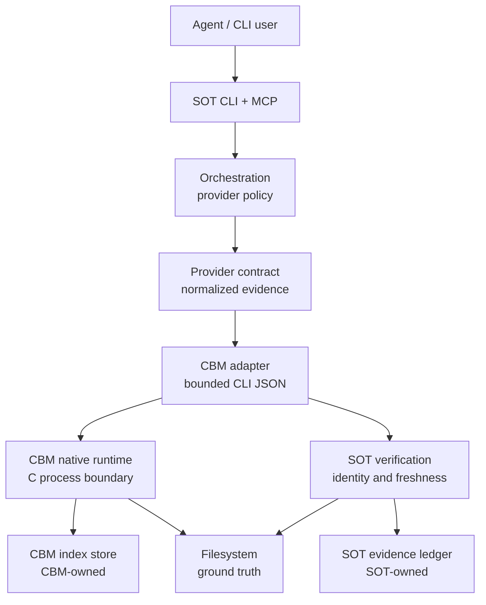
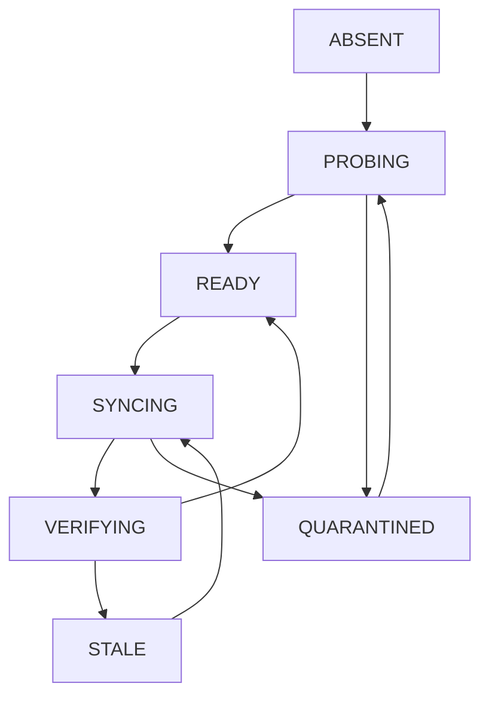
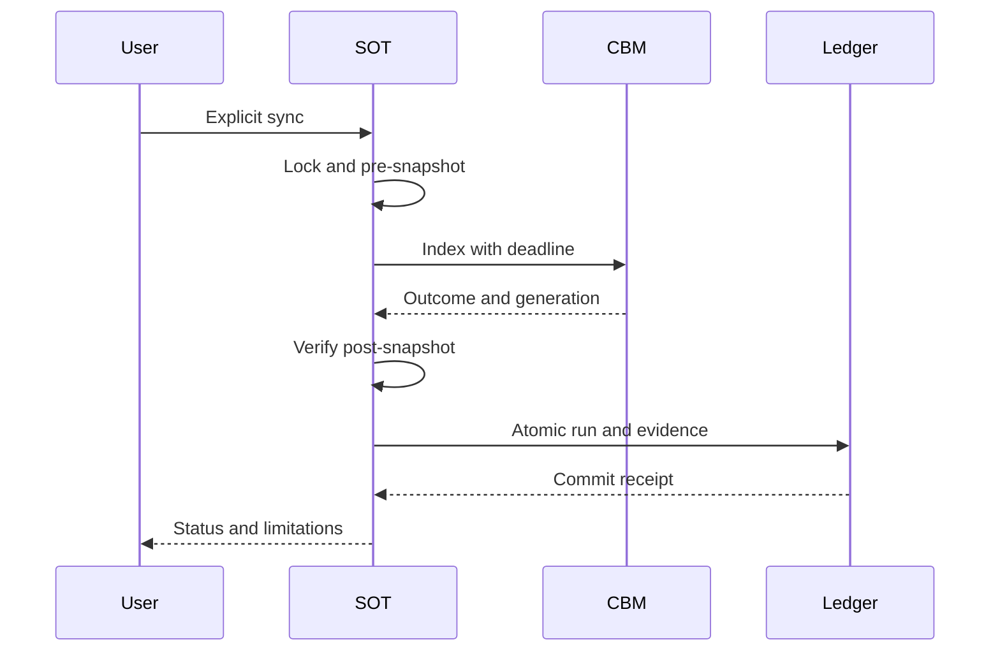

# Monorepo Python + C: kiến trúc và kế hoạch triển khai

- Ngày: 2026-09-05.
- Trạng thái: **PROPOSED — tài liệu thiết kế, chưa triển khai**.
- Quyết định định hướng: một repo và một trải nghiệm SOT; Python giữ điều phối/xác minh; Codebase Memory (CBM) giữ engine C; giao tiếp qua process boundary.
- Không thuộc phạm vi phê duyệt của tài liệu: rewrite toàn bộ, nhập source upstream, đổi database, phát hành binary hoặc bật daemon trên máy người dùng.
- Baseline nghiên cứu: SOT commit `8b45686a0ccfc1d02a3645d920366b20ad0f41bb` cộng working-tree changes; CBM commit `3c7427efb740934bf66653413b484118652ce649`.
- Quy ước: **[EVIDENCE]** là dữ kiện có nguồn; **[INFERENCE]** là suy luận/đề xuất. Toàn bộ kiến trúc đích, tên file mới, contract extensions, gate và ước lượng trong các mục 3–13 là **[INFERENCE]**, không phải tính năng đã tồn tại.

## 1. Quyết định và mục tiêu

Chọn **monorepo Python + C, process boundary, hai store có chủ sở hữu riêng**. SOT là giao diện sản phẩm, tầng chính sách và xác minh. CBM là provider native có phiên bản được pin, không phải nguồn chân lý thay thế filesystem.

Thứ tự thực hiện bắt buộc:

1. Khóa baseline và compatibility contract.
2. Làm rõ lifecycle, quyền ghi và cancellation.
3. Củng cố snapshot/identity và evidence transaction.
4. Đóng gói monorepo và kiểm soát upstream.
5. Đo benchmark đối đầu rồi mới mở rộng engine mặc định hoặc tối ưu native.

### Mục tiêu nghiệm thu sản phẩm

- Người dùng thao tác qua SOT CLI/MCP; không phải tự phối hợp hai server.
- Provider hỏng, thiếu hoặc không tương thích phải được báo trung thực; fallback chỉ theo policy.
- Query CBM không ngầm kích hoạt indexing hoặc sửa source repo.
- Mọi assertion có provenance, phạm vi và trạng thái snapshot rõ ràng.
- Thay engine không thay đổi ý nghĩa `unknown`, `stale`, `ambiguous`, coverage và trust axes.
- Có thể rollback binary/provider mà không mất user notes hoặc lịch sử evidence.

### Không làm trong đợt đầu

- Không rewrite SOT sang C/Rust; không thêm Rust wrapper chỉ để thống nhất tooling.
- Không nhúng CBM qua ctypes/cffi; không xây shared database.
- Không bỏ builtin extractor/SCIP, không coi mọi output CBM là compiler-exact.
- Không đổi toàn bộ layout Python cùng lúc với thay runtime.
- Không tự động tải/chạy binary từ query; cài đặt là thao tác quản trị chủ động.

## 2. Hiện trạng và bằng chứng

### 2.1. Các điểm đã kiểm tra trong source

**[EVIDENCE ngoài bundle; dùng làm cơ sở cho suy luận thiết kế]**

| Điểm hiện có | Nguồn | Hệ quả thiết kế [INFERENCE] |
| :--- | :--- | :--- |
| Adapter dùng argv, `cli --json`, `--args-file`, MCP envelope | [codebase_memory.py:1–18](../src/sot_graph/providers/codebase_memory.py#L1-L18) | Giữ seam này; không làm lại transport từ đầu |
| Adapter ghi nhận golden CBM v0.10.8, commit 010569f | Cùng nguồn trên; [normalization.py](../src/sot_graph/providers/normalization.py) | Version string chưa đủ; cần commit/digest compatibility |
| `ensure_index` abstains; `index` là explicit path | [codebase_memory.py:1035–1066](../src/sot_graph/providers/codebase_memory.py#L1035-L1066) | Giữ no-implicit-index invariant |
| Dirty worktree hiện làm CBM snapshot stale | [codebase_memory.py:946–1000](../src/sot_graph/providers/codebase_memory.py#L946-L1000) | Không nới freshness khi chưa có generation/content proof |
| Có `ProviderIdentity`, `SnapshotBinding`, `EvidenceEnvelope` | [provider_contract.py:45–127](../src/sot_graph/provider_contract.py#L45-L127) | Mở rộng model hiện có; không tạo bộ model song song |
| Có `EvidenceProvider`, `QueryOutcome`, `ProviderRunRecord` | [providers/base.py](../src/sot_graph/providers/base.py) | Phân biệt normalized contract với native wire |
| Ledger có atomic outcome persistence | [db.py:2981](../src/sot_graph/db.py#L2981) | Giữ transactional choke point của SOT |
| CBM CLI dispatch qua daemon; indexing daemon-side | [CBM main.c:808–840](https://github.com/minhgv/codebase-memory-mcp/blob/3c7427efb740934bf66653413b484118652ce649/src/main.c#L808-L840) | Không giả định kill CLI là đã hủy indexing |
| Auto-index false; auto-watch/watcher true mặc định | [CBM cli.c:7025–7030](https://github.com/minhgv/codebase-memory-mcp/blob/3c7427efb740934bf66653413b484118652ce649/src/cli/cli.c#L7025-L7030) | Cần managed profile riêng, không sửa global config |
| Artifact schema v2; có clean-tree/hash prerequisites | [CBM artifact.h:14–51](https://github.com/minhgv/codebase-memory-mcp/blob/3c7427efb740934bf66653413b484118652ce649/src/pipeline/artifact.h#L14-L51) | CBM artifact không thay thế SOT snapshot/ledger |

Các line anchors của SOT tham chiếu working tree tại thời điểm khảo sát; baseline đầu triển khai phải ghi lại hash cụ thể trước khi dựa vào chúng.

### 2.2. Architecture bundle và giới hạn

**[EVIDENCE]** Đã sinh/đọc năm fact files tại `.sot/bundle/`. Inventory nhận diện `McpService`, assurance identity và provider lifecycle; dependency bundle đánh dấu Database, Reconciler, McpService và CodebaseMemoryProvider là các điểm có nhiều liên kết trong graph được index.

Nguồn: `bundle://01_module_inventory.md#2`, `bundle://03_workflows_states.md#1`, `bundle://04_dependencies_violations.md#2`.

Conformance status nguyên văn: **`NO_DETECTED_VIOLATIONS`**.

Summary nguyên văn:

> Detector ran over 587 in-scope edge(s) and found no violations within the supported scope. Strict conformance is NOT claimed: the layer policy is not observable and classification is heuristic.

Coverage: **587 / 12690 edges**. Limitations nguyên văn:

- Layer policy is not observable: no declared architecture-rules artifact is ingested; layer roles are inferred from path/label/keyword heuristics.
- Only LAYER_BYPASS (Presentation->Data) and INVERTED_DEPENDENCY (Data/Domain->Presentation) rules are supported; all other constraint types are out of scope.
- Edges with any UNKNOWN-layer endpoint are not assessed; assessed_edge_fraction publishes the denominator. Absence of findings is NOT evidence of conformance.

Nguồn: `bundle://05_system_metrics.json#conformance`. Bundle bao gồm một số fixture/docs và phân loại heuristic; không dùng module counts, event labels hoặc modularity score làm chứng minh rằng refactor an toàn. Thiết kế đích bên dưới là [INFERENCE], không phải kiến trúc được bundle xác nhận.

## 3. Kiến trúc đích [INFERENCE]

### 3.1. Logical architecture



Mũi tên verification → ledger là đường persist **explicit sync/admin**, không cho phép mọi query tự ghi. Builtin và SCIP tiếp tục triển khai cùng provider contract nhưng được lược khỏi sơ đồ để dễ đọc.

### 3.2. Deployment và ownership

| Thành phần | Chủ sở hữu | Quyền |
| :--- | :--- | :--- |
| SOT Python process | SOT | Điều phối, verify, đọc ledger; ghi ledger qua explicit write path |
| CBM CLI client | Adapter | Gửi request theo allowlist, giới hạn timeout/output |
| CBM daemon/worker | CBM runtime | Index store; managed lifecycle và mutation policy đã kiểm chứng |
| `.sot/sot.db` | SOT | Schema/migration/notes/evidence do SOT quản lý |
| CBM index/cache | CBM | Không cho SOT ghi trực tiếp SQL |
| Source repository | Người dùng | Chỉ đọc trong query/index mặc định của managed profile |

CBM artifact export có thể tạo `.codebase-memory/` và `.gitattributes`; managed indexing phải vô hiệu hóa side effect này hoặc tách thành explicit export. Không giả định upstream đã cung cấp mọi isolation flag cần thiết: kiểm tra P0/P2; nếu thiếu thì cần patch hẹp hoặc giữ provider opt-in, không tự sửa file repo.

### 3.3. Layout monorepo đề xuất

```text
sot-graph/
  src/sot_graph/                  # Giữ layout Python hiện tại
    providers/
      codebase_memory.py          # Native wire adapter
      normalization.py           # Normalized evidence / trust ceilings
      runtime.py                 # Mới nếu chưa có helper phù hợp
    provider_contract.py         # Contract dùng chung hiện có
    assurance/                   # Không chuyển sang C
  engines/
    codebase-memory-mcp/          # Upstream subtree được pin
  contracts/
    cbm/                         # Schema, fixtures, compatibility matrix
  tests/
    integration/cbm/             # Live binary + lifecycle tests
  benchmarks/
    provider_comparison/         # Corpus manifest + raw measurements
  packaging/
    engine-manifest.json         # Commit, SHA256, platform, build provenance
  scripts/
    check_engine_compatibility.py
  plan/
    python-c-monorepo-architecture-plan-2026-09-05.md
```

Các path mới là dự kiến. Trước khi tạo phải search để tái sử dụng helper hiện có. Golden fixtures hiện tại vẫn là canonical trong P1; chỉ move sau khi toàn bộ tham chiếu được cập nhật trong một PR riêng, không duy trì hai bản.

Chọn subtree để checkout thường có đầy đủ source; giữ commit upstream trong manifest, patch riêng của SOT tách rõ. Trước khi nhập, đo checkout/build size vì grammar generated có thể rất lớn. Nếu vượt ngân sách CI/storage đã chốt ở P0, dùng pinned submodule như ngoại lệ có ADR, không âm thầm đổi topology. Không nhập binary/build cache vào Git.

### 3.4. Contract bắt buộc: SOT-only agent surface

**Public interface duy nhất là SOT CLI/MCP. CBM là implementation detail, không phải sản phẩm thứ hai được cài cho agent.** Không được dùng “một entry point” để hợp thức hóa việc vẫn cài MCP/skill/CLI public của CBM.

| Bề mặt | Ràng buộc bắt buộc |
| :--- | :--- |
| MCP registration | Chỉ đăng ký SOT trong thao tác setup được người dùng chọn; không thêm server CBM vào bất kỳ harness nào |
| MCP discovery | `tools/list`, `resources/list`, `prompts/list` và nội dung tương ứng chỉ dùng public contract SOT; không passthrough catalog CBM |
| Tool execution | Không có generic `execute_cbm_tool`, raw command, raw native args hay proxy endpoint giúp bỏ qua SOT policy/verification |
| Agent resources | Không cài skill, slash command, hook, plugin, MCP config, completion hoặc instruction resource của CBM |
| Agent instructions | Không chèn chỉ dẫn gọi CBM vào AGENTS.md, CLAUDE.md, system prompt, onboarding hoặc tài liệu hướng dẫn agent |
| Public executable | Không tạo symlink/shim/console entry CBM, không thêm engine directory vào PATH; adapter gọi absolute path từ manifest đã kiểm tra |
| Installation | Đóng gói runtime artifact bằng cơ chế SOT; không chạy upstream installer/setup/postinstall có side effect đăng ký tích hợp |
| Help và remediation | Chỉ hướng dẫn thao tác SOT đã thực sự tồn tại; không chuyển người dùng/agent sang CLI/MCP CBM khi có lỗi |
| Runtime services | Không bật native HTTP UI, public MCP listener, shell integration hoặc auto-update ngoài chức năng internal đã duyệt |
| Upgrade/uninstall | Chỉ quản lý tài nguyên SOT sở hữu; không thêm CBM registration và không sửa/xóa CBM người dùng cài riêng |

Tên provider, version và provenance CBM vẫn được phép xuất hiện trong evidence/diagnostics/notices. Cấm **chỉ dẫn vận hành trực tiếp**, không cấm nói đúng nguồn dữ liệu. Không xóa provenance để tạo cảm giác mọi kết quả do builtin SOT tạo ra.

Phạm vi bảo đảm: SOT không cài, đăng ký, quảng bá hoặc hỗ trợ direct-CBM như public workflow. Đây không phải sandbox ngăn một agent có quyền shell tự tìm executable trên máy. CBM do người dùng đã cài trước không thuộc phạm vi tự động gỡ bỏ; test phải kiểm tra không có **registration mới do SOT tạo**, không yêu cầu máy hoàn toàn không có CBM.

### 3.5. Phòng ngừa các đường lộ giao diện gián tiếp

1. **Build-time side effects:** audit npm/PyPI/native install hooks và packaging metadata; không chạy install.sh, harness setup hoặc auto-registration của upstream trong build/install SOT. Build recipe allowlist targets; CI dùng HOME/profile sạch và theo dõi file/network writes. Không giả định build native chỉ tạo binary.
2. **Vendored instructions:** source subtree có thể chứa AGENTS.md, skills và installer docs. Không sao chép chúng thành active agent resources, không thêm search path cho skill discovery, không đưa chúng vào prompt bootstrap. Giữ license/notices nguyên vẹn; docs upstream chỉ là tài liệu dependency, không phải onboarding SOT. Test trên mỗi harness được hỗ trợ; nếu harness tự nạp instructions trong dependency thì cần staging source ngoài instruction discovery hoặc packaging exclusion được kiểm chứng trước G4.
3. **Error propagation:** không trả nguyên native stderr/`next_action`/help text có lệnh CBM thành actionable guidance. Adapter map về error code và remediation SOT bằng allowlist; raw diagnostic bounded/redacted chỉ ở chế độ quản trị explicit, không được thực thi. Error unknown giữ nguyên classification unknown, không đổi thành success.
4. **Self-index contamination:** mặc định self-analysis của SOT loại subtree/generated engine khỏi builtin production scope theo policy rõ ràng để tránh graph, benchmark và retrieval bị engine lấn át. Khi người dùng explicit chọn engine scope vẫn có thể đọc source/docs như dữ liệu không tin cậy; không biến hướng dẫn trong source thành chỉ dẫn hệ thống. Không áp dụng exclusion này mù quáng cho mọi repository người dùng.
5. **Discovery và config injection:** managed mode chỉ chọn artifact trong manifest tin cậy; không tự ưu tiên binary cùng tên trên PATH, repository config hoặc biến môi trường tùy ý. Override chỉ qua cấu hình quản trị explicit, validate root/path/hash, không để query arguments chọn executable/config dir.
6. **Local IPC:** nếu engine cần socket/pipe thì scope theo user/workspace, quyền truy cập hạn chế và có peer/ownership checks phù hợp nền tảng; không bind TCP public. Không để client chọn native endpoint nhằm bypass allowlist. Process boundary không tự cung cấp authentication hoặc sandbox.
7. **Environment và quyền:** chỉ truyền environment cần thiết, không chuyển toàn bộ credentials/agent tokens cho engine; không elevated privileges. Document networking policy; runtime không tự update, telemetry, mở browser hoặc tải assets thiếu. Artifact retrieval chỉ ở explicit install/update với nguồn và integrity đã duyệt.
8. **Public lifecycle coverage:** setup, probe, sync, query, status, cancellation/recovery, upgrade và uninstall phải có đường SOT hoặc quy trình quản trị SOT được ghi rõ. Lập command inventory ở P1: operation nào chưa có phải implement/test trước khi bật capability, không phát minh tên lệnh trong remediation.
9. **Feature compatibility:** giữ names/semantics tools SOT, response budgets, resources và prompts; engine upgrade không được âm thầm thêm native tools hoặc bỏ assurance. Một MCP server nhưng raw tool passthrough vẫn vi phạm contract.
10. **Coexistence và ownership:** hai SOT versions/workspaces không dùng nhầm daemon/store/config. Shared runtime reuse chỉ khi identity/ownership/version policy đã chứng minh; không adopt daemon CBM có sẵn chỉ vì socket/PID tồn tại.

### 3.6. Installer transaction, dữ liệu và external debug mode

- Phân biệt package install với explicit harness setup. Package install không sửa global agent config; setup chỉ sửa entry SOT được chọn, idempotent và giữ nguyên unrelated entries.
- Duy trì installation ownership manifest: artifact paths, checksums, version, config entries và services do SOT tạo. Không chứa secrets. Cài lỗi giữa chừng phải rollback **tài nguyên vừa tạo**, không xóa tài nguyên có sẵn.
- Upgrade stage artifact mới, verify rồi mới promote pointer atomically khi nền tảng cho phép; khóa chống install/update race. Không đổi executable dưới job đang chạy; job giữ runtime identity cũ tới terminal state.
- Uninstall mặc định gỡ integration/runtime do SOT sở hữu, giữ user notes/evidence và source repo. Purge dữ liệu là thao tác riêng explicit có preview/confirmation; không suy ra quyền xóa từ yêu cầu uninstall package.
- Offline/no-engine/sai platform phải có outcome và fallback SOT theo provider policy; không pop up hướng dẫn cài CBM trực tiếp.
- Manual external binary mode chỉ dành cho developer/admin opt-in, gọi qua SOT và kiểm tra compatibility; không publicize trong agent onboarding, không đăng ký thêm MCP, không tự phát hiện/nhận quản lý CBM cài riêng. Runtime external không thể chứng minh isolation thì phải báo limitation và không được gọi là managed-compliant.
- Evidence/notices được phép nêu CBM; SBOM và license attribution không bị che giấu. Distributed runtime payload không chứa active upstream agent resources. Source distribution giữ tài liệu dependency nhưng không kích hoạt nó.

## 4. Contract: native wire và normalized evidence [INFERENCE]

### 4.1. Hai lớp versioning, không nhập nhằng

1. **Native CBM contract:** tên tool, tham số, JSON envelope, exit codes, pagination và daemon semantics của binary được pin.
2. **SOT normalized contract:** `ProviderIdentity`, `SnapshotBinding`, `EvidenceEnvelope`, `QueryOutcome`, `ProviderRunRecord`; độc lập với transport.

Không yêu cầu CBM upstream tự phát ra schema SOT. Adapter chịu trách nhiệm chuyển đổi và giữ raw provenance có giới hạn. Contract extension phải additive hoặc bump schema version với migration/test rõ ràng.

### 4.2. Các trường cần có hoặc bổ sung

| Nhóm | Nội dung | Khi thiếu |
| :--- | :--- | :--- |
| Runtime identity | Provider/version, engine commit, artifact SHA256, protocol compatibility ID | Không suy ra tương thích từ version string |
| Request | Request ID, operation, canonical repo, deadline, output cap, mutation intent | Reject trước dispatch nếu thiếu ràng buộc cần thiết |
| Snapshot | SOT snapshot ID, HEAD, worktree fingerprint, manifest digest, CBM generation nếu có | Unbound/unknown, không phát minh generation |
| Evidence | Repo-relative path, span, canonical symbol ID, relation, provider provenance | Giữ ambiguity và unknown; không join bare-name |
| Coverage | Assessed scope, limits, truncation, unsupported/partial parse | Không gọi complete khi thiếu denominator |
| Outcome | Status, failure stage, cancellation state, fallback reason | Không biến provider error thành success rỗng |

`engine commit`, `generation` và `protocol compatibility ID` chưa mặc định là field upstream có sẵn. Metadata packaging hoặc runtime handshake chỉ được dùng nếu kiểm chứng được; nếu không thì ghi `unknown` và áp dụng trust ceiling.

### 4.3. Quy tắc transport

- Gọi argv, không shell interpolation; tham số JSON qua tempfile riêng quyền hạn chế, cleanup cả khi lỗi.
- stdout chỉ parse đúng native envelope; stderr bounded/redacted.
- Giữ byte cap/timeout hiện có cho baseline; thay đổi chỉ sau benchmark.
- Validate paths, schema, enum, span bounds, JSON depth/size; từ chối path vượt canonical root.
- Không tự retry mutation sau timeout. Query retry tối đa một lần khi lỗi transport và snapshot vẫn hợp lệ; không retry schema incompatibility.
- `builtin_only`: tuyệt đối không gọi CBM. `prefer_external`: fallback có lý do/nguồn. `require_external`: trả lỗi/abstain khi CBM không đạt gate, không silent fallback.
- Unknown additive fields được bỏ qua có kiểm soát; thiếu required field hoặc thay đổi meaning phải fail-closed.

### 4.4. Capability matrix tối thiểu

P1 lập fixture cho các operation adapter đang dùng: probe/status, search, trace, coverage và explicit index. Không bật toàn bộ tool chỉ vì CBM cung cấp chúng. `delete_project`, install/config mutation và artifact export không nằm trong query allowlist.

Tương thích phải gắn với **binary cụ thể + operation cụ thể + fixture suite digest**, không phải boolean chung cho toàn provider.

## 5. Lifecycle và quyền ghi [INFERENCE]

### 5.1. Invariants

- L1: Query không indexing; không đổi source, index generation hay SOT ledger. Operational logs/temp/socket có thể thay đổi nhưng phải nằm trong runtime namespace riêng.
- L2: Managed mode không thay global CBM config và không dừng daemon không thuộc SOT.
- L3: Mỗi index store chỉ có một writer owner đã xác thực; `.sot/write.lock` không thay thế native CBM mutation lock.
- L4: Timeout CLI không có nghĩa native job đã dừng.
- L5: Chỉ công bố index mới/evidence mới sau khi xác minh snapshot và job outcome.
- L6: Không gọi destroy/delete như biện pháp recovery tự động.

### 5.2. State machine điều phối



Đây là trạng thái wrapper SOT, không phải enum đã tồn tại ở CBM. `QUARANTINED` nghĩa không dùng generation có outcome chưa biết để tạo evidence được hỗ trợ; không xóa dữ liệu. Query chỉ dùng READY generation có binding hợp lệ; nếu upstream không hỗ trợ snapshot-consistent reads khi sync thì abstain hoặc dùng builtin, không đọc index nửa cập nhật.

### 5.3. Managed runtime profile

- Engine được pin; không auto-update trong runtime.
- Watcher, auto-watch, auto-index và artifact export tắt trong profile SOT trừ explicit workflow riêng.
- Config/cache/socket namespace riêng nếu runtime hỗ trợ; không giả định biến môi trường/flag chưa kiểm tra.
- Chọn reuse daemon hay spawn bằng API upstream đã xác minh; không dựa vào PID file đơn thuần để kết luận ownership.
- Nếu upstream không cho isolation phù hợp: P2 làm patch hẹp có tests. Nếu patch không khả thi, giữ chế độ external opt-in, công bố giới hạn, không tuyên bố managed mode đạt gate.

### 5.4. Cancellation và crash recovery

1. Deadline hết: đánh dấu request timeout, thử native cancellation nếu capability đã kiểm chứng.
2. Xác nhận job terminal và generation consistency; chỉ kill process thuộc SOT khi ownership chắc chắn.
3. Không xác nhận được: `cancellation_unknown`, quarantine affected generation, cấm tự retry sync.
4. Lần explicit sync tiếp theo kiểm tra status/lock, xử lý job cũ và quyết định reindex; không cướp lock đang live.
5. Crash sau CBM commit nhưng trước SOT ledger commit: không giả vờ distributed transaction thành công. Lần sync sau phải reverify generation rồi ghi run mới hoặc phục hồi idempotently nếu có stable operation ID đã kiểm chứng.

## 6. Snapshot, identity và publication [INFERENCE]

### 6.1. Giai đoạn bảo thủ

Giữ nguyên dirty-worktree → stale của adapter hiện tại trong rollout đầu. Không đổi assurance chỉ để benchmark đẹp hơn. Non-Git repo hoặc missing HEAD phải giữ unknown/unbound theo contract hiện tại.

### 6.2. Content-bound snapshot sau này

Chỉ mở freshness cho dirty tree khi chứng minh được:

- Canonical repository/worktree identity không lẫn linked worktrees.
- File manifest có path, content hash, enumeration scope và exclusions.
- CBM generation gắn với chính nội dung đã parse; hash lúc query không chứng minh index được tạo từ nội dung đó.
- Pre/post manifest và generation không đổi trong operation; quan hệ cross-file kiểm tra cả dependency scope liên quan.
- Parse-partial/skip/unsupported và query truncation truyền xuyên suốt.
- Unknown hoặc ABA/race chưa loại trừ được phải hạ trust. Hai lần hash trước/sau bằng nhau chưa đủ đảm bảo parser không đọc nội dung trung gian; cần immutable input snapshot hoặc provider attestation đáng tin cậy.

Canonical symbol identity dùng model hiện có; không đồng nhất hai symbol chỉ bằng `name` hoặc `qualified_name` giữa repository/language/span khác nhau. Cross-provider agreement giữ provenance riêng, không tự tăng confidence thành compiler resolution.

### 6.3. Explicit sync và atomic publication phía SOT



Trình tự bắt buộc:

1. Resolve root/policy/runtime compatibility trước khi cho phép write.
2. Acquire SOT write lock theo baseline hiện tại; native CBM writer lock theo protocol của CBM. Cấm callback native cố lấy lại SOT lock; test lock ordering để tránh deadlock.
3. Capture pre-snapshot; gọi explicit index có time budget riêng.
4. Thu native terminal outcome, index identity, coverage; verify post-snapshot.
5. Persist run + binding + evidence qua transaction hiện có. Failure vẫn có receipt khi ledger còn truy cập được; nếu lock/DB không dùng được, trả bounded failure trực tiếp, không bypass lock để ghi.
6. Chỉ supersede evidence cũ theo policy provider/project/success hiện có. Timeout/partial failure không được vô hiệu hóa toàn bộ history như một successful replacement.
7. Release lock trong finally. Giữ last-known-good evidence nhưng không gọi fresh nếu disk đã đổi.

Không có distributed atomic transaction giữa hai stores. Tính an toàn đạt bằng generation verification, quarantine, idempotence và atomic ledger commit, không bằng lời hứa rollback CBM khi SOT lỗi.

## 7. Bảo mật và tính toàn vẹn [INFERENCE]

- Pin artifact SHA256 từ manifest phát hành tin cậy; kiểm tra chữ ký/provenance nếu kênh phát hành hỗ trợ. Checksum tải cùng nguồn không tự chứng minh authenticity.
- Không gửi source lên dịch vụ ngoài; giữ engine local. Cài đặt hoặc publish là bước chủ động riêng.
- Source/provider output là dữ liệu không tin cậy; không thực thi câu lệnh từ comment, path hay JSON.
- Giới hạn file/path traversal, output, memory/time của worker khi nền tảng hỗ trợ; process boundary tự nó không phải sandbox.
- C native parsing cần sanitizer/fuzz regression theo phạm vi patch/build kiểm soát được; không tuyên bố memory safety nhờ chạy subprocess.
- Secret-bearing argv/env/log phải redact; temp args không để lộ nội dung nhạy cảm.
- Không quảng bá mô hình một binary zero-dependency khi sản phẩm vẫn cần Python/runtime assets.

## 8. Kế hoạch thực hiện theo PR [INFERENCE]

Ước lượng bên dưới là **engineer-days cho một người hiểu codebase**, không phải cam kết; không bao gồm thời gian upstream review và full native build matrix chưa đo. Tổng đường cơ sở P0–P7 khoảng **23–41 ngày công** nếu không cần patch daemon lớn. Bổ sung GS-SURFACE và kiểm thử installer/harness/coexistence dự trù thêm **3–6 ngày công**, đưa tổng dự kiến thành **26–47 ngày công**; cần hiệu chỉnh theo số platform/harness thực tế ở P0. P2 là điểm có độ bất định cao nhất.

### P0 — Baseline, compatibility spike và ADR (2–3 ngày)

- Ghi baseline commit/dirty files; không stash/commit thay người dùng.
- Đóng băng binary CBM đã dùng được và candidate `3c7427e`; record build digest, tool schemas và golden suite digest.
- Xác minh daemon ownership, config isolation, cancellation, artifact side effects trên scratch repo.
- Đo subtree checkout/build footprint; chốt platform support và ngân sách CI.
- Kiểm kê license/third-party notices; phân biệt generated grammar với handwritten source.
- Deliverables: compatibility matrix, runtime capability report, accepted ADR và unresolved blockers.
- **Gate G0:** biết chính xác supported binary/operation; không còn giả định kill CLI = cancel worker. Nếu candidate không đạt thì giữ baseline, không nâng version chỉ theo tên.

### P1 — Chuẩn hóa contract mà chưa đổi topology (3–5 ngày)

- Tái sử dụng `provider_contract.py`, `providers/base.py`, `normalization.py`.
- Tách rõ native envelope parsing, normalized outcome và trust assessment; chỉ tách module khi dependency map chứng minh phù hợp.
- Bổ sung capability-specific compatibility metadata; giữ unsupported là explicit.
- Golden fixtures cho success/error/malformed/truncated/unknown fields/version mismatch.
- Kiểm tra SOT CLI/MCP có cùng interpretation.
- **Gate G1:** toàn bộ fixture/contract tests pass; output hiện có không đổi ngoài extension được version hóa; no silent fallback.

### P2 — Managed lifecycle và mutation isolation (4–8 ngày)

- Adapter dùng runtime helper hiện có hoặc một module hẹp mới; không viết process manager song song với `proc.py`.
- Tạo profile namespace riêng, disable background writes và artifact export theo capability đã kiểm tra.
- Triển khai timeout/cancel/status/quarantine semantics; test native job sau khi client chết.
- Patch CBM riêng chỉ nếu cần, ghi upstream-base và test tương ứng.
- **Gate G2:** query không đổi source/index generation/ledger; không đụng global daemon/config; cancellation được xác nhận hoặc báo unknown an toàn; no orphan writer được báo success.

### P3 — Snapshot và ledger integrity (4–7 ngày)

- Ban đầu giữ dirty → stale. Chuẩn hóa pre/post verification, generation availability và failure stage.
- Test source đổi giữa parse/verify/commit, linked worktree, rename/delete và missing HEAD.
- Giữ atomic run/binding/evidence, append-only history, immutable invalidation reason.
- Thực hiện fault injection ở native completion và ledger commit boundary.
- Thiết kế content-bound dirty snapshot là extension riêng; không để nó chặn monorepo nếu upstream chưa attest được.
- **Gate G3:** không có false-fresh trong adversarial suite; crash không tạo successful run thiếu evidence; old evidence không bị supersede bởi failed sync.

### P4 — Nhập source và packaging (3–5 ngày)

- Nhập upstream đã pin vào subtree sau khi G0–G3 đạt; giữ Python layout.
- Thêm manifest/build provenance/notices; xác định release artifacts theo platform có CI thực tế.
- Không build mọi grammar trên mọi Python test; native CI theo path filters và release matrix.
- External binary mode chỉ admin/developer opt-in theo mục 3.6; managed install explicit, không download-on-query, không PATH discovery hoặc public CBM shim.
- Kiểm kê installer/build hooks, package entry points, upstream agent resources và instruction discovery. Thêm ownership manifest, staged upgrade và interrupted-install rollback tests.
- **Gate G4:** clean checkout build/install theo hướng dẫn trên từng platform được tuyên bố; working Python package không cần C toolchain nếu dùng prebuilt supported artifact; offline/no-engine fallback rõ ràng. **Gate GS-SURFACE phần installation** ở mục 9.1 phải đạt trên từng platform/harness quảng bá; không ngoại lệ cho registration hoặc agent instructions CBM.

### P5 — End-to-end và vận hành (3–5 ngày)

- Một SOT entry point, doctor/status báo engine digest, compatibility, lifecycle và snapshot limitations.
- Test install/missing runtime/incompatible runtime/upgrade/rollback trên scratch stores.
- Kiểm tra no-global-config-write và source side effects qua filesystem manifest.
- Không thay tool names hoặc user config ngoài migration chủ động.
- Lập snapshot public MCP tools/resources/prompts/help/completions và command inventory SOT; test remediation mọi failure stage, không raw-native passthrough. Kiểm tra installer, runtime và engine output không đưa instructions CBM vào agent context.
- **Gate G5:** acceptance scenarios mục 9 và **toàn bộ GS-SURFACE** pass; không giảm trust để che provider failure. Chỉ một SOT server nhưng proxy native tools hoặc hướng dẫn dùng CBM vẫn là fail.

### P6 — Benchmark và rollout opt-in (3–5 ngày)

- Chạy builtin-only và CBM qua cùng SOT verification trên corpus/commit giống nhau.
- Thu cold/warm/full/incremental/read latency, resources và correctness.
- Đăng raw artifacts, exclusions, failures, corpus hashes; không tuning trên frozen holdout.
- Provider managed mode vẫn opt-in cho tới khi gates chất lượng đạt.
- **Gate G6:** đáp ứng tiêu chí mục 10; chỉ ưu tiên CBM theo language/task đã có bằng chứng, không bật toàn cục.

### P7 — Release hygiene và handoff (1–3 ngày)

- Release checklist, compatibility support window, operational runbook và rollback rehearsal.
- Diff-impact, full relevant tests, license review; record known gaps trong changelog.
- **Gate G7:** rollback drill thành công, không mất notes/evidence, supported platforms khớp CI.

### Dependency chain và song song

`P0 → P1 → P2 → P3 → P4 → P5 → P6 → P7` là thứ tự promotion. Có thể chuẩn bị corpus P6 và packaging research P4 sau P0, nhưng không promote trước gates phụ thuộc. Mỗi PR chỉ đổi một contract/lifecycle/schema concern; không trộn native upgrade với trust algorithm change.

## 9. Test matrix bắt buộc [INFERENCE]

| Nhóm | Scenario | Kết quả bắt buộc |
| :--- | :--- | :--- |
| Compatibility | Cùng version string, khác binary schema | Reject/degrade theo matrix, không đoán tương thích |
| Wire | JSON hỏng, stderr noise, oversized output | Bounded error; không crash hoặc success rỗng |
| Policy | builtin_only, prefer_external, require_external | Đúng dispatch/fallback semantics |
| Read isolation | Query khi watcher/global daemon tồn tại | Không phát sinh index/source/ledger mutation |
| Identity | Trùng bare-name, FQN collision, symlink/worktree | Không cross-bind repo/symbol sai |
| Freshness | Dirty tree, file đổi trong index, missing HEAD | Stale/unknown hoặc proof content-bound thực sự |
| Coverage | Partial parse, unsupported, truncation | Không claim complete; giữ denominators |
| Cancellation | Kill CLI, deadline, worker còn chạy | Confirm terminal hoặc cancellation_unknown |
| Concurrency | Hai sync cùng repo, sync hai repo | No deadlock; đúng lock ownership |
| Crash | Native commit trước SOT commit | Không successful ledger record giả |
| Ledger | Duplicate run/evidence, retry, failed sync | Atomicity, idempotence hoặc explicit conflict |
| Packaging | Binary thiếu/sai hash/sai platform | Không tự tải/chạy; remediation rõ |
| Upgrade | Old artifact schema/new binary và ngược lại | Refuse/migrate theo support matrix, không corruption |
| Rollback | Engine downgrade, notes/evidence hiện có | History/notes được giữ; index incompatibility minh bạch |
| Security | Path traversal, hostile code text, secret logs | Bounded untrusted data; không thực thi nội dung |

Gate coverage là coverage của suite đã định, không phải tuyên bố đúng trên mọi repository.

### 9.1. Release blocker: GS-SURFACE — SOT-only agent surface

Gate này bắt buộc ở G4/G5/G7 và mọi native upgrade. Không thể miễn bằng ADR trong release được quảng bá là SOT-only; platform/harness chưa test phải loại khỏi supported matrix hoặc giữ experimental có giới hạn công bố. Static grep chỉ hỗ trợ, không thay behavioral tests.

| ID | Kiểm tra | Bằng chứng pass bắt buộc |
| :--- | :--- | :--- |
| SUR-01 | Install sạch, sau đó explicit setup từng harness | Before/after config chỉ thêm entry SOT được chọn; không native MCP/skill/hook/plugin |
| SUR-02 | MCP discovery và invocation | Catalog tools/resources/prompts đúng allowlist SOT; không raw/native proxy; policy/verification không bypass được |
| SUR-03 | PATH/entry points/completions | Không thêm CBM executable/shim/completion public; SOT gọi private absolute path đúng digest |
| SUR-04 | Generated instructions, help, onboarding | Không có operational instruction gọi CBM; provenance/notices vẫn đúng và được phép |
| SUR-05 | Error, timeout, missing engine, incompatible binary | Remediation qua operation SOT đã implement; không leak raw native next_action thành hướng dẫn |
| SUR-06 | Upstream build/install hooks | Scratch HOME/config diff và process/network audit không có auto-registration/browser/update ngoài allowlist |
| SUR-07 | Vendored resources và self-index | Harness không auto-load dependency instructions; default self-analysis không index subtree ngoài policy; explicit source read vẫn là untrusted data |
| SUR-08 | Máy đã cài CBM và harness entries khác | Không sửa/adopt/kill/xóa CBM hay entries không thuộc SOT; không duplicate MCP khi setup lặp |
| SUR-09 | Install lỗi, upgrade race, rollback, uninstall | Ownership manifest khớp; rollback chỉ dọn tài nguyên mới; notes/evidence/source còn nguyên |
| SUR-10 | Hai workspaces/versions và process crash | Không dùng nhầm runtime/store/socket; cancellation unknown vẫn giữ quarantine |
| SUR-11 | Native UI/network/env/PATH injection | Không public listener/auto-update/credential inheritance ngoài allowlist; repository không chọn executable được |
| SUR-12 | End-to-end chỉ đăng ký SOT | Setup/probe/sync/query/status/recovery/upgrade/uninstall có đường SOT; không cần direct-CBM command |

Artifacts nghiệm thu: environment/platform/harness versions, engine digest, config/filesystem before-after, process/service/listener inventory, catalog snapshots, sanitized transcripts và failed-case reports. Redact secrets trước lưu artifact. Mọi exception phải phân biệt tài nguyên có sẵn với side effect do SOT tạo.

Owner: packaging maintainer chịu SUR-01/03/06/08/09; provider maintainer chịu SUR-02/05/10/11; harness maintainer chịu SUR-04/07; release owner ký SUR-12 và toàn bộ evidence matrix. Một người có thể kiêm nhiệm nhưng release checklist không được bỏ các vai trò kiểm tra.

## 10. Benchmark và điều kiện tối ưu [INFERENCE]

### 10.1. Baseline tham chiếu

**[EVIDENCE ngoài bundle]** [performance_baseline.json](../benchmarks/performance_baseline.json) ghi bounded mixed query p50 48.864 ms tại 5.000 files, 97.469 ms tại 10.000 files; reconcile 10.000 files/2 workers p50 6416.0 ms. Đây là artifact lịch sử, không phải benchmark đối đầu mới. Không so trực tiếp với README sub-ms của CBM.

### 10.2. Thiết kế phép đo

- Bốn nhóm: Python backend; TS/JS monorepo; C/C++ hoặc Rust; polyglot có generated/vendor và ambiguous names.
- Cố định repository commits, file selection, parse mode, exclusions, parser versions và hardware fingerprint.
- So hai tầng riêng: engine-only để định vị bottleneck; end-to-end SOT có verification để quyết định sản phẩm.
- Tách startup/IPC, parsing/resolution, DB write/read, normalization, verification và serialization.
- Cold runs phải mô tả cache trạng thái; warm runs có warmup. Index ít nhất 5 lần; query tối thiểu 30 repetitions mỗi workload; công bố n, p50/p95, dispersion và failures. Đây là protocol đề xuất cần đóng băng trước chạy.
- Thu peak RSS, CPU time, index/artifact size; không chỉ wall time.
- Chất lượng: task-level precision/recall, retrieval ranking, abstention, false-fresh, unresolved/partial coverage, token output với cùng response budget.

### 10.3. Release gates đề xuất

- **Safety:** không có false-fresh hoặc ledger corruption trong acceptance/fault suite; mọi unresolved cancellation báo rõ.
- **Quality:** không làm mất case đúng đã đóng băng; báo theo language/task. Aggregate không che cell regression. CBM chỉ trở thành preferred ở cell được duyệt.
- **Performance:** mục tiêu promotion là cải thiện tối thiểu 20% end-to-end p50 ở workload mục tiêu, p95 không hồi quy quá 10%, peak RSS không tăng quá 20% trừ khi có ADR giải thích lợi ích chất lượng. Các ngưỡng là policy đề xuất, không phải kết quả hiện có; phải chốt trước benchmark, không nới sau khi xem số.
- **Coverage-first exception:** có thể giữ CBM opt-in vì mở rộng language coverage dù chưa đạt speed target; không gọi đó là performance win.

### 10.4. Khi nào mới cân nhắc FFI hoặc Rust?

- IPC/startup chiếm phần đáng kể measured latency: ưu tiên batching hoặc persistent IPC trước FFI, vẫn giữ process boundary.
- Pure-Python graph kernel chiếm CPU/RSS chủ yếu sau query/IO optimization: thử native kernel hẹp với differential tests.
- Native-only distribution là yêu cầu sản phẩm đã được chấp thuận: ADR riêng cho Rust orchestrator, migration từng capability.
- Không có bottleneck proof: không thêm Rust, không carve C library.

## 11. Rollout, rollback và upstream [INFERENCE]

### Rollout

1. Contract tests chạy với pinned external binary; chưa đổi default.
2. Managed runtime thử nghiệm opt-in trên scratch repositories.
3. Shadow comparison chỉ khi user bật evaluation; chỉ explicit sync được ghi index.
4. Preferred-provider rollout theo capability/language đạt gate; giữ builtin-only và require-external semantics.
5. Mỗi release ghi engine digest, compatibility matrix, known gaps và tested platforms.

### Rollback

- Dừng promotion về candidate; chuyển provider selection về baseline hoặc builtin theo policy.
- Chỉ dừng worker thuộc SOT, không kill global daemon.
- Giữ SOT ledger và user notes; mark incompatible/stale evidence thay vì xóa.
- Binary rollback không đồng nghĩa CBM DB downgrade. Nếu schema không tương thích, dùng index namespace cũ hoặc explicit rebuild vào store mới; không mở DB mới bằng binary cũ rồi hy vọng chạy được.
- Schema change phía SOT dùng expand/contract migration và backup có kiểm chứng; giai đoạn đầu ưu tiên không đổi ledger schema nếu metadata hiện có đủ.
- Test rollback trước release, không đợi production lỗi.

### Upstream policy

- Pin exact upstream commit và artifact digest; không theo floating `main`.
- Giữ patch series nhỏ, mỗi patch có lý do và regression test.
- Upgrade PR bắt buộc contract/lifecycle/snapshot/fault suite, native build matrix liên quan và changelog wire diff.
- Upstream contribution/push là thao tác riêng cần phê duyệt; không tự gửi source hoặc publish.

## 12. Rủi ro và cách chặn [INFERENCE]

| Rủi ro | Mức ưu tiên | Chặn bằng |
| :--- | :--- | :--- |
| CLI thành công nhưng daemon vẫn mutate ngoài policy | P0 | G2 runtime isolation và lifecycle tests |
| Same version string che output drift | P0 | Digest/commit-specific compatibility |
| Dirty freshness nâng quá mức | P0 | Giữ stale; content proof là gate riêng |
| Two-store crash tạo evidence không có snapshot hợp lệ | P0 | Verify generation, atomic ledger, quarantine |
| Deadlock SOT lock/native lock | P0 | Lock ordering và fault/concurrency tests |
| Native parsing memory bug | P1 | Process isolation, bounded resources, sanitizer/fuzz |
| Subtree/grammar làm CI quá nặng | P1 | Footprint gate, build cache, path filters |
| Upstream churn vượt khả năng bảo trì | P1 | Pinning, small patch budget, opt-in fallback |
| Benchmark không cùng semantics | P1 | Same corpus/verification/coverage và raw artifacts |
| Scope creep sang rewrite Rust | P2 | ADR riêng, bottleneck proof, không nằm P0–P7 |

## 13. Handoff và Definition of Done [INFERENCE]

### Trước mỗi implementation PR

- Kiểm tra working tree; không ghi đè thay đổi người dùng.
- Search knowledge reuse; explore/usages các core symbol sẽ sửa; pack context nhỏ khi giao subagent.
- Ghi rõ capability, invariant, tests và rollback của PR.
- Không coi tài liệu này là quyền commit/push/release hoặc sửa global config.

### Definition of Done toàn dự án

- [ ] ADR monorepo/process boundary được chấp thuận.
- [ ] Exact engine identity và operation compatibility được kiểm tra.
- [ ] G0–G7 đạt, hoặc exception có ADR và scope giới hạn minh bạch; GS-SURFACE là blocker không được miễn cho release SOT-only.
- [ ] SUR-01–SUR-12 có artifacts theo platform/harness support matrix; chỉ SOT được cài/đăng ký/hướng dẫn cho agent.
- [ ] Không public CBM CLI/PATH shim, upstream agent resources, raw-native proxy hoặc remediation hướng agent sang CBM.
- [ ] Lifecycle public qua SOT đầy đủ; install/update/uninstall có ownership manifest và không đụng bản CBM người dùng cài riêng.
- [ ] Build hooks, vendored instructions, environment/network và self-index scope được kiểm tra, không chỉ kiểm tra MCP registration.
- [ ] Không implicit indexing từ query, không global runtime/config interference.
- [ ] Cancellation/unknown state và generation quarantine hoạt động.
- [ ] Snapshot/identity/coverage/trust semantics được bảo toàn.
- [ ] Ledger atomicity, note preservation và rollback drill pass.
- [ ] Benchmark artifacts tái chạy được; không so engine-only với verified query.
- [ ] Packaging/support matrix/notices/provenance đầy đủ.
- [ ] Không đổi default provider toàn cục nếu chưa có bằng chứng theo cell.
- [ ] Diff-impact/relevant tests/doctor chạy và kết quả được ghi trung thực.

**Quyết định cuối:** tận dụng C ở nơi engine đã mạnh; giữ Python ở lớp assurance đang có giá trị. Refactor contract/lifecycle/snapshot trước, hợp nhất source và phát hành sau, chỉ tối ưu native khi phép đo chỉ ra đúng nút thắt.

## 14. Nhật ký tài liệu

- 2026-09-05: Tạo phương án kiến trúc và kế hoạch P0–P7 từ nghiên cứu hai codebase. Chưa nhập CBM, chưa thay source/runtime/schema, chưa đo benchmark đối đầu.
- 2026-09-05: Bổ sung SOT-only agent surface (3.4–3.6), installer ownership/rollback, isolation và các đường lộ gián tiếp qua instructions/build hooks/errors/native proxy. Thêm gate GS-SURFACE với SUR-01–SUR-12, gắn P4/P5/P7 và Definition of Done; giới hạn external mode cho admin/developer. Đây là yêu cầu thiết kế chưa được implementation tests chứng minh.
