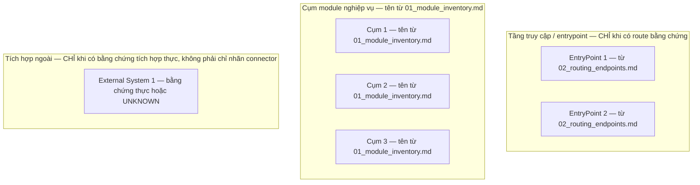
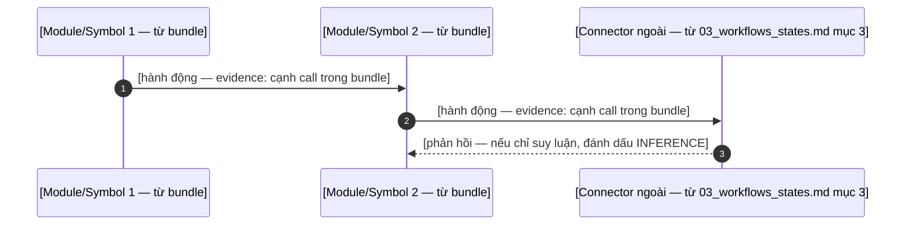

# SOT-GRAPH ARCHITECTURE REPORT TEMPLATE (Dual-Target: Human & AI)

> **Mục đích:** Bản mẫu chuẩn hóa 6 phần cho AI Agent / LLM khi nhận yêu cầu: *"Xuất báo cáo kiến trúc"*, *"Tổng quan hệ thống"*, *"Architecture Report"*.
> **Nguyên tắc Ingestion:** LLM CHỈ đọc các file Fact Bundle trong `.sot/bundle/` (`01_module_inventory.md`, `02_routing_endpoints.md`, `03_workflows_states.md`, `04_dependencies_violations.md`, `05_system_metrics.json`) và điền dữ liệu theo cấu trúc chuẩn dưới đây.
> **Nguyên tắc Schema-driven:** Bản mẫu này KHÔNG chứa giả định domain. Mọi tên miền nghiệp vụ, hệ thống ngoài, vai trò người dùng, state machine phải đến từ Fact Bundle. Nếu bundle không có dữ liệu → ghi `UNKNOWN` hoặc `[INFERENCE]`, TUYỆT ĐỐI KHÔNG bịa.

### Markdown, LaTeX & Mermaid Rendering Rules (BẮT BUỘC TUÂN THỦ)
1. **Mermaid Diagrams:**
   - Mọi nhãn của Node và Subgraph BẮT BUỘC phải đặt trong dấu nháy kép: `NODE["Tên node"]`, `subgraph ID ["Tiêu đề subgraph"]`.
   - TUYỆT ĐỐI KHÔNG dùng ký tự pipe đơn `|` bên trong nhãn node (dùng `/` hoặc `\|` để thay thế).
   - Luôn chừa 1 dòng trống trước và sau khối ````mermaid`.
2. **Ký hiệu Toán học & Unicode (Khuyến nghị dùng Unicode chuẩn):**
   - Ưu tiên sử dụng ký tự Unicode trực tiếp: `Q ≥ 0.650`, `Q = 0.371`, `≈ 400`, `State ∈ { S1, S2, S3 }` (tên state lấy từ bundle, không bịa).
   - TUYỆT ĐỐI KHÔNG dùng dấu `$` toán học bên trong ô bảng biểu Markdown (Table cells), tiêu đề hoặc danh sách bullet để tránh lỗi hiển thị raw `$` trên GitHub, VS Code, Obsidian và công cụ xuất DOCX.
3. **Markdown Tables & Text:**
   - Trong bảng markdown, không dùng ký tự `<` hoặc `>` đứng trước số một cách trần trụi; BẮT BUỘC dùng `&lt;`, `&gt;` hoặc Unicode `≤`, `≥`.
   - Không để ký tự pipe `|` không escape làm vỡ cấu trúc cột bảng.

---

## QUY TẮC BẮT BUỘC VỀ BẰNG CHỨNG & TÍNH TRUNG THỰC (EVIDENCE & HONESTY POLICY — ƯU TIÊN CAO NHẤT)

1. **Mọi khẳng định phải có một trong hai:** (a) **tham chiếu bằng chứng** tới bundle, dạng `evidence: bundle://<tên-file>#<mục>` (ví dụ `bundle://05_system_metrics.json#pattern_name`), hoặc (b) nhãn rõ ràng `[INFERENCE]` (suy luận của người viết, có nêu cơ sở) hoặc `UNKNOWN` (bundle không có dữ liệu, chưa đánh giá).
2. **Tuyệt đối cấm:** khẳng định domain không có trong bundle (tên hệ thống ngoài, cổng thanh toán, viễn thông, SSO, hóa đơn…); khẳng định tuân thủ kiến trúc tuyệt đối ("strictly conforms", "ZERO_VIOLATIONS", "không có vi phạm nào trong toàn hệ thống").
3. **Trạng thái tuân thủ kiến trúc (conformance):** copy NGUYÊN VĂN `conformance.status` từ `bundle://05_system_metrics.json#conformance` — chỉ được dùng một trong ba giá trị do bundler sinh ra: `NOT_ASSESSED` (chưa đánh giá: detector không quan sát được layer policy / không có cạnh trong phạm vi hỗ trợ), `NO_DETECTED_VIOLATIONS` (đã quét trong phạm vi hỗ trợ, không phát hiện vi phạm — KHÔNG được diễn giải là tuân thủ), `VIOLATIONS_DETECTED` (có vi phạm, mỗi vi phạm đều có bằng chứng kèm theo). Luôn kèm số liệu phủ detector (`assessed_edges` / `total_edges`) và giới hạn (`limitations`) từ cùng mục JSON.
4. **Số liệu:** mọi con số phải truy về `05_system_metrics.json` hoặc bảng trong bundle; không làm tròn lại theo ý mình.
5. **Phạm vi:** module/route/workflow ngoài bundle phải ghi rõ "chưa được bundle bao phủ" — không suy diễn nội dung.

---

# [TÊN DỰ ÁN — lấy từ user, KHÔNG bịa] — BÁO CÁO KIẾN TRÚC & PHÂN TÍCH HỆ THỐNG TOÀN DIỆN

**Nguồn phân tích:** Single Source of Truth (`sot-graph`) Fact Bundle tại `.sot/bundle/`
**Mục tiêu:** Bóc tách kiến trúc tổng thể, phân rã chi tiết các modules & chức năng con trong phạm vi bundle đã sinh, theo đúng bằng chứng và giới hạn đã công bố.
**Pattern & Modularity:** `[pattern_name — evidence: bundle://05_system_metrics.json#pattern_name]` — Modularity Score (`[Q — evidence: bundle://05_system_metrics.json#modularity_score_q]`)
**Trạng thái tuân thủ (conformance):** `[conformance.status — evidence: bundle://05_system_metrics.json#conformance]` — `[summary + coverage kèm theo]`

---

## 1. TỔNG QUAN HỆ THỐNG & SƠ ĐỒ CONTAINER TỔNG THỂ (C4-CONTAINER HLD)

### 1.1 Bản chất & Định vị Hệ thống
* Tóm tắt mục đích cốt lõi (nếu user cung cấp) và stack công nghệ **chỉ từ bundle**: `primary_language`, `framework_hints` (`evidence: bundle://05_system_metrics.json#primary_language`, `#framework_hints`). Thiếu mục nào ghi `UNKNOWN` mục đó; không suy luận kiểu hệ thống (web/mobile/backend) nếu bundle không chứng minh.

### 1.2 Sơ đồ C4 Container Tổng thể (Mermaid HLD)
* Chỉ vẽ tầng/subgraph **có bằng chứng trong bundle**: tên nhóm module lấy từ Cụm/Business Domains trong `bundle://01_module_inventory.md`; entrypoint chỉ vẽ khi `bundle://02_routing_endpoints.md` có route tương ứng.
* **Connector trong `bundle://03_workflows_states.md` mục 3 là TÍN HIỆU ỨNG VIÊN** (phát hiện theo nhãn symbol, heuristic) — KHÔNG đủ để vẽ container hệ thống ngoài. Chỉ vẽ container ngoài khi có bằng chứng tích hợp thực (cạnh gọi ra ngoài ranh giới module, cấu hình endpoint); thiếu → node ghi `UNKNOWN["Chưa xác định từ bundle"]` hoặc gắn `[INFERENCE]`.
* **KHÔNG suy ra kết nối mặc định:** không vẽ sẵn cạnh tầng-trên→tầng-dưới; chỉ nối cạnh khi bundle chứng minh dependency, còn lại `[INFERENCE]` hoặc bỏ.



---

## 2. PHÂN RÃ CHI TIẾT MODULES NGHIỆP VỤ & TÍNH NĂNG SUB-MODULE (FEATURE TAXONOMY — THEO PHẠM VI BUNDLE)

> **Cấu trúc bắt buộc:** Nhóm theo Cụm module **đúng như `bundle://01_module_inventory.md` liệt kê**; không tạo module không có trong bundle. Module ngoài phạm vi bundle ghi rõ "chưa được bao phủ".

### CỤM [N]: [tên cụm — evidence: bundle://01_module_inventory.md]

#### Module [M]: `[module_name — evidence: bundle://01_module_inventory.md]`
* **Thư mục mã nguồn:** `[path/to/module/ — evidence: bundle://01_module_inventory.md#Internal Source Files]`
* **Entities / Models chính:** `[core_entities — evidence: bundle://01_module_inventory.md]`; không có → `UNKNOWN`
* **Endpoints / Routes / Handlers:** `[entrypoints/route khớp module — evidence: bundle://02_routing_endpoints.md]`; không có → `UNKNOWN`
* **Chức năng cụ thể:** chỉ mô tả khi suy ra được từ symbol/file trong bundle; mỗi ý ghi `evidence: bundle://…#…`. Mức suy luận sâu hơn (quy tắc nghiệp vụ, validation) phải gắn `[INFERENCE]` kèm cơ sở. Không đủ dữ liệu → ghi `UNKNOWN`.

---

## 3. MA TRẬN VAI TRÒ & PHÂN QUYỀN (NẾU CÓ BẰNG CHỨNG)

> Fact Bundle hiện **không chứa dữ liệu phân quyền**. Cột/hàng vai trò chỉ được điền khi có bằng chứng ngoài-bundle do user cung cấp (kèm dẫn chiếu); nếu không, thay toàn bộ mục này bằng: `UNKNOWN — bundle không chứa dữ liệu phân quyền theo vai trò`.

| Module (từ bundle://01) | [Vai trò 1 — nguồn: user/bundle] | [Vai trò 2 — nguồn: user/bundle] |
| :--- | :---: | :---: |
| `[module_name]` | [quyền — nguồn dẫn chiếu] | [quyền — nguồn dẫn chiếu] |

---

## 4. VÒNG ĐỜI STATE MACHINE & VẬN HÀNH TỰ ĐỘNG (WORKFLOWS & CRON JOBS)

### 4.1 State Machine (chỉ vẽ khi bundle phát hiện được)
* Symbol state/status trong `bundle://03_workflows_states.md` mục 1 là **tín hiệu ứng viên** (match theo nhãn/tên, heuristic) — không tự chứng minh một state machine tồn tại.
* **Transition KHÔNG được suy từ cạnh call-graph** (cạnh gọi ≠ chuyển trạng thái). Mọi transition ghi `UNKNOWN` trừ khi có bằng chứng chuyển trạng thái thực tế (bảng chuyển trạng thái, handler gán giá trị state, event transition) kèm dẫn chiếu nguồn.
* Nếu bundle không phát hiện state/lifecycle symbol nào → ghi: *"Không phát hiện state machine từ bundle — không tự vẽ"*.

### 4.2 Background Workers / Cron / Scheduled Tasks
* Liệt kê đúng các worker/cron từ bảng mục 2 của `bundle://03_workflows_states.md` (kèm đường dẫn file). Không có → ghi "không phát hiện từ bundle". Chu kỳ/SLA không có trong bundle → `UNKNOWN`, không suy diễn.

---

## 5. LUỒNG NGHIỆP VỤ XUYÊN SUỐT (END-TO-END SEQUENCE FLOW)

* Participant chỉ được là: module cụm / symbol / hệ thống ngoài **có trong bundle** (`01`, `02`, `03`), tên dạng `[Module/Symbol — evidence: bundle://…]`. Hệ thống ngoài cần bằng chứng tích hợp thực, không chỉ nhãn connector.
* Cạnh call trong bundle chứng minh **tương tác giữa hai symbol** (tín hiệu ứng viên); ý nghĩa nghiệp vụ và thứ tự các bước chỉ là `[INFERENCE]` — ghi nhãn ngay tại bước tương ứng. Không đủ bằng chứng cho luồng end-to-end → thay bằng `UNKNOWN` và mô tả các đoạn đã chứng minh.



---

## 6. ĐÁNH GIÁ KIẾN TRÚC & LỘ TRÌNH TỐI ƯU HÓA (ROADMAP P0/P1/P2)

### 6.1 Trạng thái Tuân thủ & Các Điểm Mạnh Nổi Bật
1. **Conformance (bắt buộc, copy nguyên văn):** `conformance.status` + `summary` + `detector.assessed_edges` / `detector.total_edges` + `detector.limitations` từ `bundle://05_system_metrics.json#conformance`. Cấm diễn giải thành "tuân thủ tuyệt đối".
2. **God nodes / blast radius:** chỉ nêu khi `bundle://04_dependencies_violations.md` mục 2 có dữ liệu (kèm evidence); không có → `UNKNOWN`.
3. **Điểm mạnh:** mỗi ý gắn evidence hoặc `[INFERENCE]`.

### 6.2 Khuyến Nghị Tối Ưu Hóa Tiếp Theo (Actionable Roadmap)
* **Priority P0:** khuyến nghị phải bám vào vi phạm/god node đã chứng minh trong bundle (kèm evidence); khuyến nghị mở rộng ngoài bằng chứng → gắn `[INFERENCE]`.
* **Priority P1:** ví dụ an toàn: tách module có degree cao, giảm phụ thuộc chéo — số liệu từ `05_system_metrics.json`.
* **Priority P2:** chất lượng mã & giám sát — chỉ đề xuất chung chung khi thiếu bằng chứng, và ghi rõ `[INFERENCE]`.
